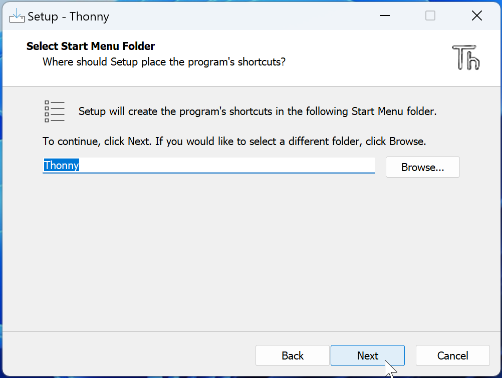
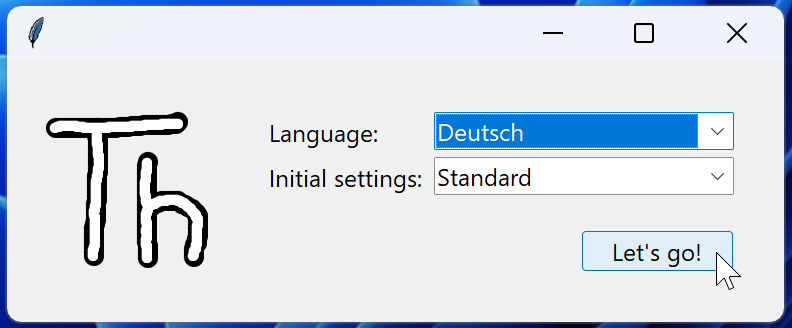

# Thonny installieren
## Installation

::::Tabs{groupId="os"}
:::Tab[Windows]{value="win"}
1. Als ersten Schritt laden Sie Thonny von [dieser Webseite](https://thonny.org/) für **Windows** herunter:

2. Suchen Sie die heruntergeladene Datei im Downloads-Ordner und führen Sie sie mit einem Doppelklick aus:

3. Next...

4. Wählen Sie hier die obere Option:

5. Akzeptieren Sie die Lizenvereinbarungen:

6. Lassen Sie den Pfad unverändert:

7. Lassen Sie auch diese Option unverändert:

8. Aktivieren Sie hier die Option zum Erstellen einer Desktopverknüpfung:

9. Install...

10. Dann ist die Installation angeschlossen

:::

:::Tab[macOS]{value="macos"}
1. Als ersten Schritt laden Sie Thonny von [dieser Webseite](https://thonny.org/) für **Mac** herunter:

2. Suchen Sie die heruntergeladene Datei im Downloads-Ordner und führen Sie sie mit einem Doppelklick aus:

3. Fortfahren...

4. Fortfahren...

5. Akzeptieren Sie die Softwarelizenz:

6. Bestätigen Sie diese Auswahl:

7. Installieren...

8. Die Installation ist abgeschlossen - klicken Sie auf _Schliessen_:

9. Das Installationsprogramm benötigen Sie nicht mehr - Sie können es in den Papierkorb legen:

:::
::::

## Erste Einrichtung
Starten Sie nun Thonny, um die erste Einrichtung abzuschliessen.

Falls folgende Frage auftaucht, wählen Sie hier die Sprache _Deutsch_:

Die erste Einrichtung können Sie dann mit _Let's go!_ abschliessen:

Jetzt ist Thonny einsatzbereit!

---
