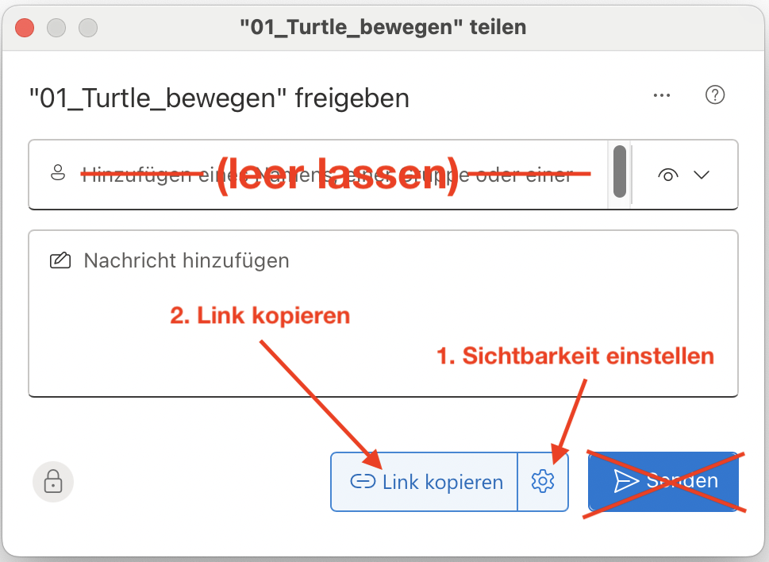

import TaskState from '@tdev-components/documents/TaskState';
import Solution from '@tdev-components/documents/Solution';
import String from '@tdev-components/documents/String';

# Turtle bewegen
Jetzt können Sie selber aktiv werden und Ihre ersten Turtle-Zeichnungen erstellen!

## Vorbereitung
Bevor wir anfangen, müssen wir noch etwas vorbereiten.

Sie werden in den kommenden Übungen viele verschiedene Python-Dateien erstellen. Es ist wichtig, dass Sie dabei auf Ihrem Computer Ordnung halten.

:::aufgabe[Ordnerstruktur vorbereiten]
<TaskState id='205f6b69-e47d-4884-bcd4-6e67a78b80a8' />
Befolgen Sie deshalb diese Schritte ganz genau:
1. In **OneDrive** einen neuen Ordner namens __Programmieraufgaben__ erstellen
2. Im __Programmieraufgaben__-Ordner einen neuen Ordner namens __01_Turtle_bewegen__ erstellen
3. Thonny öffnen
   1. Sicherstellen, dass der [Dateibereich](../Thonny/Thonny-Verwenden#dateibereich) angezeigt wird
   2. Im Dateibereich zum Ordner __01_Turtle_bewegen__ [navigieren](../Thonny/Thonny-Verwenden#navigieren)

Wenn Sie alles richtig gemacht haben, sollte der Pfad in Dateibereich von Thonny nun etwa so aussehen:

:::

## Aufgaben
:::warning[Keine Dateien überschreiben!]
Denken Sie vor jeder Aufgabe unbedingt daran, die unten stehenden Schritte durchzuführen. Ansonsten überschreiben Sie Ihre Lösungen und müssen die entsprechende Aufgabe wiederholen.
:::

Gehen Sie **bei jeder dieser Aufgaben** folgendermassen vor:
1. Erstellen Sie in Thonny eine neue Datei.
2. Speichern Sie die Datei im Ordner __01_Turtle_bewegen__ ab — und zwar mit dem Namen der Aufgabe in Kleinbuchstaben (z.B. `aufgabe_1.py`, siehe unten).

Lesen Sie bei Bedarf nochmal den Abschnitt zur [Benutzeroberfläche von Thonny](../Thonny/Thonny-Verwenden#benutzeroberfl%C3%A4che) und zum [Speichern von Dateien](../Thonny/Thonny-Verwenden#datei-speichern).

:::aufgabe[aufgabe_1.py]
<TaskState id='bf995213-a8f9-4a22-8641-0e3ccd558edf'/>
Schreiben Sie ein Turtle-Programm, das folgende Figur mit den angegebenen Längen zeichnet (die Längenangaben müssen Sie natürlich nicht mitzeichnen 😉):


<Solution id='a7a23d1a-6922-4678-bf8a-b54e6a3cee8f'>
  ```py live_py readonly slim
  from turtle import *

  shape('turtle')

  forward(100)
  left(90)
  forward(50)
  right(90)
  forward(100)
  right(90)
  forward(50)
  left(90)
  forward(100)

  done()
  ```
</Solution>
:::

:::aufgabe[aufgabe_2.py]
<TaskState id='5d40ff0e-682a-45ba-8585-51dc9f1d0fef'/>
Erstellen Sie ein Turtle-Programm, das ein gleichseitiges Dreieck mit einer Seitenlänge von $100$ zeichnet. Finden Sie den korrekten Drehwinkel heraus?


<Solution id='186e35a4-1f14-412e-8764-269c1dd06e60'>
  ```py live_py readonly slim
  from turtle import *

  shape('turtle')

  forward(100)
  right(120)
  forward(100)
  right(120)
  forward(100)

  done()
  ```
</Solution>
:::

## Abgabe
Wenn Sie alles richtig gemacht haben, dann befinden sich in Ihrem Ordner __01_Turtle_bewegen__ jetzt sieben Dateien namens __aufgabe_1.py__...__aufgabe_7.py__.

:::aufgabe[Ordner abgeben]
<TaskState id='a930cf06-fc15-4946-829f-a7f812042d3a'/>
Erstellen Sie jetzt einen OneDrive-Freigabelink für den Ordner __01_Turtle_bewegen__ mit Sichtbarkeit für **_Personen in EDUBERN_**.

**Achtung:** Nur den Link kopieren, kein E-Mail senden!


Fügen Sie den kopierten Link jetzt hier ein:
<String placeholder='https://erzbe-my.sharepoint.com/...' inputWidth='30em' id='27d0667c-da55-4ea3-8d7b-21a1e9e8a346'/>
:::


---