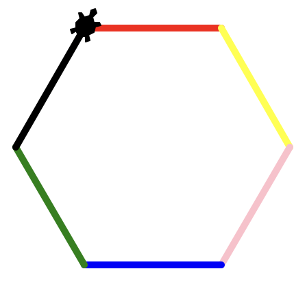
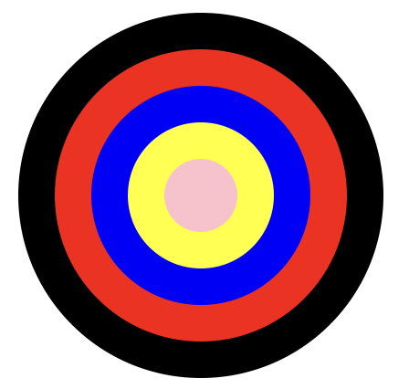

import TaskState from '@tdev-components/documents/TaskState';
import Solution from '@tdev-components/documents/Solution';
import String from '@tdev-components/documents/String';

# Farben verwenden
## Vorbereitung
:::aufgabe[Ordnerstruktur vorbereiten]
<TaskState id='edf3a53f-fe63-43b0-b72c-532ee49c187b' />
1. Im __Programmieraufgaben__-Ordner (siehe [vorheriges Kapitel](Turtle-Bewegen)) einen neuen Ordner namens __02_Farben_verwenden__ erstellen
3. Thonny öffnen
   1. Sicherstellen, dass der [Dateibereich](../Thonny/Thonny-Verwenden#dateibereich) angezeigt wird
   2. Im Dateibereich zum Ordner __02_Farben_verwenden__ [navigieren](../Thonny/Thonny-Verwenden#navigieren)
:::

## Aufgaben
Gehen Sie **bei jeder dieser Aufgaben** wieder folgendermassen vor:
1. Erstellen Sie in Thonny eine neue Datei.
2. Speichern Sie die Datei im Ordner __02_Farben_verwenden__ ab — und zwar mit dem Namen der Aufgabe in Kleinbuchstaben (z.B. `aufgabe_1.py`, siehe unten).

:::tip[Cheatsheet]
Denken Sie auch an das [Cheatsheet](Cheatsheet-Turtle-Befehle) — es wird Ihnen eine Hilfe sein!
:::

::::aufgabe[aufgabe_1.py]
<TaskState id='c7293cfe-20f5-42a6-bbd0-d098e2976568' />
Zeichnen Sie mit der Turtle ein regelmässiges Sechseck und verwenden Sie dabei für jede Seite eine andere Farbe.



:::tip[pensize(n)]
Mit dem Befehl `pensize(n)` können Sie die Dicke des Stifts verändern, damit die Linien deutlicher zu sehen sind.
:::

<Solution id='3b710afe-5484-4802-8168-55fe901bd31c'>
  ```py live_py readonly slim
  from turtle import *

  shape('turtle')

  pensize(5)

  pencolor('red')
  forward(100)
  right(60)

  pencolor('yellow')
  forward(100)
  right(60)

  pencolor('pink')
  forward(100)
  right(60)

  pencolor('blue')
  forward(100)
  right(60)

  pencolor('green')
  forward(100)
  right(60)

  pencolor('black')
  forward(100)

  done()
  ```
</Solution>
::::

:::aufgabe[aufgabe_2.py]
<TaskState id='d2c9e17a-3ae8-4e84-b259-2745d2c1379e' />
Zeichnen Sie folgende Figur. Am Schluss soll die Turtle nicht mehr sichtbar sein.



<Solution id='5f8b3ed1-d025-41c1-b7b4-16a82a0b41af'>
  ```py live_py readonly slim
  from turtle import *

  hideturtle()

  pencolor('black')
  dot(200)

  pencolor('red')
  dot(160)

  pencolor('blue')
  dot(120)

  pencolor('yellow')
  dot(80)

  pencolor('pink')
  dot(40)

  done()
  ```
</Solution>
:::

::::aufgabe[aufgabe_3.py]
<TaskState id='fa754d9e-90b6-4418-96e8-feae18ad3955' />
Zeichnen Sie solche Kreise mit den Farben `'red'`, `'yellow'`, `'blue'`, `'magenta'`.


Die Kreise sollen einander berühren. Es sollen aber keine zusätzlichen Striche Sichtbar sein (nur die Kreise).

:::tip[back(n)]
Damit die Turtle nicht aus dem Fenster rennt, können Sie sie am Anfang mit dem Befehl `back(n)` etwas nach links bewegen.
:::

<Solution id='6dd5c050-76cc-4577-8d22-80911272bc6c'>
  ```py live_py readonly slim
  from turtle import *

  shape('turtle')

  penup()
  back(200)
  pendown()

  pencolor('red')
  circle(50)
  penup()
  forward(100)
  pendown()

  pencolor('yellow')
  circle(50)
  penup()
  forward(100)
  pendown()

  pencolor('blue')
  circle(50)
  penup()
  forward(100)
  pendown()

  pencolor('magenta')
  circle(50)
  penup()
  forward(100)
  pendown()

  done()
  ```
</Solution>
::::

## Abgabe
:::aufgabe[Ordner abgeben]
<TaskState id='4f4d11af-13ab-4080-a19a-cd4b054c8e6f'/>
Erstellen Sie jetzt einen OneDrive-Freigabelink für den Ordner __02_Farben_verwenden__ mit Sichtbarkeit für **_Personen in EDUBERN_**.

**Achtung:** Nur den Link kopieren, kein E-Mail senden!

Fügen Sie den kopierten Link jetzt hier ein:
<String placeholder='https://erzbe-my.sharepoint.com/...' inputWidth='30em' id='c63bda8f-f3b6-40c2-bf53-49ac317ce549'/>
:::

---