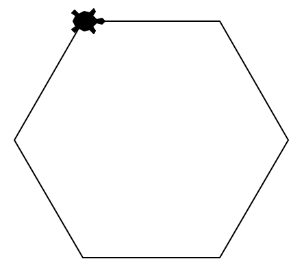
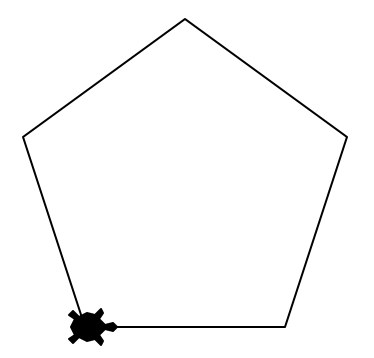
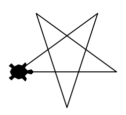
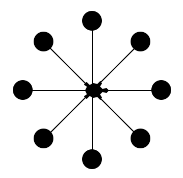
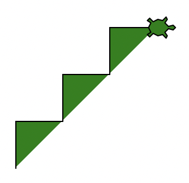
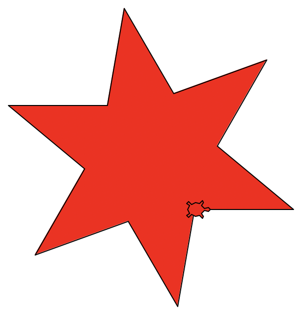

import Solution from '@tdev-components/documents/Solution';
import TaskState from "@tdev-components/documents/TaskState";
import String from "@tdev-components/documents/String";

# `for`-Schleife 🔁

:::warning[Auf der Webseite arbeiten]
Erledigen Sie alle Aufgaben direkt hier auf der Webseite. Thonny brauchen Sie nicht.
:::

::::aufgabe[Aufgabe 1]
<TaskState id='c093bbad-6fff-41b4-9db9-f1bbc6faaeb7' />
Verwenden Sie eine **Schleife**, um mit der Turtle ein regelmässiges Sechseck mit Seitenlänge `100` zu zeichnen.

:::tip[Zeilen]
Ihre Lösung sollte aus maximal 6 Zeilen bestehen (Leerzeilen nicht mitgezählt).
:::



```py live_py title=aufgabe__1.py id=a0373049-cfe2-455c-964e-554d78451e3d
```

<Solution id='e90f76b8-49db-4163-876e-e35b266ba68b'>
  ```py live_py slim
  from turtle import *

  shape('turtle')

  for i in range(6):
      forward(100)
      right(60)

  done()
  ```
</Solution>
::::

::::aufgabe[Aufgabe 2]
<TaskState id='5b7ba54a-5130-4ec1-ab6e-77d13709176b' />
Kopieren Sie das Programm aus der vorherigen Aufgabe und experimentieren Sie mit der Anzahl Wiederholungen und den Drehwinkeln (dazu gehören auch `left(n)` vs. `right(n)`) um die folgenden beiden Figuren zu zeichnen:

:::cards{gap="1em" marginBottom="1em" width="100%"}

::br

:::

```py live_py title=aufgabe__2__pentagon.py id=9cd753ca-4999-4844-a08f-47c693c2b105
```

```py live_py title=aufgabe__2__stern.py id=ded71905-e1cb-4835-ba38-e9e1248f4911
```

<Solution id='ce600c03-98aa-4382-bdec-8c1b030b67cb'>
  **Pentagon (Fünfeck):**
  ```py live_py slim
  from turtle import *

  shape('turtle')

  for i in range(5):
      forward(100)
      left(72)

  done()
  ```

  **Stern:**
  ```py live_py slim
  from turtle import *

  shape('turtle')

  for i in range(5):
      forward(100)
      left(144)

  done()
  ```
</Solution>
::::

::::aufgabe[Aufgabe 3]
<TaskState id='95a69298-6a02-4797-a4b4-af9ff94229c3' />
Verwenden Sie eine **Schleife** um eine Treppe mit 7 Stufen zu zeichnen. Die Stufen sollen je 20 Pixel hoch und tief sein.


```py live_py title=aufgabe__3.py id=8e143f3e-671e-48a5-9994-913b12718362
```

**Verständnisfrage:** Auf wie vielen Codezeilen müssen Sie etwas ändern, wenn Sie statt 7 neu 25 Stufen möchten? Geben Sie Ihre Antwort hier als Zahl ein und überprüfen Sie sie mit einem Klick auf den :mdi[help-circle-outline]-Button.

<String id="acc7b8f9-c547-4e8f-a82a-36b16f811c96" label="Antwort" placeholder="Antwort als Zahl..." solution="1" sanitizer={val => val.trim()} />

<Solution id='78c0e8aa-cd80-454f-b360-5af3778fffe2'>
  ```py live_py slim
  from turtle import *

  shape('turtle')

  for i in range(7):
      left(90)
      forward(20)
      right(90)
      forward(20)

  done()
  ```
</Solution>
::::

::::aufgabe[Aufgabe 4]
<TaskState id='2125bffa-e322-4a52-80bd-08734a743904' />
Verwenden Sie eine Schleife, um die folgende Figur zu zeichnen:



```py live_py title=aufgabe__4.py id=08dad9e3-bcf1-43a1-9433-1e31fd9bd1c6
```

<Solution id='e6f04dd7-a387-4d5c-b921-dffa4de0bbd4'>
  ```py live_py slim
  from turtle import *

  shape('turtle')

  for i in range(8):
      forward(70)
      dot(20)
      back(70)
      right(360/8)

  done()
  ```
</Solution>
::::

::::aufgabe[Aufgabe 5]
<TaskState id='2924ee51-c062-49cb-b06a-ec9520b1ab24' />
Verwenden Sie eine Schleife, um diese Treppe zu zeichnen:



```py live_py title=aufgabe__5.py id=ed494c37-2f37-40ca-892b-0b2eb1c749f0
```

<Solution id='f27c3546-f0de-453f-94ba-9033637a93a3'>
  ```py live_py slim
  from turtle import *

  shape('turtle')
  fillcolor('green')

  begin_fill()
  for i in range(3):
      left(90)
      forward(40)
      right(90)
      forward(40)
  end_fill()

  done()
  ```
</Solution>
::::

::::aufgabe[Aufgabe 6]
<TaskState id='e4df55ce-3f8f-4ccc-9219-5e830292349c' />
Verwenden Sie eine Schleife, um diesen Stern zu zeichnen:



```py live_py title=aufgabe__5.py id=5609a11f-b0db-4ed1-bb00-7fa0184195b7
```

<Solution id='3fbbe90d-a824-4dee-ae9f-434a30584844'>
  ```py live_py slim
  from turtle import *

  shape('turtle')

  fillcolor('red')

  begin_fill()
  for i in range(6):
      forward(100)
      left(140)
      forward(100)
      right(80)
  end_fill()

  done()
  ```
</Solution>
::::


::::aufgabe[Aufgabe 7]
<TaskState id='' />
Beschreibung.

```py live_py title=aufgabe__4.py id=
```

<Solution id=''>
  ```py live_py slim
  ```
</Solution>
::::

::::aufgabe[Aufgabe 8]
<TaskState id='' />
Beschreibung.

```py live_py title=aufgabe__8.py id=
```

<Solution id=''>
  ```py live_py slim
  ```
</Solution>
::::

::::aufgabe[Aufgabe 9]
<TaskState id='' />
Beschreibung.

```py live_py title=aufgabe__9.py id=
```

<Solution id=''>
  ```py live_py slim
  ```
</Solution>
::::

::::aufgabe[Aufgabe 10]
<TaskState id='' />
Beschreibung.

```py live_py title=aufgabe__10.py id=
```

<Solution id=''>
  ```py live_py slim
  ```
</Solution>
::::

---