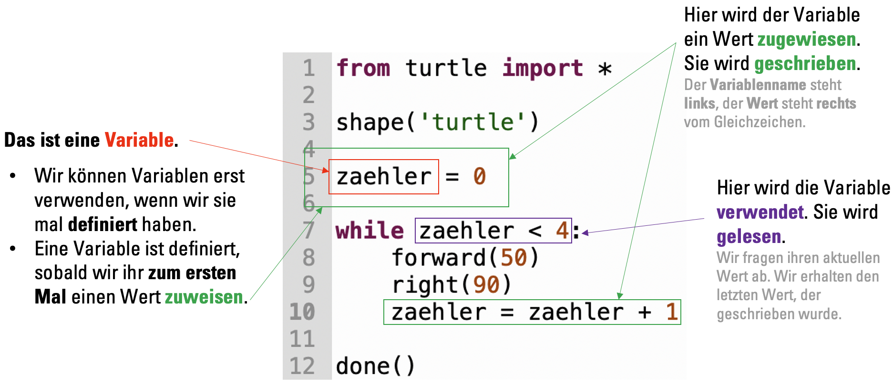

import Solution from '@tdev-components/documents/Solution';
import TaskState from "@tdev-components/documents/TaskState";
import String from '@tdev-components/documents/String';
import QuillV2 from '@tdev-components/documents/QuillV2';

# `while`-Schleife & Variablen
## Theorie


:::danger[Keine Frage, sondern ein Befehl...]
Denken Sie daran: Beim Programmieren ist `zaehler = 0` **keine Frage, sondern ein Befehl**. Wir befehlen dem Computer, den Wert der Variable `zaehler` auf `0` zu setzen.

Die Reihenfolge ist deshalb entscheidend! Der _Datenfluss_ geht **von rechts nach links**: **Rechts** von Gleichzeichen steht der zuzuweisende Wert. Links davon steht der **Name der Variable**.
:::

### Regeln für Variablennamen in Python
Variablennamen können mehr oder weniger frei gewählt werden. Es gibt aber einige **Regeln**, an die wir uns halten **müssen**. Zudem gibt es **Konventionen**, an die wir uns halten **sollten**.

**Harte Regeln**\
_Wenn wir diese Regeln nicht befolgen, können wir das Programm nicht ausführen._
* Erlaubt sind nur **alphanumerische Zeichen** (also Gross- und Kleinbuchstaben, sowie Zahlen), sowie der **Underscore** (`_`). **Umlaute** (ä, ö, ü) und **Leerschläge** sind **nicht erlaubt**.
  * ✅ `groesse_person_1`
  * ❌ `grösse_person_1`
  * ❌ `groesse person 1`
* Ein Variablenname muss mit einem Buchstaben (oder mit einem Underscore (`_`)) beginnen (also nicht mit einer Zahl).
  * ✅ `groesse_person_1`
  * (✅ `_groesse_person_1` ← nur in ganz spezifischen Fällen[^1])
  * ❌ `1_groesse_person`
* Die Gross- und Kleinschreibung wird berücksichtigt. `hallo` und `HaLLo` sind also zwei **unterschiedliche** Variablennamen.
* Python-_Keywords_[^2] wie `for` und `while` dürfen **nicht** als Variablennamen verwendet werden.

**Konventionen**\
_(Un)verbindliche Abmachungen, die uns dabei helfen, möglichst einheitlichen Python-Code schreiben. Es gehört zum guten Stil, dass wir uns daran halten._
* Wir verwenden nur Kleinbuchstaben (und ggf. Zahlen).
  * ✅ `zaehler`
  * ❌ `Zaehler`
* Wörter werden mit einem Underscore getrennt.
  * ✅ `anzahl_ecken`
  * ❌ `anzahlecken`
* Variablen sinnvoll benennen.
  * Anders als in der Mathematik verwenden wir beim Programmieren eher nicht Variablennamen wie `a` und `x`, da sie wenig über ihre Bedeutung aussagen.
  * Wir verwenden möglichst _sprechende_ Variablennamen wie `seitenlaenge` oder `anzahl_seiten`.

## Aufgaben
::::aufgabe[Aufgabe 1: Theorie]
Schauen Sie sich das folgende Python-Programm an (das ist übrigens kein Turtle-Programm, deshalb brauchen wir kein `from turtle import *`, etc.):

```py showLineNumbers
a = 12
b = 7
b = a
```

Welchen Wert haben die Variablen `a` und `b` am Ende des Programms (also nachdem Zeile 3 ausgeführt wurde)? Überprüfen Sie Ihre Antwort, indem Sie auf den :mdi[help-circle-outline]-Button klicken.

<String label='a:' placeholder='Wert als Zahl' solution='12' id='54e4d152-d13c-4a9f-8d4c-03a4ff92fbe4' />
<String label='b:' placeholder='Wert als Zahl' solution='12' id='8163f397-00d8-4220-a407-acc6ba3d014d' />

Woher wissen Sie das?

<QuillV2 id='ab77d284-afc1-4ec7-8414-0013fed7cf10' />

<Solution id='7959dfe9-3168-4eb5-9ef0-0035df0e77aa'>
  Beide Variablen haben am Ende den Wert $12$.
  <br />
  Wir wissen das, weil der _Datenfluss_ immer **von rechts nach links** geht. `a` hat zuerst den Wert $12$ und `b` den Wert $7$. Mit `b = a` befehlen wir dem Computer, dass er den Wert der Variable `b` auf den aktuellen Wert der Variable `a` setzen soll. Der Wert der Variable `a` ist zu dem Zeitpunkt $12$, also hat `b` danach ebenfalls den Wert $12$.
  <br />
  Und ja, die Zuweisung auf Zeile 2 (`b = 7`) ist damit unnötig, weil `b` danach gleich wieder **überschrieben** wird 😉.
</Solution>

::::

:::insight[Mathematische Operatoren]
Dies sind die wichtigsten mathematischen Operatoren in Python:

| Zeichen | Operation                                |
|---------|------------------------------------------|
| +       | Addition                                 |
| -       | Subtraktion                              |
| *       | Multiplikation                           |
| /       | Division                                 |
| **      | Potenzieren ($a^b$)                      |
| %       | Modulo (Restwert einer Ganzzahldivision) |
:::

::::aufgabe[Aufgabe 2]
<TaskState id='d430604b-655d-4806-ae86-b44511a8c0de' />

Erweitern Sie das unten stehende angefangene (aber nicht fertige) Turtle-Programm so, dass ein **beliebiges** `n`-Eck mit Seitenlänge `seite` gezeichnet wird.

Mit den hier voreingestellten Werten würde also ein **Fünfeck** mit **Seitenlänge 100** gezeichnet. Sie sollen die
Werte aber auch z.B. zu `n = 3` und `seite = 150` ändern können, um in dem Fall ein Dreieck mit Seitenlänge 150 zu erhalten.

:::tip[Drehung]
Schlussendlich muss sich die Turtle bei einem beliebigen `n`-Eck immer einmal um insgesamt 360° drehen.
:::

```py live_py id=23452f22-1fed-4cb6-bbf0-13552234314b
from turtle import *

shape('turtle')

n = 5
seite = 100
```

<Solution id='2441c13f-470f-4f87-b9aa-674452e6b674'>
  ```py live_py readonly slim
  from turtle import *

  shape('turtle')

  n = 5
  seite = 100

  for i in range(5):
      forward(seite)
      left(360 / n)

  done()
  ```
</Solution>
::::

::::aufgabe[Aufgabe 3]
Kopieren Sie nun Ihr Programm aus der vorangehenden Aufgabe. Verändern Sie es dann so, dass Sie nicht mehr eine `for`-Schleife, sondern eine `while`-Schleife verwenden.

```py live_py id=b897bb37-7c15-47c1-ad50-236ea3685e57
```

<Solution id='5e9ea055-a3eb-403d-90fc-d075d03c1e56'>
  ```py live_py readonly slim
  from turtle import *

  shape('turtle')

  n = 5
  seite = 100

  zaehler = 0
  while zaehler < n:
      forward(seite)
      left(360 / n)
      zaehler = zaehler + 1

  done()
  ```
</Solution>
::::

::::aufgabe[Aufgabe 4]
Vervollständigen Sie dieses angefangene Turtle-Programm so, dass die Turtle einen Kreis mit dem festgelegten `umfang` zeichnet. Als Annäherung für die Zahl $\pi$ können Sie den Wert `3.14` verwenden.

:::tip[Umfang, Durchmesser, Radius]
- Für einen Kreis mit Umfang $U$ und einen Durchmesser $d$ gilt $U = d \cdot \pi$.
- Der Befehl `circle(r)` zeichnet einen Kreis mit **Radius** `r`.
:::

```py live_py id=33542cb7-8748-46c4-85e0-9cae4f930d28
from turtle import *

shape('turtle')

umfang = 290
```

<Solution id='c7bef16f-ac77-4898-b8cd-aced858d790f'>
  ```py live_py readonly slim
  from turtle import *

  shape('turtle')

  umfang = 290

  durchmesser = umfang / 3.14
  radius = durchmesser / 2

  circle(radius)
  ```
</Solution>
::::

[^1]: Bei der _objektorientierten Programmierung_ (**nicht** Teil dieser Unterrichtseinheit) unterscheiden wir zwischen _privaten_ und _öffentlichen_ Variablen. _Private_ Variablen kennzeichnen wir mit einem `_` am Anfang des Variablennamens.
[^2]: Als _Keywords_ bezeichnen wir in Programmiersprachen "reservierte Wörter" – also Wörter mit einer besonderen Bedeutung. In Python sind das beispielsweise die Wörter `for`, `while`, `import`, `if` und einige mehr. Eine vollständige Liste aller Python-_Keywords_ finden Sie [hier](https://www.w3schools.com/python/python_ref_keywords.asp).