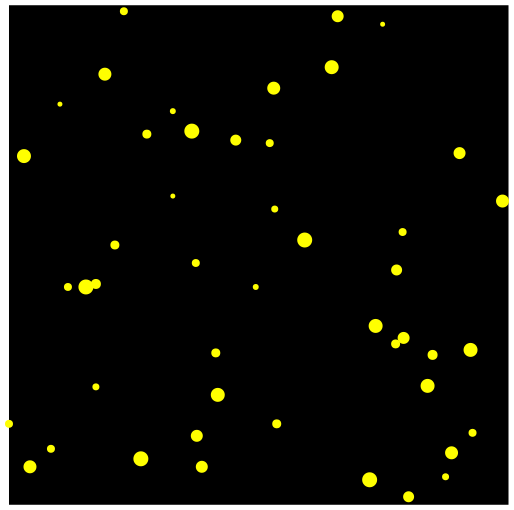

# Zufall 🎲
Beim Programmieren (und bei Algorithmen) haben wir die Dinge meistens gern _deterministisch_: Wir möchten, dass die gleiche Eingabe jedes Mal zum gleichen Ergebnis führt.

Manchmal kann es aber auch nützlich oder interessant sein, wenn wir gewisse Elemente vom Zufall abhängig machen. Dazu können wir in Python **Zufallszahlen** verwenden.

Schauen wir uns beispielsweise folgendes Turtle-Programm an:

```py live_py slim
from turtle import *

shape('turtle')

radius = 50

circle(radius)
```

Wir können dieses Programm interessanter machen, indem wir den Wert der Variable `radius` nicht einfach fix auf `50` festlegen, sondern durch eine Zufallszahl ersetzen. Dazu können wir folgenden Befehl verwenden:

```py
randint(min, max)
```

Hier ersetzen wir `min` mit der niedrigsten und `max` mit der höchsten gewünschten Zahl. So generiert folgender Befehl beispielsweise eine zufällige **Ganz**zahl[^1] zwischen 1 und 6 (wie ein Würfel):

```py
randint(1, 6)
```

Und damit der Wert nicht einfach geniert und gleich wieder vergessen wird, müssen wir ihn in einer Variable speichern. Wir schreiben also beispielsweise:

```py
meine_zufallszahl = randint(1, 6)
```

Aber damit wir diesen Befehl verwenden können, müssen wir zuerst das Modul `random` importieren – genau so, wie wir für Turtle-Programme immer das Modul `turtle` importieren müssen. Wir schreiben dazu:

```py
from random import *
```

:::insight[randint ist Nicht Turtle-spezifisch]
Bisher haben wir Python nur in Zusammenhang mit der Turtle verwendet. Man kann mit Python aber natürlich auch ganz andere Dinge machen, die nichts mit zeichnenden Schildkröten zu tun haben! Das werden Sie bald selbst sehen.

Der Befehl `randint(min, max)` gehört nicht zum Modul `turtle`, sondern eben zum Modul `random`. Er hat also eigentlich nichts mit der Turtle zu tun und kann somit auch dann verwendet werden, wenn wir mal nicht mehr mit der Turtle arbeiten.
:::

Unser ursprüngliches Turtle-Programm können wir nun wie folgt anpassen:

```py live_py slim
from turtle import *
from random import *

shape('turtle')

radius = randint(20, 100)

circle(radius)
```

Jedes Mal, wenn wir dieses Programm ausführen, wird auf Zeile 6 eine neue Zufallszahl generiert. Das Programm zeichnet also einen Kreis mit einem zufällig gewählten Radius von mindestens 20 und höchstens 100 Pixel. Das Ergebnis sieht demnach jedes Mal ein Bisschen anders aus.

## Aufgaben
::::aufgabe[Aufgabe 1]
<TaskState id='90a1c4bb-092b-4bc5-83c2-e529030228c9' />
Zeichnen Sie mit der Turtle ein Quadrat, dessen Seitenlänge jedes Mal zufällige festgelegt wird. Die Seitenlänge soll immer mindestens 15 Pixel und höchstens 200 Pixel betragen.

```py live_py title=zufallsquadrat.py id=13c5ffc0-6401-4f2c-9f1b-77658b7d2c74
```

<Solution id='530b6ae7-cf3c-45e8-9176-1f69770e5469'>
  ```py live_py readonly slim
  from turtle import *
  from random import *

  seitenlaenge = randint(15, 200)

  for i in range(4):
      forward(seitenlaenge)
      right(90)

  done()
  ```
</Solution>
::::

::::aufgabe[Aufgabe 2]
<TaskState id='b5dfc146-4a02-4f38-8310-a64671e4e3e5' />

Entwickeln Sie ein Programm, das ein n-Eck mit einer zufälligen Anzahl Ecken zeichnet. Es soll mindestens 3 und höchstens 20 Ecken haben. Die Seitenlänge soll fix 50 Pixel betragen. Einmal zeichnet Ihr Programm also z.B. ein Fünfeck, dann einmal ein Dreieck, einmal ein 13-Eck, und so weiter...

:::tip[Hinweis]
So etwas Ähnliches haben Sie bereits gemacht: Bei einer früheren Aufgabe mussten Sie mal ein beliebiges n-Eck zeichnen 😉.
:::

```py live_py title=zufaelligs__n__eck.py id=7cfaba6e-fd51-45af-b474-cf364f67cd83
```

<Solution id='0e195753-c280-4c60-8375-810843664361'>
  ```py live_py readonly slim
  from turtle import *
  from random import *

  anzahl_seiten = randint(3, 20)

  for i in range(anzahl_seiten):
      forward(50)
      left(360 / anzahl_seiten)

  done()
  ```
</Solution>
::::


::::aufgabe[Aufgabe 3]
<TaskState id='10981dde-938a-46b5-9a08-ea2581b49113' />

Schreiben Sie ein Turtle-Programm, das einen solchen zufällig generierten "Sternenhimmel" zeichnet.

Das heisst:
- schwarzer Hintergrund
- gelbe Punkte
- zufällige Anzahl Punkte, zwischen 30 und 100 Stück
- zufällige Grösse für jeden Punkt (also zufälliger Wert für `d` im Befehl `dot(d)`), jeweils zwischen 5 und 15 Pixel
- zufällige Position der Punkte im Turtle-Fenster



:::tip[Tipps]
- Nutzen Sie den Befehl `goto(x, y)` um die Turtle an einen bestimmten Punkt im Turtle-Fenster zu bewegen.
- Wählen Sie für die $x$- und $y$-Position jeweils Werte zwischen $-250$ und $250$.
- Beim Befehl `randint(min, max)` sind auch negative Zahlen erlaubt.
- Mit dem Befehl `speed(9)` oder `speed(0)` können Sie das Zeichnen beschleunigen.
:::

```py live_py title=starry__night.py id=0aea24fd-83d1-43c5-9544-839b3ea3ac7b
```

<Solution id='195b4793-bdac-41be-b95f-efc7fcf6d19a'>
  ```py live_py readonly slim
  from turtle import *
  from random import *

  speed(9)
  penup()

  bgcolor('black')
  pencolor('yellow')

  anzahl_punkte = randint(30, 100)

  for i in range(anzahl_punkte):
      x = randint(-250, 250)
      y = randint(-250, 250)
      goto(x, y)
      dot(randint(5, 15))

  hideturtle()
  done()
  ```
</Solution>
::::

::::aufgabe[⭐️ Aufgabe 4]
<TaskState id='296aeb5e-202d-43cd-94f3-7e335658b5d4' />

Gehen Sie nochmal durch die bisherigen Programmieraufgaben durch und suchen Sie sich mindestens eine Turtle-Zeichnung aus, die Sie mithilfe von Zufallszahlen interessanter machen könnten.

Alternativ können Sie kreativ werden und sich ein eigenes zufällig generiertes Kunstwerk ausenken.

```py live_py title=idee__1.py id=f9b78eae-a18d-4fa3-849f-ec0c4b890cfe
```

```py live_py title=idee__2.py id=fee749a1-93b3-440a-94b3-5e059f0a0919
```

```py live_py title=idee__3.py id=fe7aa89e-ba11-45ed-b243-6c5c1717d22e
```
::::

::::aufgabe[⭐️ Aufgabe 5]
<TaskState id='0f78abb9-6f98-49d9-87db-e049563ffda8' />

Für diese Aufgabe müssen wir ein Wenig vorgreifen: Wir können mehrere Werte zu einer sogenannten **Liste** zusammenfassen. In diesem Beispiel enthält die Variable `farben` eine Liste von sechs "Farben" (sechs Werte von Datentyp `str`). Die Variable selbst hat in dem Fall den Datentyp `list` (den Sie bisher noch nicht kennen):

```py
farben = ['red', 'green', 'blue', 'cyan', 'magenta', 'yellow']
```

Wichtig sind dabei die eckigen Klammern (`[...]`) und die Kommata zwischen den Werten.

Mit dem Befehl `choice(liste)` (der ebenfalls im Modul `random` enthalten ist) können Sie nun ein zufälliges Element aus einer Liste auswählen.

Das folgende Programm zeichnet also ein Quadrat in einer zufälligen Farbe:

```py live_py readonly slim
from turtle import *
from random import *

farben = ['red', 'green', 'blue', 'cyan', 'magenta', 'yellow']
zufaellige_farbe = choice(farben)

pencolor(zufaellige_farbe)

for i in range(4):
    forward(100)
    right(90)
```

Zeichnen Sie mit diesem Wissen nun die unten stehende Figur, die Sie in einer früheren Aufgabe schon einmal gezeichnet haben. Sorgen Sie diesmal aber dafür, dass für jeden Punkt eine zufällige Farbe gewählt wird. Verwenden Sie dazu eine `for`-Schleife.

:::tip[Repetitive Farben]
Es lässt sich dabei (vorerst) nicht vermeiden, dass ab und zu die gleiche Farbe mehrfach vorkommt.
:::


```py live_py id=f9b927c8-71d8-458f-b10d-ede2aa2e5e6c
```

<Solution id='403ca3bb-3c1a-4c0c-82a3-fbfcee43358c'>
  ```py live_py readonly slim
  from turtle import *
  from random import *

  farben = ['red', 'green', 'blue', 'cyan', 'magenta', 'yellow']
  durchmesser = 200

  for i in range(5):
      zufaellige_farbe = choice(farben)
      pencolor(zufaellige_farbe)
      dot(durchmesser)
      durchmesser = durchmesser - 40

  done()
  ```
</Solution>
::::

::::aufgabe[⭐️ Aufgabe 6]
<TaskState id='0b2eff47-a54e-41ee-af09-1e7d01f8e921' />

Oben im Aufgabe 2 haben Sie ein n-Eck mit einer zufälligen Anzahl Seiten gezeichnet. Kopieren Sie nun dieses Programm zuerst mal unten hin.

Passen Sie es dann so an, dass **alles** dem Zufall überlassen wird: also die Anzahl Seiten, die Seitenlänge und die Farbe für jede einzelne Seite.

```py live_py id=f158d142-4059-4633-8caa-d93ecb4b64c6
```

<Solution id='ee7ec054-e40b-4b78-9f36-71abd0f09fe2'>
  ```py live_py readonly slim
  from turtle import *
  from random import *

  farben = ['red', 'green', 'blue', 'cyan', 'magenta', 'yellow']
  anzahl_seiten = randint(3, 20)
  seitenlaenge = randint(50, 100)

  for i in range(anzahl_seiten):
      forward(seitenlaenge)
      pencolor(choice(farben))
      left(360 / anzahl_seiten)

  done()
  ```
</Solution>
::::

::::aufgabe[⭐️ Aufgabe 7]
<TaskState id='d3d2a424-8f81-4736-98ad-066bcfeec347' />

Jetzt haben Sie sich nochmal ein neues Werkzeug erarbeitet: Sie können zufällige Farben verwenden.

Werden Sie jetzt wieder kreativ: Gehen Sie durch die bisherigen Übungen und suchen Sie sich mindestens eine Aufgabe aus, die Sie mithilfe von zufällige gewählten Farben interessanter gestalten könnten.

Alternativ können Sie sich auch hier stattdessen ein eigenes Kunstwerk ausdenken.

```py live_py title=idee__1.py id=bb8096e1-69b2-49cf-8d17-5d525f8f233e
```

```py live_py title=idee__1.py id=d53729ed-87cb-4e5d-9b00-2bb635f2f434
```

```py live_py title=idee__1.py id=8baf12f9-3da2-41d1-81c8-46870dded56e
```
::::

[^1]: Dieser Befehl generiert einen Wert von Datentyp `int` (Ganzzahl). Deshalb heisst er `randint(min, max)` – für **rand**om **int**eger: zufällige Ganzzahl.
