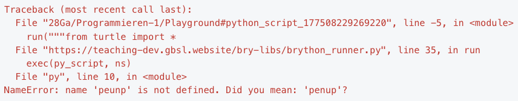
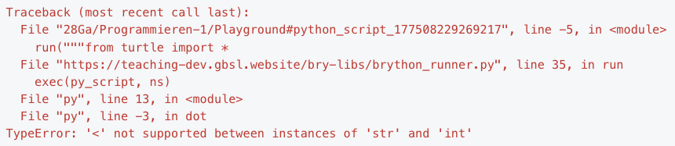

# Bugs 🪲
Beim Programmieren passieren Fehler. Programmfehler nennt man auch **Bugs**.

Es gibt zwei Arten von Programmfehlern:

Syntaxfehler
: Das Programm ist für den Computer unverständlich und nicht ausführbar.
: **Problem:** Wir sagen es falsch.
: **Lösung:** Fehlermeldung genau analysieren.
Logikfehler (Semantikfehler)
: Das Programm ist für den Computer verständlich und wird ausgeführt, macht aber nicht das, was es soll.
: **Problem:** Wir sagen das Falsche.
: **Lösung:** Code genau analysieren (hier gibt es keine Fehlermeldung).

## Aufgaben
::::aufgabe[Aufgabe 1]
<TaskState id='d28b659c-4dd9-4a03-926d-33189d498b70' />

Beim Ausführen eines Programms stossen Sie auf folgende Fehlermeldung:



Was ist hier wohl das Problem? Halten Sie Ihre Vermutung hier fest:

<QuillV2 id='d7baec1a-56e8-453b-a54d-ab973b88ffd5' />

<Solution id='1a3a3caf-dc2c-4066-a589-c5604732224d'>
  Es gibt einen Buchstabendreher auf Zeile 10: Statt `penup()` wurde `peunp()` geschrieben.
</Solution>
::::

::::aufgabe[Aufgabe 2]
<TaskState id='c162628e-ab10-45ec-90c9-57a2022cd2ab' />
Beim Ausführen eines Programms stossen Sie auf folgende Fehlermeldung:


Auf welcher Zeile sollten Sie mit der Fehlersuche beginnen?

<String placeholder='Antwort als Zahl' solution="13" id='58cc8582-e6c2-4ff0-8b75-e08ccd589150' />
::::

::::aufgabe[Aufgabe 3]
<TaskState id='13a0c8b9-b42d-40d0-8d46-3048eccdecd7' />

Beim Ausführen eines Programms stossen Sie auf folgende Fehlermeldung:



Was könnte hier das Problem sein?

:::tip[Tipps]
- Um welchen Turtle-Befehl handelt es sich hier wohl?
- Welche Datentypen haben Sie bereits kennengelernt?
- Falls Ihnen der Begriff _Datentyp_ noch nichts sagt, dann können Sie diese Aufgabe vorerst überspringen.
:::

Halten Sie Ihre Vermutung hier fest:

<QuillV2 id='05f77c5e-3743-4b2c-b923-2eab682bffbb' />

<Solution id='52e42c14-e0a9-4775-a409-32bea999e0e3'>
  Es scheint, als hätte hier jemand den Befehl `dot(d)` mit einem `str` statt mit einem `int` aufgerufen. Vielleicht wurde also so etwas geschrieben wie `dot('40')` statt `dot(40)`.
  <br/>
  Die entsprechenden Hinweise finden Sie auf den letzten beiden Zeilen der Fehlermeldung.
</Solution>
::::

::::aufgabe[Aufgabe 4]
<TaskState id='3885423e-98e0-45cd-953c-447ac9092619' />

Beim untenstehenden Programm gibt es einen Fehler. Führen Sie das Programm aus, analysieren Sie die Fehlermeldung und korrigieren Sie den Code.

Am Schluss sollte das Programm fehlerfrei ausgeführt werden können.

```py live_py id=45b6c3f5-f2e0-49f2-a709-cdccddce06a9
from turtle import *

shape('turtle')

pencolor('red')

fillcolor('green')
begin_fill()

left(90)
forward(50)
right(90)
forward(50)

left(90)
forward(50)
right(90)
forward(50)

left(90)
forward(50)
right(90)
forward(50)

endfill()

done()
```

<Solution id='8d3506e0-d295-4a87-bac6-b2f7669b9d04'>
  Auf Zeile 25 muss das `endfill()` zu `end_fill()` korrigiert werden.
</Solution>
::::

::::aufgabe[Aufgabe 5]
<TaskState id='8aa4ce22-5fe8-4d0e-b5a6-43eb46072e34' />

Auch in diesem Programm hat sich wieder ein Bug eingeschlichen. Eigentlich sollte hier die UK-Flagge gezeichnet werden, aber das Programm lässt sich momentan nicht ausführen.

Starten Sie das Programm, analysieren Sie die Fehlermeldung und beheben Sie den Fehler. Das Programm sollte danach mindestens ausführbar sein.

:::tip[Dokumentation]
Die korrekte Verwendung aller Turtle-Befehle ist im [Cheatsheet](../Cheatsheet-Turtle-Befehle) dokumentiert.
:::

```py live_py id=9fd5b5c8-8c35-4de6-9a94-6f5fe5a40bb9
from turtle import *

speed(0)
bgcolor('#012169')

penup()
goto(-300, 150)
pendown()
color('white')
pensize(30)
goto(300, -150)

penup()
goto(-300, -150)
pendown()
goto(300, 150)

penup()
goto(-300, 150)
pendown()
color('#C8102E')
pensize(10)
goto(300, -150)

penup()
goto(-300, -150)
pendown()
goto(300, 150)

penup()
goto(0, 150, 0)
pendown()
color('white')
pensize(50)
right(90)
forward(300)

penup()
goto(-300, 0)
pendown()
left(90)
forward(600)

penup()
goto(0, 150)
pendown()
color('#C8102E')
pensize(30)
right(90)
forward(300)

penup()
goto(-300, 0)
pendown()
left(90)
forward(600)

hideturtle()
done()
```

<Solution id='98bd2d38-73a9-43a4-8603-1ae3726f4886'>
  Der `goto(x, y)`-Befehl auf Zeile 31 hat ein Argument zu viel. Wenn das dritte Argument (also das zusätzliche `, 0`) entfernt wird, dann läuft das Programm fehlerfrei.
</Solution>
::::

::::aufgabe[Aufgabe 6]
<TaskState id='b28dff32-9079-4503-9530-4dd6137b5d17' />

Im untenstehenden Programm hat sich ein **Logik**fehler eingeschlichen. Eigentlich sollte hier die folgende "Zielscheibe" gezeichnet werden (die Sie bereits kennen):


Korrigieren Sie den Logikfehler.

```py live_py id=8d35010d-3a82-44d5-9894-98165f177444
from turtle import *

hideturtle()

pencolor('red')
dot(160)

pencolor('blue')
dot(120)

pencolor('yellow')
dot(80)

pencolor('pink')
dot(40)

pencolor('black')
dot(200)

done()
```

<Solution id='03190b38-836a-4864-ae43-f1c20138c9f8'>
  Der schwarze Punkt mit Durchmesser 200 wird hier ganz am Schluss gezeichnet und überdeckt damit alle anderen (kleineren) Punkte. Wenn wir diesen Punkt zuerst zeichnen (also die Zeilen 17 und 18 nach oben verschieben), dann funktioniert das Programm wieder.
</Solution>
::::

---