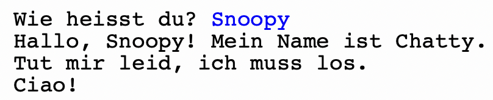

# ⭐️ Chatbot
In dieser Übung entwickeln Sie einen einfachen Chatbot.

Lesen Sie den ganzen Artikel durch. Führen Sie die Beispiele jeweils selbst aus (in Thonny), um sie ausprobieren und nachvollziehen zu können. Sobald Sie bei Schritt 4 angelangt sind, erweitern Sie den Chatbot mit Ihren eigenen Ideen.

:::warning[Thonny verwenden]
In diesem Projekt arbeiten wir mit Endlosschleifen. Das funktioniert auf der Webseite nicht sehr gut. Arbeiten Sie deshalb am besten in Thonny: Sie können die Beispiele auch dorthin kopieren.
:::

## Schritt 1: Die Konversationsschleife
Wir fangen dazu mit einer grundlegenden "Konversationsschleife" an:

```py showLineNumbers
while True:
    eingabe = input('Wie heisst du? ')
    if eingabe == 'stop':
        break

print('Ciao!')
```

Hier passiert bereits einiges! Schauen wir uns das mal genauer an.

Als erstes ist Ihnen vermutlich aufgefallen, dass wir hier eine Endlosschleife kreiert haben:
```py showLineNumbers
while True:
    ...
```

Als Bedingung für die `while`-Schleife haben wir nämlich einfach den Wert `True` verwendet. Die Bedingung ist also immer wahr, egal was passiert – und somit würde die Schleife theoretisch immer weitergehen.

Damit wir die Schleife aber trotzdem irgendwie beenden und die Zeile `print('Ciao!')` ausführen können, verwenden wir ein spezielles Python-Keyword: `break`. Das heisst so viel wie "brich (die Schleife) ab" und funktioniert sowohl bei der `while`- als auch bei der `for`-Schleife.

Der Block

```py showLineNumbers
if eingabe == 'stop':
    break
```

bedeutet also: Wenn die Benutzereingabe dem Wort `stop` entspricht, soll die Schleife abgebrochen werden.

Zusammengefasst passiert im obigen Programm also Folgendes:
- Wir treten in eine Endlosschleife ein.
- Wir fragen die Benutzerin immer wieder nach einer Eingabe.
- Wenn die Eingabe etwas anderes als das Wort `stop` ist, tun wir nichts (respektive, fragen einfach wieder nach einer nächsten Eingabe).
- Wenn die Eingabe genau das Wort `stop` ist, beenden wir die Endlosschleife und gehen zur Zeile 6, wo wir `Ciao!` ausgeben. Danach ist das Programm beendet.

Jetzt wollen wir noch dafür sorgen, dass unser Chatbot auch etwas sagt, wenn wir ihm unseren Namen angeben. Wir fügen dem Programm also noch ein `else` hinzu:

```py showLineNumbers
while True:
    eingabe = input('Wie heisst du? ')
    if eingabe == 'stop':
        break
    else:
        print('Hallo, ' + eingabe + '! Mein Name ist Chatty.')

print('Ciao!')
```

Und schon haben wir das Grundgerüst für unseren Chatbot. Im nächsten Abschnitt können wir die Konversation nun noch etwas spannender gestalten.

## Schritt 2: Interaktionen
Unsere Konversation ist noch etwas eintönig. Das wollen wir jetzt ändern.

Dazu definieren wir ein Konzept, das wir im Rahmen unseres Chatbots _Interaktion_ nennen. Wir sagen, eine _Interaktion_ kann aus folgenden Teilen bestehen:
- eine Frage (seitens Programm)
- eine Antwort (seitens Benutzer:in)
- einer Reaktion (seitens Programm)

Hier ein Beispiel, wie so eine Interaktion definiert werden könnte:

| Nr. | Frage             | Erlaubte Antworten | Reaktion                               |
|-----|-------------------|--------------------|----------------------------------------|
| 1   | `Wie heisst du? ` | Beliebiger String  | `Hallo, [Name]! Mein Name ist Chatty.` |

Zudem soll jede Interaktion definieren, welche Interaktion als Nächstes folgen soll. Wir fügen unserer Tabelle dazu eine weitere Spalte `Next` hinzu und definieren auch gleich noch eine weitere Interaktion, mit welcher der Chatbot das Gespräch (ohne eine Frage) beendet.

| Nr. | Frage             | Erlaubte Antworten | Reaktion                               | Next     |
|-----|-------------------|--------------------|----------------------------------------|----------|
| 1   | `Wie heisst du? ` | Beliebiger String  | `Hallo, [Name]! Mein Name ist Chatty.` | 2        |
| 2   | (keine)           | (keine)            | `Tut mir leid, ich muss los.`          | (nichts) |

Diese Interaktionstabelle ermöglicht nun folgendes Gespräch:



Die letzte Zeile (`Ciao!`) ist hier nicht vorhanden – wir geben sie einfach aus, wenn die Konversationsschleife fertig ist.

Der Code dazu sieht folgendermassen aus:

```py showLineNumbers
interaktion = 1
frage = 'Wie heisst du? '

while True:
    eingabe = ''
    if frage != '':
        eingabe = input(frage)

    if eingabe == 'stop':
        break
    else:
        if interaktion == 1:
            print('Hallo, ' + eingabe + '! Mein Name ist Chatty.')
            frage = ''
            interaktion = 2
        elif interaktion == 2:
            print('Tut mir leid, ich muss los.')
            break

print('Ciao!')
```

Schauen wir uns die wichtigsten Veränderungen an:
- Auf den Zeilen 1-2 definieren wir zwei Variablen: `interaktion` und `frage`.
  - `interaktion` merkt sich, bei welcher Interaktionsnummer wir gerade sind.
  - `frage` merkt sich, welche Frage wir der Benutzerin als Nächstes stellen wollen.
- Falls aktuell eine Frage definiert ist, dann wollen wir nach einer Eingabe fragen (z.B. bei Interaktion Nr. 2 brachen wir das aber nicht). Zur Sicherheit setzen wir zuerst `eingabe = ''`, damit wir nicht mit einer vorherigen Eingabe weiterarbeiten, falls es für die aktuelle Interaktion keine Eingabe gibt. All das passiert auf den Zeilen 5-7.
- Sofern die Eingabe nicht `stop` war, schauen wir uns auf den Zeilen 12 und 16 die aktuelle Interaktionsnummer an, um zu entscheiden, wo wir weiterfahren müssen. Falls wir aktuell bei Interaktion Nr. 1 sind, machen wir den Block auf den Zeilen 13-15. Falls wir bei Nr. 2 sind, machen wir Zeilen 17-18.
- Falls wir aktuell in der Interaktion 1 sind, machen wir Folgendes (Zeilen 13-15):
  - Reaktion ausgeben
  - Frage für Interaktion Nr. vorbereiten (es gibt dort keine Frage)
  - `interaktion` auf `2` setzen
- Auf Zeile 18 haben wir wieder ein `break`, damit die Konversation dort endet.

## Schritt 3: Bedingte Konversationssprünge
Jetzt haben wir ein solides System, mit dem wir auch komplexere Konversationen umsetzen können.

Unsere Interaktionstabelle erweitern wir nun wie folgt:

| Nr. | Frage                                     | Erlaubte Antworten | Reaktion                               | Next                       |
|-----|-------------------------------------------|--------------------|----------------------------------------|----------------------------|
| 1   | `Wie heisst du? `                         | Beliebiger String  | `Hallo, [Name]! Mein Name ist Chatty.` | 3                          |
| 2   | (keine)                                   | (keine)            | `Tut mir leid, ich muss los.`          | (nichts)                   |
| 3   | `Wie geht es dir heute? [gut/schlecht]: ` | `gut`, `schlecht`  | (keine)                                | `gut`: 4<br/>`schlecht`: 5 |
| 4   | (keine)                                   | (keine)            | `Das freut mich 🥳!`                   | 2                          |
| 5   | (keine)                                   | (keine)            | `Das tut mir leid 🫤.`                 | 2                          |

Wenn wir das umsetzen, sieht unser Code so aus:

```py showLineNumbers
interaktion = 1
frage = 'Wie heisst du? '

while True:
    if frage != '':
        eingabe = input(frage)

    if eingabe == 'stop':
        break
    else:
        if interaktion == 1:
            print('Hallo, ' + eingabe + '! Mein Name ist Chatty.')
            frage = 'Wie geht es dir heute? [gut/schlecht]: '
            interaktion = 3
        elif interaktion == 2:
            print('Tut mir leid, ich muss los.')
            break
        elif interaktion == 3:
            frage = ''
            if eingabe == 'gut':
                interaktion = 4
            elif eingabe == 'schlecht':
                interaktion = 5
        elif interaktion == 4:
            print('Das freut mich 🥳!')
            interaktion = 2
        elif interaktion == 5:
            print('Das tut mir leid 🫤.')
            interaktion = 2

print('Ciao!')
```

:::insight[Falsche Eingaben]
Was passiert, wenn wir auf die Frage `Wie geht es dir heute?` nicht mit `gut` oder `schlecht`, sondern z.B. mit `ganz okay` oder `Gut` (mit Grossbuchstaben) antworten?

Sie können das Verhalten unseres Programms in solchen Fällen noch verbessern, indem Sie dem `if-elif`-Block auf den Zeilen 20-23 ein `else` hinzufügen, in dem Sie die Benutzerin auf die falsche Eingabe aufmerksam machen und die Konversationsschleife beenden (Hinweis: `break`).
:::

## Schritt 4: Chatbot erweitern
Besonders hilfreich ist er noch nicht, unser Chatbot. Nun sind Sie gefragt! Erweitern Sie die Interaktionstabelle so, dass man mit dem Chatbot ein nützliches oder unterhaltsames, witziges Gespräch führen kann. Sie dürfen auch bestehende Elemente anpassen oder entfernen. Sobald Sie mit Ihrer Tabelle zufrieden sind, setzen Sie diese im Code um.

## Ihr Chatbot
Hier können Sie Ihren Code "abgeben" – auch, damit Sie es nicht verlieren.

```py live_py id=d58e0efc-0486-47fa-b61f-22be03d50514
```

---