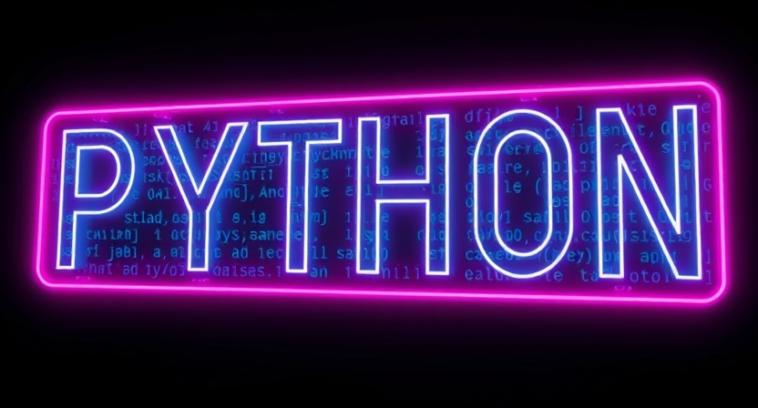

import Restricted from '@tdev-components/documents/Restricted';
import CmsText from '@tdev-components/documents/CmsText';
import WithCmsText from '@tdev-components/documents/CmsText/WithCmsText';

# Programmieren 1

In diesem Themenbereich beschäftigen wir uns mit Algorithmen und mit den Grundlagen der Programmierung in Python.

<Restricted id='41e788c5-6303-4f74-87d6-57b413dee815'>
  ## Folien
  Die Unterrichtsfolien diesem Themebereich finden Sie [hier](https://erzbe-my.sharepoint.com/:f:/g/personal/silas_berger_gbsl_ch/EtFl0-QjpS1Ps3fs07mxut4BN_SZxONga0l2J6SPtPmW_Q?e=mt45JS).
</Restricted>

## Proben
### Algorithmen + Turtle 1
<Dl>
  <dt>Zeit</dt>
  <dd>45 Minuten</dd>
  <dt>Format</dt>
  <dd>Ein Teil auf Papier und ein Teil am Laptop</dd>
  <WithCmsText entries={{note: 'a51a26a1-1226-4ded-84f3-81c226751142'}}>
    <dt>Note</dt>
    <dd>__<CmsText name="note" />__</dd>
  </WithCmsText>
</Dl>
:::info[Prüfungsstoff]
- Sie können für einen gegebenen Sachverhalt entscheiden, ob es sich dabei um einen Algorithmus handelt oder nicht.
- Sie können einen gegebenen Algorithmus auf die sechs Kriterien (Allgemeinheit, Eindeutigkeit, Ausführbarkeit, Endlichkeit, Korrektheit und Determiniertheit) untersuchen und Ihre Entscheidung (bei Bedarf unter entsprechenden Annahmen) begründen.
- Sie können die Ausführung eines gegebenen Struktogramms Schritt für Schritt nachvollziehen und die entsprechende(n) Ausgabe(n) korrekt bestimmen.
- Sie können für ein gegebenes algorithmisches / mathematisches Problem einen Algorithmus entwickeln, der dieses Problem löst.
- Sie können die Begriffe _inkrementieren_ und _dekrementieren_ definieren.
- Sie können einen Algorithmus als formal korrektes Struktogramm darstellen.
- Sie können erklären, weshalb man zum Programmieren eine _formale_ Sprache benötigt.
- Sie können vier Kernunterschiede zwischen natürlichen und formalen Sprachen aufzählen und erläutern.
- Sie können eine Python-Datei in Thonny öffnen.
- Sie können in Thonny eine neue Python-Datei erstellen, ausführen und an einem vorgegebenen Ort unter einem vorgegebenen Dateinamen abspeichern.
- Sie können ein korrektes, lauffähiges Turtle-Programm erstellen, welches eine gegebene (schwarz-weisse oder farbige) 2D-Grafik zeichnet.
:::

---
