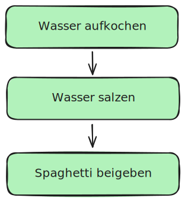
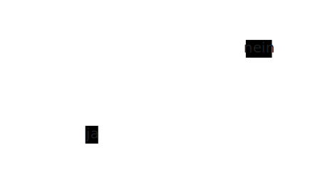
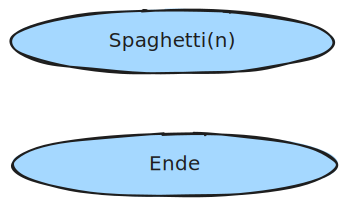
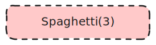
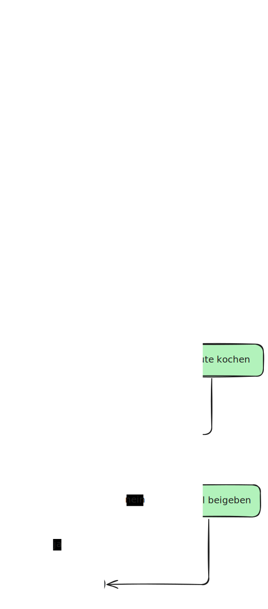
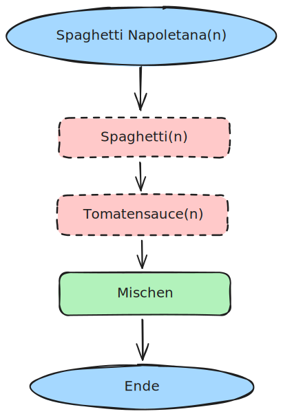
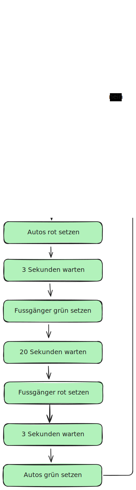
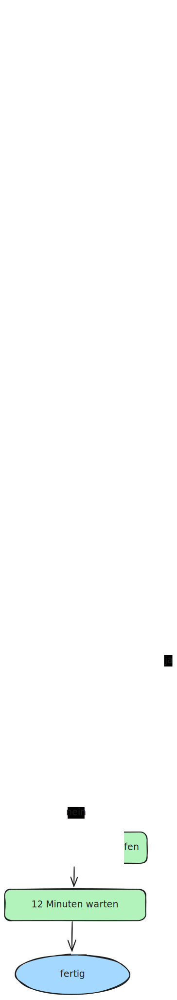

---
sidebar_custom_props:
  source:
    name: mit Inhalten von inf.gbsl.website
    ref: https://inf.gbsl.website/28Gb/Programmieren-1/Algorithmen/Flussdiagramm
page_id: 4f9593d9-7395-4ded-b79d-09a4674f41a2
---

import Excalidoc from '@tdev/excalidoc/Component';
import useBaseUrl from '@docusaurus/useBaseUrl';
import Video from '@tdev-components/Video'

# Flussdiagramm

Ein **Flussdiagramm** (engl. flow chart) ist eine grafische Darstellungsform eines Algorithmus. Es besteht aus Elementen, welche einzelne Schritte des Algorithmus darstellen. Pfeile, welche die Elemente verbinden, geben die Reihenfolge an, in welcher die Schritte ausgeführt werden müssen.

Bei Flussdiagrammen haben fast alle Strukturelemente, die wir bisher kennengelernt haben, eine bestimmtes Symbol:

Schritte, Sequenz
: 
Verzweigung / bedingte Ausführung
: 
Start und Ende
: Werden bei Flussdiagrammen explizit dargestellt, damit man weiss, wo der Algorithmus beginnt und wo er endet.
: Der Start definiert hier einen parameter `n` für die Anzahl Portionen Spaghetti, die wir kochen wollen.
: 
Unterprogramm aufrufen
: Wir rufen ein Unterprogramm `Spaghetti` mit einem Parameter `3` auf, um 3 Portionen Spaghetti zu kochen.
: 

Es ist wichtig, dass wir diese Symbole genau so verwenden, wie sie hier gezeigt werden. So können wir sicherstellen, dass andere Personen, die unser Flussdiagramm lesen, es auch verstehen.

Mit diesem Elementen können wir beispielsweise den Algorithmus für das Kochen von Spaghetti wie folgt ausdrücken:

Nun wissen wir, wie man Spaghetti kocht. Dieses Programm heisst `Spaghetti(n)`, für `n` Portionen. Gehen wir jetzt davon aus, dass wir auch wissen, wie man Tomatensauce kocht. Sagen wir mal, dieses Programm heisst `Tomatensauce(n)`, ebenfalls für `n` Portionen. Damit können wir einen neuen Algorithmus schreiben, mit dem wir `n` Portionen Spaghetti Napoletana kochen können:

Die obigen Diagramme wurden mit einem Tool namens «Excalidraw» erstellt, das Ihnen auch hier auf Classrooms zur Verfügung steht. Hier sehen Sie, wie das Spaghetti-Kochen-Diagramm in Excalidraw entstanden ist::

<Video src={useBaseUrl('/img/tutorials/excalidoc_spaghetti.mov')} />

## Übungen
:::aufgabe[Excalidraw kennenlernen]
<TaskState id="ba47f522-f377-4fbc-b4af-b4f9608d8557" />

Versuchen Sie nun selbst, das Spaghetti-Kochen-Diagramm in Excalidraw nachzubauen:

<Excalidoc id="b691d150-039a-495b-a20d-d1a0a3674da5" />
:::

:::aufgabe[Algorithmus entwickeln: Ampelsteuerung]
<TaskState id="65634ec9-8d37-46ab-b088-ed9c41b4e506" />

An einer Strasse gibt es einen Fussgängerstreifen mit einer Ampel. Wenn ein:e Fussgänger:in den Knopf drückt, wird die Ampel für die Autos nach 30 Sekunden rot. 3 Sekunden später wird die Ampel für die Fussgänger:innen grün. Nach weiteren 20 Sekunden wird die Ampel für die Fussgänger:innen wieder rot und 3 Sekunden später wird die Ampel für die Autos wieder grün. 

**Achtung:** Dieser Algorithmus ist **nicht endlich**. Wenn die Fussgänger:innen einmal durch sind, tut die Ampel wieder solange nichts, bis wieder jemand den Knopf drückt. Es gibt also **kein Ende**.

Erstellen Sie ein Flussdiagramm, das den Algorithmus für diese Ampelsteuerung beschreibt. Es stehen Ihnen folgende Befehle und Eingaben (also «Bedingungen») zur Verfügung:
- Fussgänger rot setzen
- Fussgänger grün setzen
- Autos rot setzen
- Autos grün setzen
- Knopf gedrückt?
- $n$ Sekunden warten (Wert für $n$ kann frei gewählt werden)
- nichts tun

<Excalidoc id="e1f32df7-5b2e-4ca8-869f-0c9fdcd48163" />

<Solution id="37db48bd-e657-49a1-b38a-b087ef07cda2">

</Solution>
:::

:::aufgabe[Schleife in einem Flussdiagramm]
<TaskState id="3b4abb9b-5f69-4021-833d-63ccfe4a249c" />

Flussdiagramme haben kein spezifisches Symbol für Schleife. Mann kann sie aber dennoch darstellen.

Überlegen Sie sich, wie man den folgenden Algorithmus für «Schoggigüezi» – der Schleifen enthält – in einem Flussdiagramm darstellen könnte:

> 200 Gramm Mehl, 100 Gramm Zucker, 50 Gramm Kakaopulver, 100 Gramm weiche Butter und 1 Ei in eine Schüssel geben. Rühren, bis ein glatter Teig entstehen. Ein Stück Teig nehmen, zu einer Kugel formen und auf das Backblech legen. Schritt wiederholen, solange noch Teig übrig sein. Dann das Backblech in den Ofen schieben und 12 Minuten backen.

<Excalidoc id="9d0c43b8-26a7-493a-aa4e-f98ed73c4ebd" />

<Solution id="a363447d-c56b-4efa-9cb9-e1c08da5fddc">

</Solution>

:::

---
