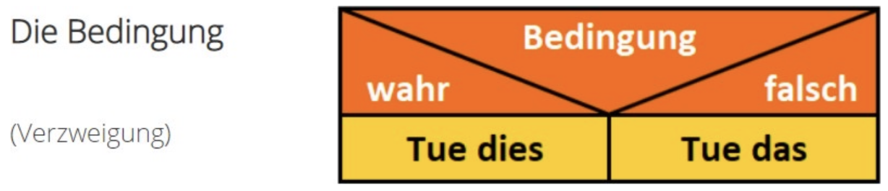

---
sidebar_custom_props:
  source:
    name: inf.gbsl.website
    ref: https://inf.gbsl.website/28Gb/Programmieren-1/Algorithmen/Struktogramme
page_id: 2a7d2aa2-f6fa-466e-a9cd-22aaf95a3007
draft: true
---

import Struktogramm from "@tdev-components/Struktogramm";
import Restricted from '@tdev-components/documents/Restricted';

# Struktogramme
Struktogramme sind eine weitere Möglichkeit, Programme und Algorithmen grafisch darzustellen. Diese Dartstellungsform wurde 1973 von Isaac Nassi und Ben Shneiderman vorgeschlagen und heisst deshalb auch Nassi-Shneiderman-Diagramm.[^1]

:::tip[Farben]
Die hier verwendeten Farben nur eine optische Hilfe. Sie haben keine besondere Bedeutung.
:::

## Sequenz 👣
In einem Struktogramm wird jeder Befehl in einen rechteckigen Kasten geschrieben. Befehle müssen nicht in einer Programmiersprache geschrieben werden.

<Struktogramm program={[
  {type: 'step', code: Mache zuerst das, ...},
  {type: 'step', code: ...dann das hier...},
  {type: 'step', code: ...und nun noch das da.},
]} />

## Schleife 🔁
Eine Schleife («Wiederholung») wird wie folgt dargestellt.

<Struktogramm program={[
  {type: 'repeat', code: Tue Folgendes solange..., block: [
      {type: 'step', code: Mach das...},
      {type: 'step', code: ...und nun noch das da.},
    ]},
]} />

:::tip[Bemerke]
- Beim Struktogramm wird der wiederholte Teil durch die **Einrückung** ersichtlich. Auch in Python werden wiederholte Sequenzen (Zeilen 4-5) visuell mit einem Tabulator eingerückt.
- Der Doppelpunkt am Zeilenende zeigt an, dass eine eingerückte Sequenz (beim Programmieren spricht man von einem *Codeblock*) folgt.
:::

## Bedingte Ausführung (Verzweigung) ☑️
Wenn ein Befehl nur unter bestimmten Bedingungen ausgeführt werden soll, stellen wir dies folgendermassen dar:
<Struktogramm program={[
  {type: 'if', code: Wenn..., block: [
      {type: 'step', code: Tue dies...}
    ]},
  {type: 'else', code: Sonst..., block: [
      {type: 'step', code: Tue jenes...}
    ]},
  ]} />

:::tip[Bemerke]
Für die bedingte Ausführung (auch _Verzweigung_ genannt) gibt es auch andere Darstellungsformen, welche wir hier nicht behandeln.
:::

Nicht bei jedem Algorithmus braucht es einen _Sonst_-Block zu einem _Wenn_-Block. Das zeigt folgendes Beispiel:

<Struktogramm program={[
  {type: 'repeat', code: Solange die Aufgabe nicht gelöst ist:, block: [
      {type: 'step', code: Bearbeiten Sie die Aufgabe},
      {type: 'if', code: Wenn Sie Unterstützung brauchen:, block: [
          {type: 'step', code: Rufen Sie die Lehrperson}
        ]},
    ]},
]} />

Eine Verzweigung kann auch mehr als nur einen oder zwei "Ausgänge" haben. Das können wir mit _Sonst, wenn_-Blöcken ausdrücken:

<Struktogramm program={[
  {type: 'if', code: Wenn es regnet:, block: [
      {type: 'step', code: Ziehe eine Regenjacke an.}
    ]},
  {type: 'elif', code: Sonst, wenn die Sonne scheint:, block: [
      {type: 'step', code: Trage eine Sonnenbrille.}
    ]},
  {type: 'elif', code: Sonst, wenn es kalt ist:, block: [
      {type: 'step', code: Ziehe einen Pullover an.}
    ]},
  {type: 'else', code: Sonst:, block: [
      {type: 'step', code: Ziehe an, was du möchtest.}
    ]},
]} />

:::tip[Bemerke]
- Wir prüfen nur so lange die jeweils nächste Bedingung, **bis eine davon erfüllt ist**.
  - Wenn also die Sonne scheint, prüft der obige Algorithmus nicht mehr, ob es allenfalls trotzdem auch kalt ist.
  - Ein neues _Wenn_ (kein _Sonst, wenn_) würde allerdings eine neue Verzweigung starten: ab da prüfen wir wieder die Bedingungen.
- Der _Sonst_-Block hat **keine Bedingung**. Er wird immer dann ausgeführt, wenn keine der Bedingungen erfüllt ist.
:::

## EVA (Eingabe ‣ Verarbeitung ‣ Ausgabe)
Die meisten Algorithmen **v**erarbeiten eine **E**ingabe und produzieren eine **A**usgabe.

In einem Struktogramm stellen wir dies folgendermassen dar:
<Struktogramm program={[
  {type: 'input', code: Eingabe: },
  {type: 'step', code: xxxxxxxxxxxxxxxxxx},
  {type: 'step', code: x},
  {type: 'repeat', code: x, block: [
      {type: 'step', code: x},
      {type: 'step', code: x},
    ]},
  {type: 'output', code: Ausgabe: },
]} />

## Variablen
Eine **Variable** ist wie eine **Box**, die einen **Wert enthält**, der sich **verändern** kann.

Variablen (hier: Schafe) kennzeichnen wir in einem Struktogramm deshalb auch mit einer "Box", um sie visuell hervorzuheben:
<Struktogramm program={[
  {type: 'step', code: Ich gehe ins Bett},
  {type: 'step', code: Schafe = 0},
  {type: 'repeat', code: Solange ich wach bin..., block: [
      {type: 'step', code: Schafe = Schafe + 1}
    ]},
  {type: 'output', code: Ausgabe: 💤😴💤},
]} />

## Struktogramme in Aktion
### Addition zweier Zahlen
> Nimm zwei Zahlen als Eingabe. Addiere diese Zahlen. Gib die Summe als Ausgabe aus.

### Zahl dekrementieren
> Nimm eine Zahl als Eingabe. Dekrementiere diese Zahl in Einerschritten, solange sie grösser ist als 0. Gib nach jedem Dekrementierungsschritt die aktuelle Zahl aus. Gib am Schluss aus, dass du fertig bist.

<Restricted id='87f735d7-ea4e-4393-8845-1a9ff7aec052'>
  ## Übungen
  ### Struktogramme analysieren
  :::aufgabe[Struktogramme analysieren 1]{scroll}
  <TaskState id='aca15e4a-86da-4842-ab6b-232c9c054675' />
  ::pdf[./pdf/ab_struktogramme_analysieren_1.pdf]{scroll}
  <Solution id='45abefd3-10e5-4b86-92ad-f709d0c563bd'>
    Die Musterlösungen finden Sie [hier](https://erzbe-my.sharepoint.com/:b:/g/personal/silas_berger_gbsl_ch/EbUHxMCo8HtPisGXoY10mK0BeehbVm-dbaHObSEPtVpQ0Q?e=SigseJ).
  </Solution>
  :::

  :::aufgabe[Struktogramme analysieren 2]
  <TaskState id='69ba9a39-1a58-4052-8dce-dad60daf44c5' />
  ::pdf[./pdf/ab_struktogramme_analysieren_2.pdf]{scroll}
  <Solution id='38118731-0dd8-49ab-8221-74672ed3b8c0'>
    Die Musterlösungen finden Sie [hier](https://erzbe-my.sharepoint.com/:b:/g/personal/silas_berger_gbsl_ch/EXepdPmXRUNGtHkzIEwuaUkBcgKzA5kNuOzeEX1BUDD9pw?e=VrKrdp).
  </Solution>
  :::

  ### Struktogramme erstellen
  ::::aufgabe[Struktogramme erstellen]
  <TaskState id='88070463-3b1a-46b1-8f1c-45d57ae9043e' />
  Bearbeiten Sie [dieses Arbeitsblatt](https://erzbe-my.sharepoint.com/:b:/g/personal/silas_berger_gbsl_ch/EWzCWfMfMLhDvV6xGRHQd_EBX0OGObZitPZuC2e0ugX8dw?e=M2EHbm).

  :::tip[Alternative Darstellung]
  In diesen Arbeitsblatt wird auf Seite 5 für die Verzweigung eine alternative Darstellung verwendet:
  
  Sie dürfen aber weiterhin die Darstellung verwenden, die Sie bereits kennen.
  :::

  <Solution id='2950590e-b73f-4d68-a42c-54095d2f90ff'>
    **Aufgabe 1**
    <Struktogramm program={[
      {type: 'step', code: x = 2},
      {type: 'step', code: y = 6},
      {type: 'step', code: z = y - x},
      {type: 'step', code: y = 4},
      {type: 'step', code: z = z + y},
      {type: 'output', code: Ausgabe: z},
    ]} />

  ---

  **Aufgabe 2**
  <Struktogramm program={[
    {type: 'input', code: Eingabe: a},
    {type: 'input', code: Eingabe: b},
    {type: 'step', code: Ergebnis = 0},
    {type: 'step', code: Zähler = 0},
    {type: 'repeat', code: Solange Zähler &lt; b, block: [
        {type: 'step', code: Ergebnis = Ergebnis + a},
        {type: 'step', code: Zähler = Zähler + 1}
      ]},
    {type: 'output', code: Ausgabe: Ergebnis},
  ]} />

  ---

  **Aufgabe 3**
  <Struktogramm program={[
    {type: 'input', code: Eingabe: n},
    {type: 'step', code: Ergebnis = 1},
    {type: 'step', code: Zähler = 1},
    {type: 'repeat', code: Solange Zähler ≤ n, block: [
        {type: 'step', code: Ergebnis = Ergebnis * Zähler},
        {type: 'step', code: Zähler = Zähler + 1}
      ]},
    {type: 'output', code: Ausgabe: Ergebnis},
  ]} />

  ---

  **Aufgabe 4**
  <Struktogramm program={[
    {type: 'input', code: Eingabe: Radius},
    {type: 'step', code: Fläche = Radius * Radius * π},
    {type: 'output', code: Ausgabe: Fläche},
  ]} />

  ---

  **Aufgabe 5**
  <Struktogramm program={[
    {type: 'input', code: Eingabe: Zahl},
    {type: 'if', code: Wenn Zahl gerade, block: [
        {type: 'step', code: Ergebnis = Zahl * 2}
      ]},
    {type: 'else', code: Sonst, block: [
        {type: 'step', code: Ergebnis = Zahl + 1}
      ]},
    {type: 'output', code: Ausgabe: Ergebnis},
  ]} />

  **Zusatzaufgabe**: Eine Zahl ist gerade, wenn Sie restlos durch 2 teilbar ist.\
  Beim Programmieren können wir das wie folgt prüfen: `Zahl % 2 == 0`.\
  Der Operator `%` heisst _Modulo-Operator_. Keine Sorge, wenn Sie das jetzt noch nicht vollständig verstehen 😉.

  ---

  **Aufgabe 6**\
  (gestrichen)

  ---

  **Aufgabe 7**
  <Struktogramm program={[
    {type: 'input', code: Eingabe: Jahr},
    {type: 'if', code: Wenn Jahr teilbar durch 4, block: [
        {type: 'if', code: Wenn Jahr teilbar durch 100, block: [
            {type: 'if', code: Wenn Jahr teilbar durch 400, block: [
                {type: 'output', code: Ausgabe: "Schaltjahr"}
              ]},
            {type: 'else', code: Sonst, block: [
                {type: 'output', code: Ausgabe: "Kein Schaltjahr"}
              ]}
          ]},
        {type: 'else', code: Sonst, block: [
            {type: 'output', code: Ausgabe: "Schaltjahr"}
          ]}
      ]},
    {type: 'else', code: Sonst, block: [
        {type: 'output', code: Ausgabe: "Kein Schaltjahr"}
      ]},
  ]} />

  ---

  **Aufgabe 8**
  <Struktogramm program={[
    {type: 'input', code: Eingabe: menge},
    {type: 'if', code: menge ≥ 100, block: [
        {type: 'step', code: rabatt = 10}
      ]},
    {type: 'elif', code: Sonst, wenn menge ≥ 50, block: [
        {type: 'step', code: rabatt = 7}
      ]},
    {type: 'elif', code: Sonst, wenn menge ≥ 10, block: [
        {type: 'step', code: rabatt = 5}
      ]},
    {type: 'else', code: Sonst, block: [
        {type: 'step', code: rabatt = 0}
      ]},
    {type: 'output', code: Ausgabe: rabatt},
  ]} />

  **Hinweis:** Hier verwenden wir eine Kombination aus `Wenn...` und `Sonst...`: nämlich `Sonst, wenn...`.

  </Solution>
  ::::
</Restricted>

[^1]: Quelle: [rothe.io](https://rothe.io/?b=prog1&p=905106)
