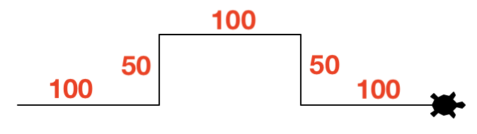
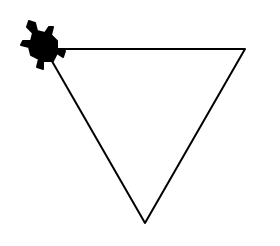
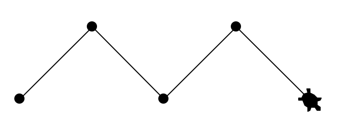
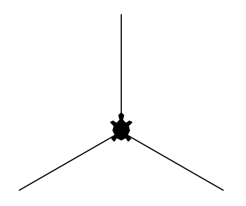
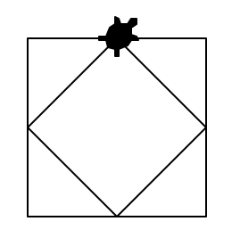
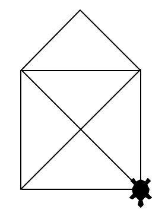
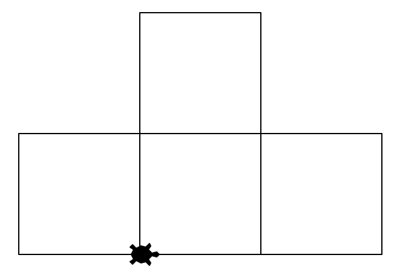

# Turtle bewegen
Jetzt können Sie selber aktiv werden und Ihre ersten Turtle-Zeichnungen erstellen!

## Aufgaben
:::aufgabe[aufgabe_1.py]
<TaskState id='bf995213-a8f9-4a22-8641-0e3ccd558edf'/>
Schreiben Sie ein Turtle-Programm, das folgende Figur mit den angegebenen Längen zeichnet (die Längenangaben müssen Sie natürlich nicht mitzeichnen 😉):



```py live_py id=67cf2bde-fcc1-49ce-8aed-aa866dd3318c
```

<Solution id='a7a23d1a-6922-4678-bf8a-b54e6a3cee8f'>
  ```py live_py readonly slim
  from turtle import *

  shape('turtle')

  forward(100)
  left(90)
  forward(50)
  right(90)
  forward(100)
  right(90)
  forward(50)
  left(90)
  forward(100)

  done()
  ```
</Solution>
:::

:::aufgabe[aufgabe_2.py]
<TaskState id='5d40ff0e-682a-45ba-8585-51dc9f1d0fef'/>
Erstellen Sie ein Turtle-Programm, das ein gleichseitiges Dreieck mit einer Seitenlänge von $100$ zeichnet. Finden Sie den korrekten Drehwinkel heraus?



```py live_py id=4320e039-f16e-40a6-b5a7-cc2804933eb0
```

<Solution id='186e35a4-1f14-412e-8764-269c1dd06e60'>
  ```py live_py readonly slim
  from turtle import *

  shape('turtle')

  forward(100)
  right(120)
  forward(100)
  right(120)
  forward(100)

  done()
  ```
</Solution>
:::

::::aufgabe[aufgabe_3.py]
<TaskState id='689d6af6-4f41-4b25-b71f-534105363d8d'/>
Erstellen Sie ein Turtle-Programm, das diese Zeichnung erstellt (Strichlänge `100`):



:::tip[Hinweis]
Verwenden Sie den Befehl `dot(d)` um einen Punkt mit dem Durchmesser `d` zu zeichnen.
:::

```py live_py id=c7327a19-d0f3-47b8-ae7e-d25817a15220
```

<Solution id='7ab4f2fc-ee77-49d6-9c9c-102d69a21624'>
  ```py live_py readonly slim
  from turtle import *

  shape('turtle')

  dot(10)
  left(45)
  forward(100)
  dot(10)
  right(90)
  forward(100)
  dot(10)
  left(90)
  forward(100)
  dot(10)
  right(90)
  forward(100)
  dot(10)

  done()
  ```
</Solution>
::::

::::aufgabe[aufgabe_4.py]
<TaskState id='385834f3-872d-4ff2-8770-aee3bce11606'/>
Erstellen Sie ein Turtle-Programm, das diese Zeichnung erstellt (Strichlänge `100`):



:::tip[Hinweis]
Verwenden Sie den Befehl `back(n)` um mit der Turtle `n` Schritte zurückzugehen.
:::

```py live_py id=36b27786-cd9f-45b1-9409-705ff3319760
```

<Solution id='0dff4d76-a16f-4bbc-9f49-645fcce11078'>
  ```py live_py readonly slim
  from turtle import *

  shape('turtle')

  left(90)
  forward(100)
  back(100)
  right(120)
  forward(100)
  back(100)
  right(120)
  forward(100)
  back(100)
  right(120)

  done()
  ```
</Solution>
::::

::::aufgabe[aufgabe_5.py]
<TaskState id='9dd480ce-de8d-44ef-8a45-e4d1b1a016a1'/>
Zeichnen Sie mit der Turtle zwei Quadrate ineinander, wobei das äussere Quadrat eine Seitenlänge von `100` haben soll:



:::tip[Hinweis]
Bei der Bestimmung der Seitenlänge des inneren Quadrats wird Ihnen Pythagoras behilflich sein 😉. Rechnen Sie es aus und runden Sie das Ergebnis auf die nächste Ganzzahl.
:::

```py live_py id=fc32ae35-d07f-4509-874b-394608e6893e
```

<Solution id='e892a2d2-5164-4636-8728-c74a5b489405'>
  ```py live_py readonly slim
  from turtle import *

  shape('turtle')

  forward(50)
  right(90)
  forward(100)
  right(90)
  forward(100)
  right(90)
  forward(100)
  right(90)
  forward(50)

  right(45)
  forward(71)
  right(90)
  forward(71)
  right(90)
  forward(71)
  right(90)
  forward(71)

  done()
  ```
</Solution>
::::

::::aufgabe[aufgabe_6.py]
<TaskState id='8f181f25-b948-4222-9bcd-c488d7090575'/>
Zeichen Sie mit der Turtle das "Haus vom Nikolaus". Sie sollen also genau 8 Linien zeichnen, und somit genau 8x den Befehl `forward(n)` (und nie `back(n)`) verwenden. Verwenden Sie für das "Basis-Quadrat" eine Seitenlänge von `100`.



:::tip[Hinweis]
Für die Länge Diagonalen können Sie den Wert aus der vorheringen Aufgabe wiederverwenden.
:::

```py live_py id=c123d29b-3fa0-4a5c-8b52-06602c0d93ee
```

<Solution id='76cd08a0-5ee7-44da-bebb-6ef0506c2c13'>
  ```py live_py readonly slim
  from turtle import *

  shape('turtle')

  forward(100)
  left(135)
  forward(142)
  right(135)
  forward(100)
  left(135)
  forward(71)
  left(90)
  forward(71)
  left(45)
  forward(100)
  left(135)
  forward(142)
  right(135)
  forward(100)

  done()
  ```
</Solution>
::::

:::aufgabe[aufgabe_7.py]
<TaskState id='b67449e6-f9b8-4d2e-a18d-02e658f98b83'/>
Zeichnen Sie mit der Turtle diese "Tetris-Figur" aus Quadraten mit je einer Seitenlänge von `100`. Es ist egal, wo die Figur beginnt und endet.



```py live_py id=885f9ae1-1b60-4e4a-81f9-973a9a2de814
```

<Solution id='2e9b8153-73fe-4da3-b727-230a66fde55f'>
  ```py live_py readonly slim
  from turtle import *

  shape('turtle')

  forward(100)
  left(90)
  forward(100)
  left(90)
  forward(100)
  back(100)
  right(90)
  forward(100)
  left(90)
  forward(100)
  left(90)
  forward(200)
  left(90)
  forward(200)
  left(90)
  forward(100)
  left(90)
  forward(300)
  left(90)
  forward(100)
  left(90)
  forward(100)

  done()
  ```
</Solution>
:::

---