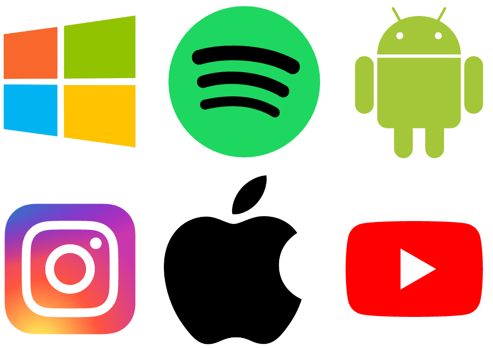

# ⭐️ Zusatzaufgaben
:::warning[Auf der Webseite arbeiten]
Erledigen Sie alle Aufgaben direkt hier auf der Webseite. Thonny brauchen Sie nicht.
:::

::::aufgabe[Aufgabe 1]
<TaskState id='a348e952-ee38-4cab-a462-273eca98e970' />
Versuchen Sie mit der Turtle eines (oder mehrere) der folgenden Logos so gut wie möglich nachzuzeichnen.



:::tip[Die richtigen Farben verwenden]
Wenn Sie das Bild herunterladen (__:mdi[cursor-default-click] Rechtskick__ > __Bild speichern unter...__) und es dann in [diesem Tool](https://imagecolorpicker.com/) hochladen, können Sie mit der Maus auf die verschiedenen Bereiche klicken, um die jeweilige Farbe herauszufinden.

Kopieren Sie jeweils den **HEX-Code** heraus (das ist der Wert, der mit einem `#` beginnt).

Den HEX-Code können Sie anschliessend wie eine ganz normale Farbe verwenden. Für den grünen Teil des Windows-Logos wäre das zum Beispiel:
```py
fillcolor('#91c300')
pencolor('#91c300')
```
:::

:::tip[Kreise und Halbkreise]
Schauen Sie sich im [Cheatsheet](../Cheatsheet-Turtle-Befehle) nochmal den Befehl `circle(r, w)` genau an.
:::

```py live_py title=Windows id=02182a23-11fa-462b-b6af-e386767974ae
```

```py live_py title=Spotify id=3cb6b232-b6d6-4247-9f48-4d962c39412b
```

```py live_py title=Android id=b9cb1bf7-0293-4b3f-994a-f29d2039f8e0
```

```py live_py title=Instagram id=0056fe7b-1848-4c16-bad2-b961bc8a13fe
```

```py live_py title=Apple id=53f3adeb-33a3-4bc9-b03c-c592a3b94cf4
```

```py live_py title=YouTube id=ec85274b-35eb-4cd2-a833-a984dcf62ec2
```
::::

::::aufgabe[Eigenes Logo designen]
<TaskState id='36aa534a-651a-494c-9f08-06a30e0f61ee' />
Werden Sie kreativ! Designen Sie auf Papier Ihr eigenes Logo, z.B. für Ihre Klasse, Ihren Sportverein, Ihr Cookie-Business, ...

Zeichnen Sie das Logo anschliessend mit der Turtle nach.

```py live_py title=logo.py id=fcefe2d0-7301-4714-a39b-c4bf18232609
```
::::

::::aufgabe[Labyrinth]
<TaskState id='f769eedb-d4ad-43ac-ac25-7dc1c8e11adc' />
:mdi[account-supervisor] Suchen Sie sich für diese Aufgabe eine:n Partner:in.

Zeichnen Sie mit der Turtle nun je (unabhängig voneinander) ein möglichst spannendes Labyrinth.


Erstellen Sie anschliessend ein Screenshot vom gezeichneten Labyrinth und senden Sie es ihrer Partner:in. Lösen Sie gegenseitig Ihre Labyrinthe (am besten mit einem digitalen Stift).
```py live_py title=labyrinth.py id=964db73c-edca-4949-bdd0-46ca46b5f322
```
::::

---