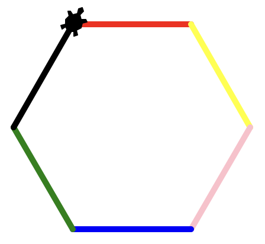
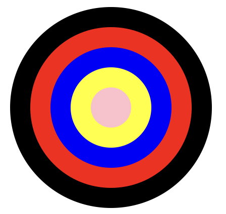
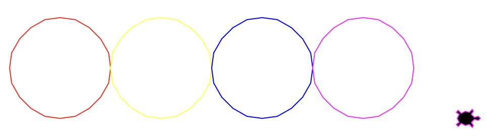
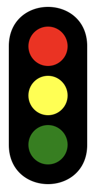
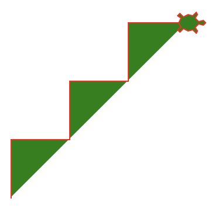
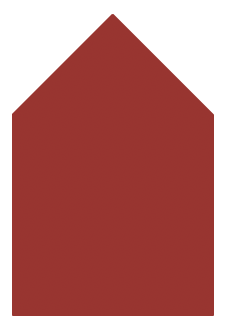
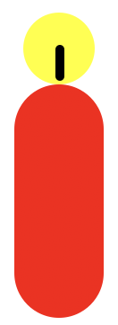
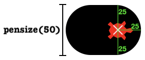
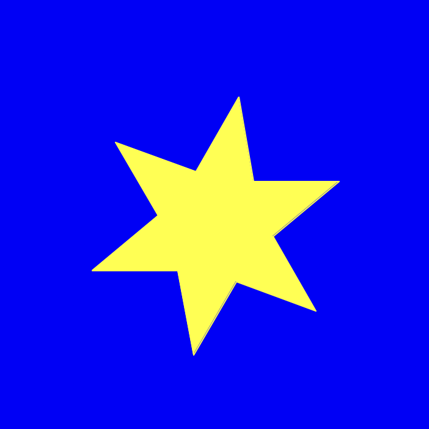

# Farben verwenden 🎨
## Vorbereitung
:::aufgabe[Ordner vorbereiten]
<TaskState id='edf3a53f-fe63-43b0-b72c-532ee49c187b' />
1. Im __Programmieraufgaben__-Ordner (siehe [vorheriges Kapitel](../Turtle-Bewegen)) einen neuen Ordner namens __02_Farben_verwenden__ erstellen
3. Thonny öffnen
   1. Sicherstellen, dass der [Dateibereich](../../Thonny/Thonny-Verwenden#dateibereich) angezeigt wird
   2. Im Dateibereich zum Ordner __02_Farben_verwenden__ [navigieren](../../Thonny/Thonny-Verwenden#navigieren)
:::

:::aufgabe[Ordner abgeben]
<TaskState id='4f4d11af-13ab-4080-a19a-cd4b054c8e6f'/>
Erstellen Sie einen OneDrive-Freigabelink für den Ordner __02_Farben_verwenden__ mit Sichtbarkeit für **_Personen in EDUBERN_**.

**Achtung:** Nur den Link kopieren, kein E-Mail senden!

Fügen Sie den kopierten Link hier ein:
<String placeholder='https://erzbe-my.sharepoint.com/...' inputWidth='30em' id='c63bda8f-f3b6-40c2-bf53-49ac317ce549'/>
:::

## Aufgaben
Gehen Sie **bei jeder dieser Aufgaben** wieder folgendermassen vor:
1. Erstellen Sie in Thonny eine neue Datei.
2. Speichern Sie die Datei im Ordner __02_Farben_verwenden__ ab — und zwar mit dem Namen der Aufgabe in Kleinbuchstaben (z.B. `aufgabe_1.py`, siehe unten).

:::tip[Cheatsheet]
Denken Sie auch an das [Cheatsheet](../Cheatsheet-Turtle-Befehle) — es wird Ihnen eine Hilfe sein!
:::

::::aufgabe[aufgabe_1.py]
<TaskState id='c7293cfe-20f5-42a6-bbd0-d098e2976568' />
Zeichnen Sie mit der Turtle ein regelmässiges Sechseck und verwenden Sie dabei für jede Seite eine andere Farbe.



:::tip[pensize(n)]
Mit dem Befehl `pensize(n)` können Sie die Dicke des Stifts verändern, damit die Linien deutlicher zu sehen sind.
:::

<Solution id='3b710afe-5484-4802-8168-55fe901bd31c'>
  ```py live_py readonly slim
  from turtle import *

  shape('turtle')

  pensize(5)

  pencolor('red')
  forward(100)
  right(60)

  pencolor('yellow')
  forward(100)
  right(60)

  pencolor('pink')
  forward(100)
  right(60)

  pencolor('blue')
  forward(100)
  right(60)

  pencolor('green')
  forward(100)
  right(60)

  pencolor('black')
  forward(100)

  done()
  ```
</Solution>
::::

:::aufgabe[aufgabe_2.py]
<TaskState id='d2c9e17a-3ae8-4e84-b259-2745d2c1379e' />
Zeichnen Sie folgende Figur. Am Schluss soll die Turtle nicht mehr sichtbar sein.



<Solution id='5f8b3ed1-d025-41c1-b7b4-16a82a0b41af'>
  ```py live_py readonly slim
  from turtle import *

  hideturtle()

  pencolor('black')
  dot(200)

  pencolor('red')
  dot(160)

  pencolor('blue')
  dot(120)

  pencolor('yellow')
  dot(80)

  pencolor('pink')
  dot(40)

  done()
  ```
</Solution>
:::

::::aufgabe[aufgabe_3.py]
<TaskState id='fa754d9e-90b6-4418-96e8-feae18ad3955' />
Zeichnen Sie solche Kreise mit den Farben `'red'`, `'yellow'`, `'blue'`, `'magenta'`.



Die Kreise sollen einander berühren. Es sollen aber keine zusätzlichen Striche Sichtbar sein (nur die Kreise).

:::tip[back(n)]
Damit die Turtle nicht aus dem Fenster rennt, können Sie sie am Anfang mit dem Befehl `back(n)` etwas nach links bewegen.
:::

<Solution id='6dd5c050-76cc-4577-8d22-80911272bc6c'>
  ```py live_py readonly slim
  from turtle import *

  shape('turtle')

  penup()
  back(200)
  pendown()

  pencolor('red')
  circle(50)
  penup()
  forward(100)
  pendown()

  pencolor('yellow')
  circle(50)
  penup()
  forward(100)
  pendown()

  pencolor('blue')
  circle(50)
  penup()
  forward(100)
  pendown()

  pencolor('magenta')
  circle(50)
  penup()
  forward(100)
  pendown()

  done()
  ```
</Solution>
::::

::::aufgabe[aufgabe_4.py]
<TaskState id='65826cef-2f0a-4ad0-9037-73552f50db5c' />
Zeichnen Sie die folgende Ampel. Die Turtle soll am Schluss nicht zu sehen sein.


:::tip[Hintergrund]
Den schwarzen Hintergrund zeichnen Sie am einfachsten mit `pensize(80)`.
:::

<Solution id='6a705aaf-97ea-4daf-acd9-6469d167402f'>
  ```py live_py readonly slim
  from turtle import *

  hideturtle()

  right(90)
  pensize(80)
  forward(100)
  back(100)

  penup()

  pencolor('red')
  dot(40)

  forward(50)
  pencolor('yellow')
  dot(40)

  forward(50)
  pencolor('green')
  dot(40)

  done()
  ```
</Solution>
::::

::::aufgabe[aufgabe_5.py]
<TaskState id='5935ba9f-5fbd-46dc-970c-7e4851742668' />
Zeichnen Sie eine solche Treppe mit rotem Stift und grüner Füllung.


:::tip[Hintergrund]
Das Füllen funktioniert auch dann, wenn die Figur eigentlich nicht geschlossen ist. Es gibt quasi eine "imaginäre Linie" zwischen dem Start- und dem Endpunkt der Figur.
:::

<Solution id='20667379-ebc5-41a0-8d41-c51bbd19cc8d'>
  ```py live_py readonly slim
  from turtle import *

  shape('turtle')

  pencolor('red')

  fillcolor('green')
  begin_fill()

  left(90)
  forward(50)
  right(90)
  forward(50)

  left(90)
  forward(50)
  right(90)
  forward(50)

  left(90)
  forward(50)
  right(90)
  forward(50)

  end_fill()

  done()
  ```
</Solution>
::::

::::aufgabe[aufgabe_6.py]
<TaskState id='81031adb-9f7b-4837-bdb6-beec9e455e2a' />
Zeichnen Sie mit der Turtle das untenstehende Haus. Die Turtle soll am Ende nicht sichtbar sein.


<Solution id='559c2c6b-7a8c-492e-a820-02d753ce722c'>
  ```py live_py readonly slim
  from turtle import *

  shape('turtle')

  pencolor('brown')
  fillcolor('brown')
  begin_fill()

  forward(100)
  left(90)
  forward(100)
  left(45)
  forward(71)
  left(90)
  forward(71)
  left(45)
  forward(100)

  end_fill()

  hideturtle()

  done()
  ```
</Solution>
::::

::::aufgabe[aufgabe_7.py]
<TaskState id='84bc9bb3-869b-4932-859f-50ab020e5603' />
Zeichnen Sie mit der Turtle eine solche Kerze. Die Turtle soll am Ende nicht mehr zu sehen sein.


:::tip[Stiftbreite und -Position]
Der Stift befindet sich genau in der Mitte der Turtle (hier markiert mit dem weissen Kreuz). Mit `pensize(d)` setzen wir die Breite des Stifts auf einen Durchmesser von `d`. Wenn wir also z.B. `pensize(50)` verwenden, dann zeichnet der Stift in einem Radius von `25` rund um die Turtle herum.


<details>
  <summary>Mehr zu diesem Bild...</summary>
  <div>
    Das obige Bild ist mit folgendem Programm entstanden:
    ```py live_py slim
    from turtle import *

    shape('turtle')

    pencolor('black')

    pensize(50)
    forward(25)

    fillcolor('red')
    pencolor('red')

    done()
    ```
  </div>
</details>
:::

<Solution id='763b487a-cbdb-4884-ba4d-7c334eaca425'>
  ```py live_py readonly slim
  from turtle import *

  shape('turtle')

  pencolor('yellow')
  dot(40)

  pencolor('black')
  pensize(5)
  right(90)
  forward(15)

  penup()
  forward(30)
  pendown()

  pencolor('red')
  pensize(50)
  forward(100)

  hideturtle()

  done()
  ```
</Solution>
::::

::::aufgabe[aufgabe_8.py]
<TaskState id='b137b1aa-f58e-4212-8552-554f35de538a' />
Zeichnen Sie einen gelben Stern auf einem blauen Hintergrund. Die Turtle soll am Ende nicht mehr zu sehen sein.


:::tip[Hintergrundfarbe]
Schauen Sie auf dem [Cheatsheet](Cheatsheet-Turtle-Befehle) nach, wie Sie die Hintergrundfarbe ändern können.
:::

<Solution id='b1d35411-d673-4bdd-9074-4989ffae67fa'>
  ```py live_py readonly slim
  from turtle import *

  shape('turtle')

  bgcolor('blue')

  pencolor('yellow')
  fillcolor('yellow')
  begin_fill()

  forward(70)
  right(140)
  forward(70)
  left(80)

  forward(70)
  right(140)
  forward(70)
  left(80)

  forward(70)
  right(140)
  forward(70)
  left(80)

  forward(70)
  right(140)
  forward(70)
  left(80)

  forward(70)
  right(140)
  forward(70)
  left(80)

  forward(70)
  right(140)
  forward(70)
  left(80)

  end_fill()

  hideturtle()

  done()
  ```
</Solution>
::::

:::aufgabe[⭐️ aufgabe_9.py]
<TaskState id='54c99261-176b-4c70-83e7-078b4176b4b3' />
Zeichnen Sie mit der Turtle eine der folgenden Staatsflaggen:

:::

---