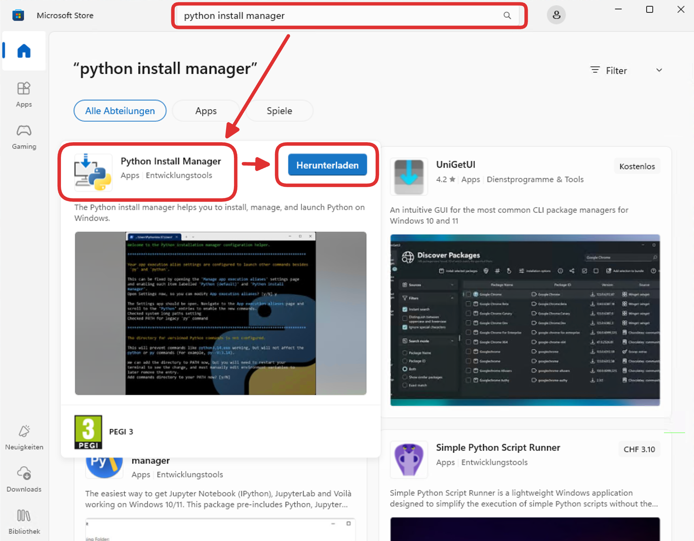
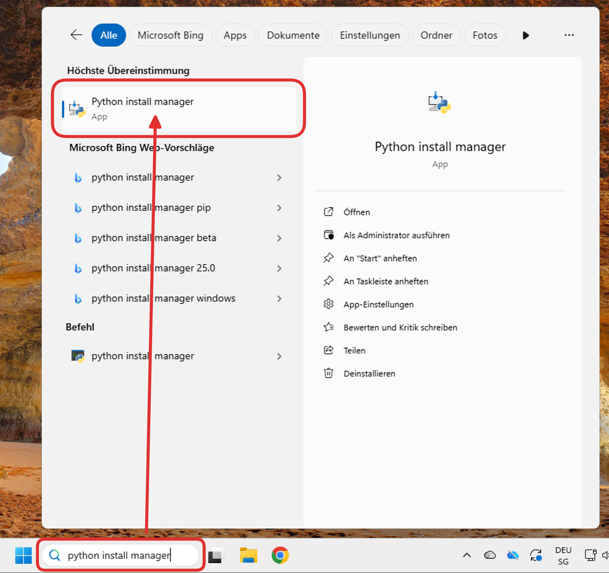
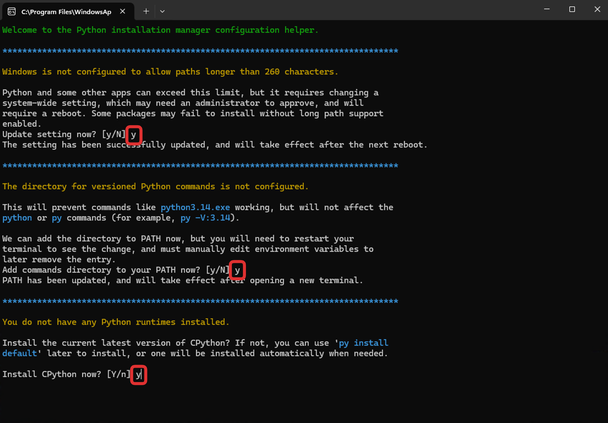
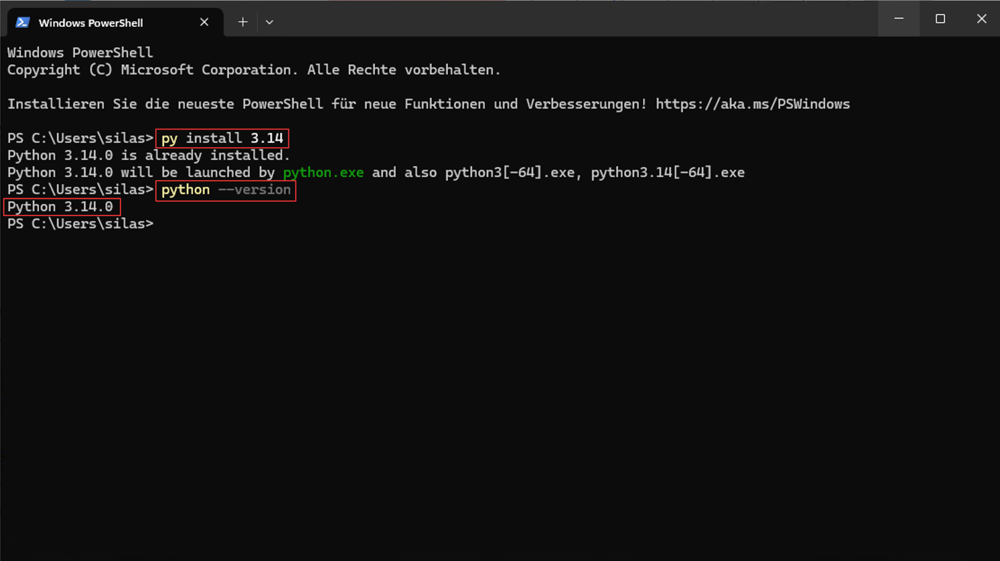

import OsTabs from '@tdev-components/OsTabs'

# VSCode einrichten
## VSCode installieren
Laden Sie sich auf der [offiziellen Webseite](https://code.visualstudio.com/download) die korrekte Version der VSCode-Installationsdatei herunter:


Die heruntergeladene Datei finden Sie anschliessend im `Downloads`-Ordner. Damit können Sie das Programm installieren, wie Sie es im Kapitel «BYOD-Basics» gelernt haben. Sie können bei allen Installationsschritten die Standardeinstellungen akzeptieren.

:::tip[Brauchen Sie einen Refresher?]
Falls Sie nicht mehr genau wissen, wie man ein Programm installiert, nutzen Sie die Suchfunktion auf Classrooms! Suchen Sie z.B. mal nach «Programm installieren».
:::

:::aufgabe[VSCode installieren]
<TaskState id="51d05894-a255-4372-b6fa-e2e7ef0ec7d3" />
Markieren Sie diese Aufgabe als erledigt, sobald Sie VSCode auf Ihrem Computer installiert haben.
:::

## Python installieren
Um ein Python-Programm ausführen zu können, müssen wir auf unserem Computer die Python-Umgebung installiert haben. Da VSCode nicht spezifisch auf Python ausgerichtet ist, müssen wir diese Umgebung noch separat installieren.

:::warning[Keine Sorge!]
Die Installation von Python ist etwas komplexer als die Installation von «normalen» Programmen. Sie müssen dazu einige Befehle in einem sogenannten **Terminal** (dt.: _Kommandozeile_) eingeben, was auf den ersten Blick etwas einschüchternd wirken kann.

Lassen Sie sich davon nicht abschrecken! Folgen Sie einfach den untenstehenden Anweisungen für Ihr Betriebssystem (Windows oder macOS) Schritt für Schritt.
:::

<OsTabs>
  <TabItem value="win">
  Öffnen Sie den _Microsoft Store_, suchen Sie nach `python install manager` und laden Sie die entsprechende App herunter:

  

  Danach können Sie den _Microsoft Store_ wieder schliessen.

  Öffnen Sie nun den _Python install manager_ über die globale Suche:

  

  Es öffnet sich anschliessend ein sogenanntes _Terminal_, in dem Sie die Ersteinstellungen vornehmen können. Sie müssen darin zuerst drei Fragen mit «ja» beantworten, indem Sie jeweils `y` (für _yes_) eingeben und mit [[Enter]] bestätigen:

  

  Die vierte Frage (`View online help?`) können Sie mit «nein» beantworten: [[n]] → [[Enter]].

  Sobald das _Terminal_ sich geschlossen hat, **starten Sie Ihren Computer neu**, damit die Änderungen übernommen werden.

  Nach dem Neustart, öffnen Sie über die globale Suche das Programm `Terminal`. Dort geben Sie zuerst den folgenden Befehl ein und bestätigen ihn mit [[Enter]]:
  
  ```bash
  py install 3.14
  ```

  Prüfen Sie, ob keine Fehlermeldung erscheint. Dann geben Sie noch folgenden Befehl ein und bestätigen ihn wieder mit [[Enter]]:
   
  ```bash
  python --version
  ```

  Kontrollieren Sie dann noch, dass in der «Antwort» (also in der _Ausgabe_ des Befehls) die Version `3.14.x` angegeben wird (die letzte Zahl kann variieren). Am Schluss sollte Ihr _Terminal_ in etwa so aussehen:

  

  Sie können das Terminal-Fenster nun schliessen – die Einrichtung von Python ist abgeschlossen.
  </TabItem>

  <TabItem value="mac">
  Schon vorhanden? Brew? Bessere Lösung?
  </TabItem>
</OsTabs>

:::aufgabe[VSCode installieren]
<TaskState id="65b85324-0404-430b-a985-b55db916a3fb" />
Markieren Sie diese Aufgabe als erledigt, sobald Sie Python auf Ihrem Computer installiert und auf die korrekte Version (`3.14.x`) geprüft haben.
:::

---