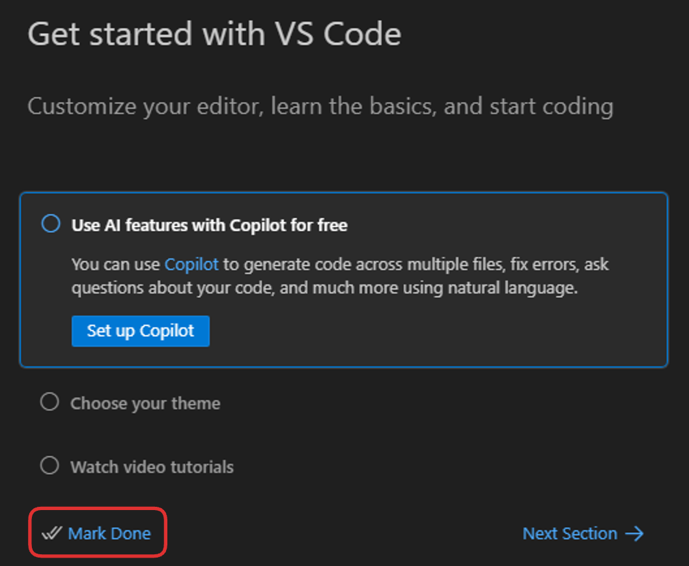
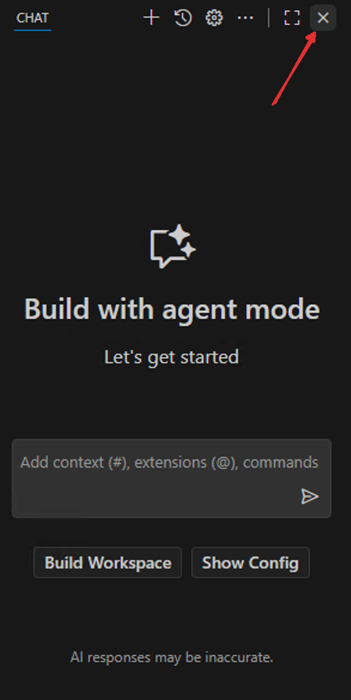
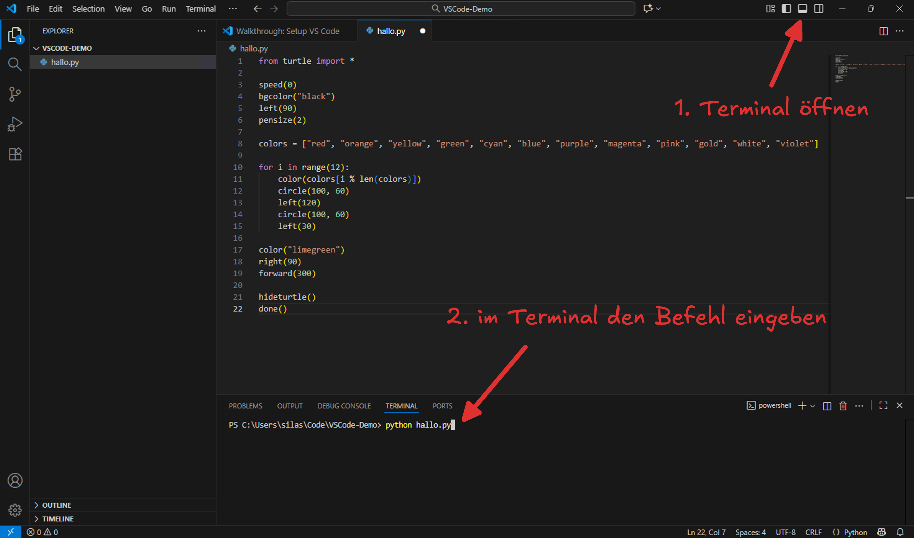

# VSCode kennenlernen
## Tour-de-VSCode
- Ordner öffnen: Achtung, Ordner muss offen sein, nicht nur angewählt
- Dateibaum
- Code-Editor-Bereich
- Terminal
- Extensions

## Ein erstes Demo-Projekt
Erstellen Sie zuerst irgendwo auf Ihrem Computer (muss nicht zwingend in OneDrive sein) einen neuen Ordner namens `VSCode-Demo` (das können Sie ganz normal im Datei-Explorer machen, also noch nicht in VSCode).

Anschliessend öffnen Sie VSCode (über die globale Suche / die Spotlight-Suche), falls Sie das Programm noch nicht geöffnet haben. Dort klicken Sie auf __File__ → __Open Folder...__ und wählen dann den Ordner `VSCode-Demo` aus, den Sie gerade erstellt haben.

Falls Sie gefragt werden, ob Sie dem Ordner vertrauen wollen, klicken Sie auf **Yes, I trust the authors**:


Womöglich erscheint anschliessend ein Bildschirm zur Ersteinrichtung von VSCode. Diesen können Sie einfach mit __Mark Done__ schliessen, ohne die die angebotenen Optionen anzuwählen:



Das Chat-Fenster am rechten Rand können Sie schliessen, um etwas Platz zu schaffen:



Nun erstellen Sie links im Explorer direkt im Ordner `VSCode-Demo` eine neue Datei ([[:mdi[cursor-default-click] Rechtsklick]] in den leeren Bereich unter dem Ordnernamen → __New File…__):


Nennen Sie die Datei `hallo.py` und drücken Sie [[Enter]]. Die Datei wird anschliessend automatisch im Code-Editor-Bereich geöffnet. Bei Ihnen sollte VSCode nun in etwa so aussehen:


:::warning[Tabs]
Sie können in VSCode mehrere Dateien gleichzeitig geöffnet haben. Jede Datei wird dabei in einem **Tab** dargestellt, wie auch in einem Webbrowser. 

Achten Sie deshalb genau darauf, welcher Tab gerade aktiv ist, wenn Sie etwas schreiben oder ändern wollen, damit Sie nicht versehentlich die falsche Datei bearbeiten. In der Abbildung oben sehen Sie z.B., dass die Datei `hallo.py`, weil der entsprechende Tab hervorgehoben ist.
:::

Nun können Sie in der Datei `hallo.py` den folgenden Code eingeben, indem Sie ihn hier kopieren und in den Code-Editor-Bereich dieser Datei einfügen:

```python showLineNumbers
from turtle import *

speed(0)
bgcolor("black")
left(90)
pensize(2)

colors = ["red", "orange", "yellow", "green", "cyan", "blue", "purple", "magenta", "pink", "gold", "white", "violet"]

for i in range(12):
    color(colors[i % len(colors)])
    circle(100, 60)
    left(120)
    circle(100, 60)
    left(30)

color("limegreen")
right(90)
forward(300)

hideturtle()
done()
```

:::danger[Speichern]
VSCode speichert nicht automatisch! Sie müssen also nach jeder Änderung daran denken, die entsprechende Datei zu speichern (:mdi[microsoft-windows]: [[Ctrl]] + [[S]] | :mdi[apple]: [[:mdi[apple-keyboard-command]]] + [[S]]), damit bei der nächsten Ausführung auch wirklich die aktuellste Version verwendet wird.
:::

Sobald Sie die Datei gespeichert haben, öffnen Sie nun ein Terminal **in VSCode** und geben dort den folgenden Befehl ein, um das Python-Programm `hallo.py` auszuführen (bestätigen mit [[Enter]]):

```bash
python hallo.py
```



:::insight[Aufbau dieses Befehls]
TBD
:::

Wenn alles geklappt hat, sollte sich nun ein Turtle-Fenster geöffnet haben, in dem eine bunte Blume gezeichnet wird:


:::aufgabe[Eigenes Programm erstellen und ausführen]
<TaskState id="7404b855-bfcd-4603-922f-dddf4db2ef74" />
TBD
:::

---