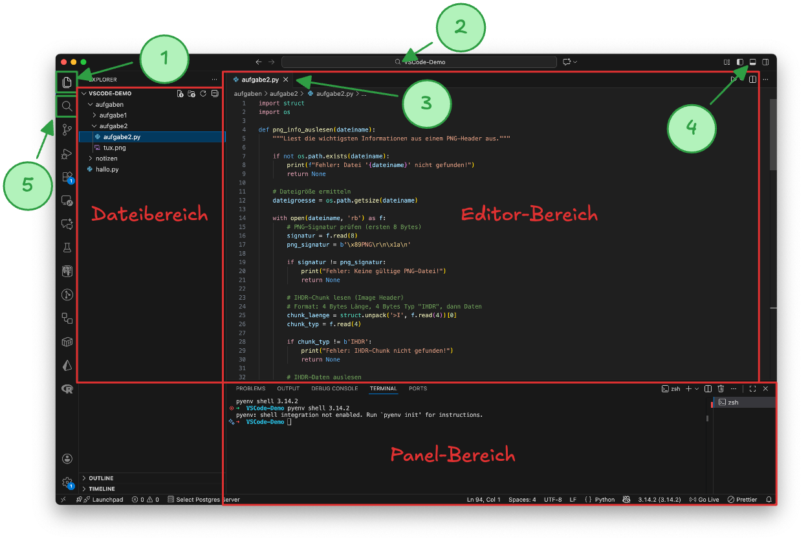
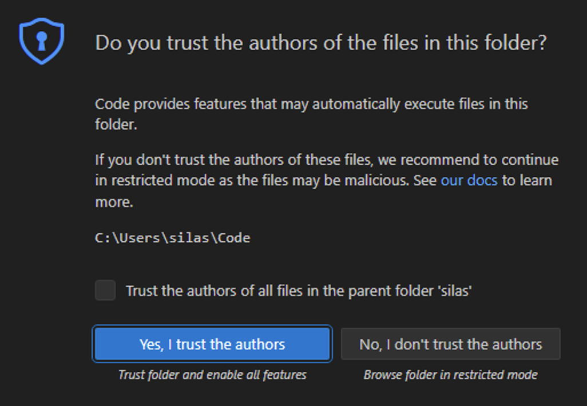
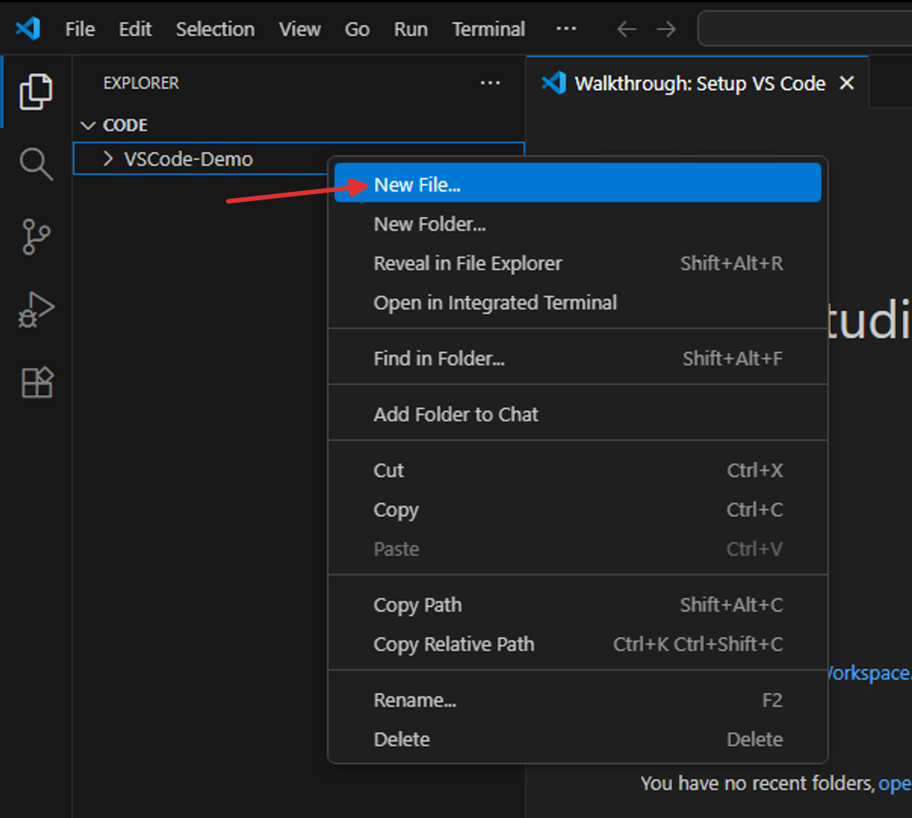
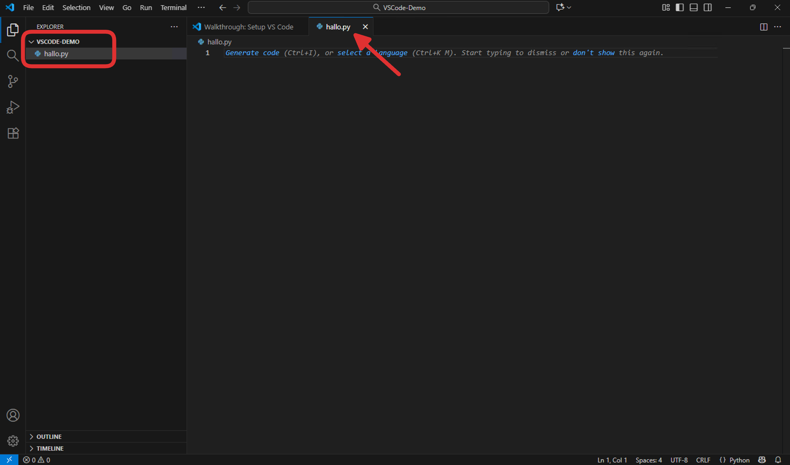
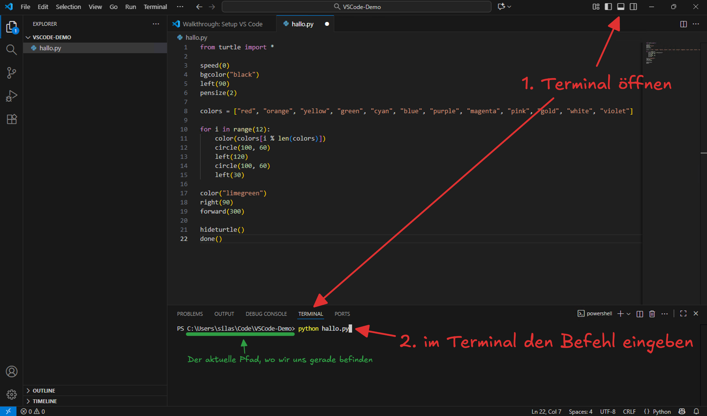
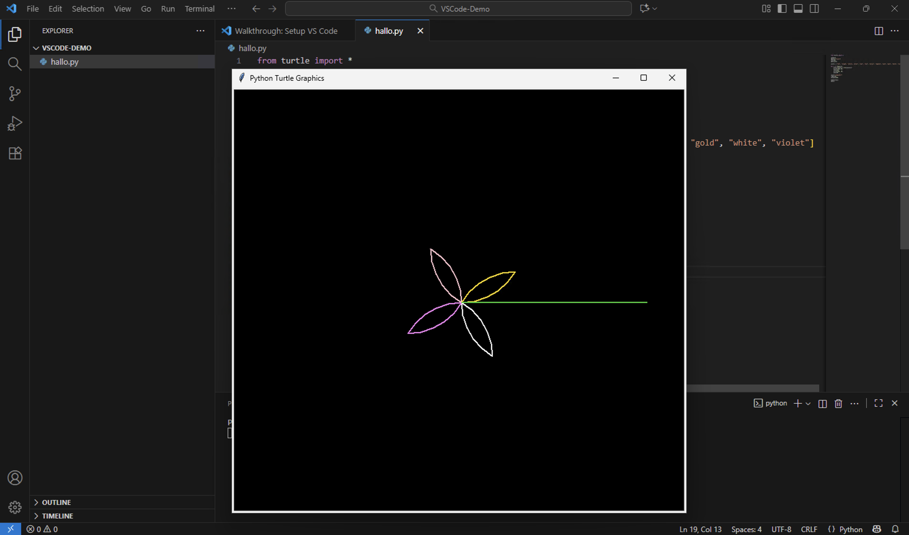

import useBaseUrl from '@docusaurus/useBaseUrl';
import Video from '@tdev-components/Video'

# VSCode kennenlernen
## Tour-de-VSCode
In diesem Abschnitt lernen Sie die wichtigsten Funktionen von Visual Studio Code (VSCode) kennen. Sie müssen hier noch nichts selbst ausprobieren – das machen Sie im nächsten Abschnitt, in dem Sie Ihr erstes kleines Programm in VSCode schreiben und ausführen. Dieser Abschnitt dient als Anleitung und als Referenz für später.

### Ein Projekt erstellen und öffnen

<Video title="Projekt erstellen und öffnen" src={useBaseUrl('/img/vscode/open-project-folder.mp4')}>
Ein «Projekt» ist in VSCode einfach ein Ordner irgendwo auf Ihrem Computer (z.B. in OneDrive), in dem Sie Ihre Programmdateien speichern.

Um ein neues zu erstellen, erstellen Sie einfach einen neuen Ordner an einem beliebigen Ort auf Ihrem Computer. In diesem Beispiel ist das der Ordner __VSCode-Demo__ im __Informatik__-Ordner in OneDrive.

Um das Projekt zu öffnen, klicken Sie in VSCode oben im Menü auf __File__ → __Open Folder...__ und wählen dann den zuvor erstellten Ordner aus (**Achtung:** Um den Ordner auszuwählen, müssen Sie ihn öffnen (Doppelklick), nicht nur markieren). Nachdem Sie den Projektordner geöffnet haben, schliessen Sie das Chat-Fenster rechts, um etwas Platz zu schaffen.
</Video>

### Überblick über die Benutzeroberfläche



Dateibereich
: Links sehen Sie den Dateibaum, in dem alle Dateien und Ordner Ihres Projekts angezeigt werden. Hier können Sie neue Dateien und Ordner erstellen, Dateien umbenennen oder löschen und durch Doppelklick eine Datei im Code-Editor-Bereich öffnen.
Editor-Bereich
: In der Mitte sehen Sie den Code-Editor-Bereich, in dem die aktuell geöffneten Dateien angezeigt und bearbeitet werden können. Jede Datei wird in einem eigenen Tab dargestellt (ähnlich wie in einem Webbrowser). Achten Sie darauf, immer im richtigen Tab zu arbeiten!
: **Achtung:** VSCode speichert **nicht** automatisch – denken Sie also daran, Ihre Dateien regelmässig zu speichern (:mdi[microsoft-windows]: [[Ctrl]] + [[S]] | :mdi[apple]: [[:mdi[apple-keyboard-command]]] + [[S]]).
Panel-Bereich
: Unten sehen Sie den Panel-Bereich, in dem verschiedene Tools wie das Terminal und die Problems-Ansicht angezeigt werden können. Das Terminal ist besonders wichtig, da Sie darüber Ihre Python-Programme ausführen können.
1
: **Dateibereich anzeigen**
2
: **Suche**
: Mit diesem Suchfeld können Sie innerhalb Ihres Projekts nach Dateien suchen.
3
: **Aktueller Editor-Tab**
: **Achtung:** Ein weisser Punkt neben dem Dateinamen bedeutet, dass die Datei **noch nicht gespeichert** wurde.
4
: **Panel-Bereich anzeigen / verbergen**
: Sollte der Panel-Bereich nicht sichtbar sein, können Sie ihn mit diesem Button einblenden.
5
: **Text-Suche anzeigen**
: Mit diesem Button können Sie links statt des Dateibaums die Text-Suche anzeigen lassen, um innerhalb aller Dateien Ihres Projekts nach einem bestimmten Begriff zu suchen.

### Navigieren in VSCode
<Video title="Navigieren in VSCode" src={useBaseUrl('/img/vscode/navigate.mp4')}>
Dieses Video zeigt, wie Sie im Dateibaum von VSCode navigieren können, um Dateien und Ordner zu öffnen, zu erstellen, umzubenennen und zu löschen.

Diese Punkte sind besonders wichtig:
- Um einen **Ordner** auf- oder zuzuklappen, klicken Sie dessen Namen oder das kleine Dreieck links davon 1x an.
- Wenn Sie eine **Datei** nur 1x anklicken, wird im Editor-Bereich eine **Vorschau** der Datei geöffnet (der Tab ist kursiv dargestellt). Wenn Sie die Datei doppelklicken (wie im Video) oder bearbeiten, wird aus der Vorschau ein «richtiger» Tab, der offen bleibt, bis Sie ihn schliessen. Wenn Sie stattdessen eine andere Datei im Dateibaum anklicken, verschwindet der Vorschau-Tab wieder.
- Wenn in einem Tab ein weisser Punkt neben dem Dateinamen angezeigt wird, bedeutet dies, dass die Datei **noch nicht gespeichert** wurde. Speichern Sie die Datei entweder über das Menü (wie im Video) oder noch besser mit :mdi[microsoft-windows]: [[Ctrl]] + [[S]] | :mdi[apple]: [[:mdi[apple-keyboard-command]]] + [[S]]. Wenn Sie das Programm ausführen, ohne den Code vorher zu speichern, wird die alte Version ausgeführt!
- Um eine Date auf die äusserste Ebene (also direkt in den Projektordner) zu verschieben, ziehen Sie die Datei in den leeren Bereich im Dateibaum (unterhalb aller Ordner und Dateien).
</Video>

## Ein erstes Demo-Projekt
Erstellen Sie zuerst irgendwo auf Ihrem Computer (muss nicht zwingend in OneDrive sein) einen neuen Ordner namens `VSCode-Demo` (das können Sie ganz normal im Datei-Explorer machen, also noch nicht in VSCode). Das ist nun ihr _Projektordner_.

Anschliessend öffnen Sie VSCode (über die globale Suche / die Spotlight-Suche), falls Sie das Programm noch nicht geöffnet haben. Öffnen Sie dann den eben erstellten Projektordner.

Falls Sie gefragt werden, ob Sie dem Ordner vertrauen wollen, klicken Sie auf **Yes, I trust the authors**:



Womöglich erscheint anschliessend ein Bildschirm zur Ersteinrichtung von VSCode. Diesen können Sie einfach mit __Mark Done__ schliessen, ohne die die angebotenen Optionen anzuwählen:


Das Chat-Fenster am rechten Rand können Sie schliessen, um etwas Platz zu schaffen:


Nun erstellen Sie links im Explorer direkt im Ordner `VSCode-Demo` eine neue Datei ([[:mdi[cursor-default-click] Rechtsklick]] in den leeren Bereich unter dem Ordnernamen → __New File…__):



Nennen Sie die Datei `hallo.py` und drücken Sie [[Enter]]. Die Datei wird anschliessend automatisch im Code-Editor-Bereich geöffnet. Bei Ihnen sollte VSCode nun in etwa so aussehen:



:::warning[Tabs]
Sie können in VSCode mehrere Dateien gleichzeitig geöffnet haben. Jede Datei wird dabei in einem **Tab** dargestellt, wie auch in einem Webbrowser. 

Achten Sie deshalb genau darauf, welcher Tab gerade aktiv ist, wenn Sie etwas schreiben oder ändern wollen, damit Sie nicht versehentlich die falsche Datei bearbeiten. In der Abbildung oben sehen Sie z.B., dass die Datei `hallo.py`, weil der entsprechende Tab hervorgehoben ist.
:::

Nun können Sie in der Datei `hallo.py` den folgenden Code eingeben, indem Sie ihn hier kopieren und in den Code-Editor-Bereich dieser Datei einfügen:

```python showLineNumbers
from turtle import *

speed(0)
bgcolor("black")
left(90)
pensize(2)

colors = ["red", "orange", "yellow", "green", "cyan", "blue", "purple", "magenta", "pink", "gold", "white", "violet"]

for i in range(12):
    color(colors[i % len(colors)])
    circle(100, 60)
    left(120)
    circle(100, 60)
    left(30)

color("limegreen")
right(90)
forward(300)

hideturtle()
done()
```

:::danger[Speichern]
VSCode speichert nicht automatisch! Sie müssen also nach jeder Änderung daran denken, die entsprechende Datei zu speichern (:mdi[microsoft-windows]: [[Ctrl]] + [[S]] | :mdi[apple]: [[:mdi[apple-keyboard-command]]] + [[S]]), damit bei der nächsten Ausführung auch wirklich die aktuellste Version verwendet wird.
:::

Sobald Sie die Datei gespeichert haben, öffnen Sie nun ein Terminal **in VSCode** und geben dort den folgenden Befehl ein, um das Python-Programm `hallo.py` auszuführen (bestätigen mit [[Enter]]):

```bash
python hallo.py
```



:::insight[Aufbau dieses Befehls]
Über das Terminal (egal ob in VSCode oder in einem separaten Programm) können Sie Befehle an Ihren Computer senden, damit dieser bestimmte Aktionen ausführt. Diese Befehle funktionieren immer nach dem gleichen Muster:

```
<Programm> <Parameter 1> <Parameter 2> ...
```

In unserem Fall war dies der Befehl:

```bash
python hallo.py
```

Hier sprechen wir also ein Programm namens `python` an. Gemeint ist damit die Python-Umgebung (auch _Python Runtime_ oder _Python Interpreter_ genannt), die wir zuvor installiert haben. Wir wollen also die Python-Umgebung aufrufen und ihr ein konkretes Python-Programm übergeben, das sie ausführen soll.

Danach folgt ein Parameter: `hallo.py`. Das ist der **relative Pfad** (vgl. nächste Info-Box) zum Python-Programm, das wir ausführen wollen. 
:::

:::insight[Relative Pfade]
Im obigen Befehl mussten wir den _Pfad_ zum Python-Programm angeben, das wir ausführen wollen. Den Pfad haben wir aber als `hallo.py` angegeben, was nicht mit 
`C:\...` oder `/...` beginnt.

Es handelt sich dabei um einen sogenannten **relativen Pfad** (im Unterschied zu _absoluten_ Pfaden, die eben mit `C:\` oder `/` beginnen). Relative Pfade werden nicht vom _Root-Verzeichnis_ (`C:\` oder `/`), sondern vom aktuellen Ordner aus angegeben, in dem wir mit unserem Terminal gerade arbeiten. Im obigen Screenshot ist der aktuelle Pfad grün markiert (`C:\Users\silas\Code\VSCode-Demo`). Wenn wir also den relativen Pfad `hallo.py` angeben, sucht Python im aktuellen Ordner (`VSCode-Demo`) nach der Datei `hallo.py`. 

Wäre die Datei in einem Unterordner namens `programme` gespeichert, müssten wir stattdessen den relativen Pfad `programme\hallo.py` angeben. Wir sagen dem Computer damit: «Gehe vom aktuellen Ordner zuerst in den Unterordner `programme`, dann dort zur Dartei `hallo.py`.».


Wäre die Datei hingegen im übergeordneten Ordner (z.B. in `C:\Users\silas\Code`) gespeichert, müssten wir `..\hallo.py` angeben (wobei `..` für den übergeordneten Ordner steht). Hier sagen wir dem Computer: «Gehe vom aktuellen Ordner in den übergeordneten Ordner (den sogenannten _Parent_, dargestellt mit `..`) und dann von dort aus zur Datei `hallo.py`.».

Diese Pfadsegmente lassen sich auch beliebig kombinieren. Zum Beispiel könnten wir einen relativen Pfad auch so angeben: 

```bash
..\..\Informatik\Programme\demo-programm.py
```

Ausgehend vom Ordner `C:\Users\silas\Code\VSCode-Demo` wäre der «Such-Weg» hier also:
1. Gehe in den übergeordneten Ordner des aktuellen Ordners (`..`) → jetzt sind wir in `C:\Users\silas\Code`.
2. Gehen von dort aus nochmal in den übergeordneten Ordner (`..`) → jetzt sind wir in `C:\Users\silas`.
3. Gehe von dort aus in den Unterordner `Informatik` → jetzt sind wir in `C:\Users\silas\Informatik`.
4. Gehe von dort aus in den Unterordner `Programme` → jetzt sind wir in `C:\Users\silas\Informatik\Programme`.
5. Öffne die Datei `demo-programm.py` → der absolute Pfad wäre also `C:\Users\silas\Informatik\Programme\demo-programm.py`.

**Wichtig zu verstehen:** Der Computer sucht die Datei dann an diesem Pfad – das aktuell geöffnete Terminal-Fenster arbeitet ansonsten aber nach wie vor im Ordner `C:\Users\silas\Code\VSCode-Demo`. Einen nächsten relativen Pfad würden wir also ebenfalls wieder relativ zum Ordner `C:\Users\silas\Code\VSCode-Demo` angeben. Wollen wir stattdessen im Terminal-Fenster in einen anderen Ordner wechseln, müssten wir den Befehl `cd <Ordner-Pfad>` verwenden (wobei `cd` für _change directory_ steht).
:::

Wenn alles geklappt hat, sollte sich nun ein Turtle-Fenster geöffnet haben, in dem eine bunte Blume gezeichnet wird:



:::aufgabe[Blume zeichnen]
<TaskState id="0289f05d-44a7-4b11-85b6-69877d636d81" />
Markieren Sie diese Aufgabe als erledigt, wenn Sie alle obigen Schritte nachgemacht und (in VSCode, ohne Classrooms) die bunte Blume erfolgreich gezeichnet haben.
:::

:::aufgabe[Eigenes Programm erstellen und ausführen]
<TaskState id="7404b855-bfcd-4603-922f-dddf4db2ef74" />
Erstellen Sie nun im selben Ordner (`VSCode-Demo`) eine neue Datei namens `mein_programm.py`. Schreiben Sie darin ein beliebiges Turtle-Programm (Sie können z.B. auch etwas kopieren, dass Sie bereits in Classrooms gemacht haben). **Wichtig:** Schauen Sie, dass Sie wirklich im Tab der Datei `mein_programm.py` arbeiten und nicht versehentlich im Tab der Datei `hallo.py`.

Speichern Sie anschliessend die Datei (im Tab sollte der weisse Punkt neben dem Dateinamen verschwinden) und führen Sie das Programm anschliessend im Terminal aus. Dazu müssen Sie den Befehl etwas anpassen, den Sie zum ausführen des Programms `hallo.py` verwendet haben. Wie genau muss der Befehl aussehen? Probieren Sie es aus!
:::

---