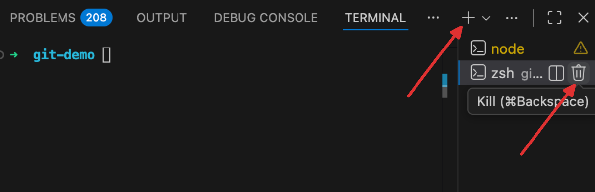
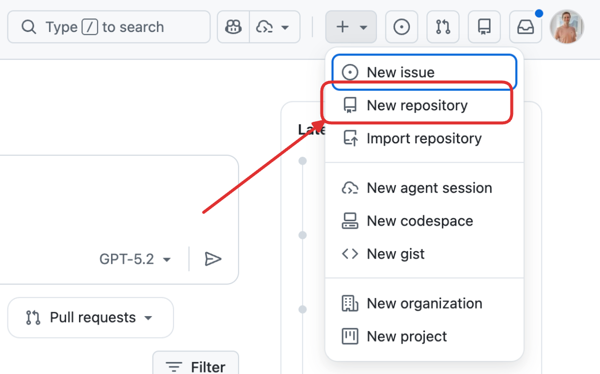
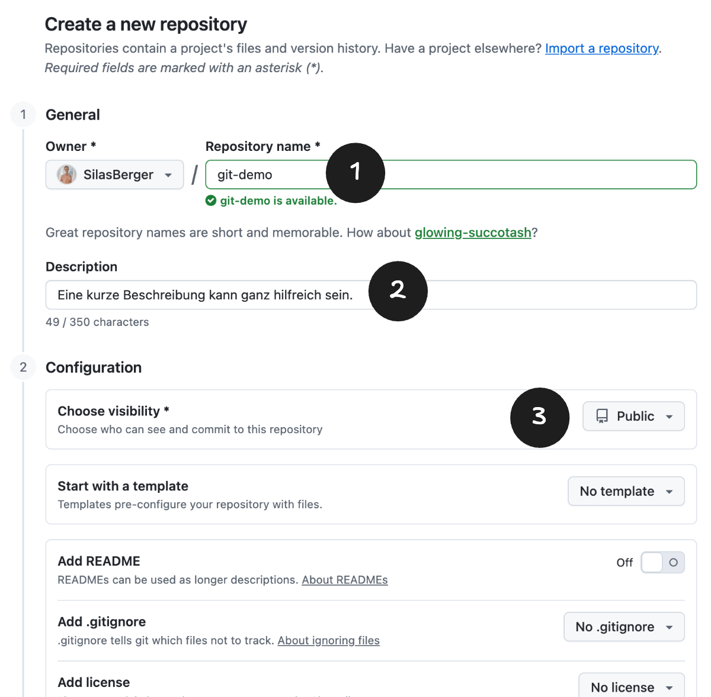
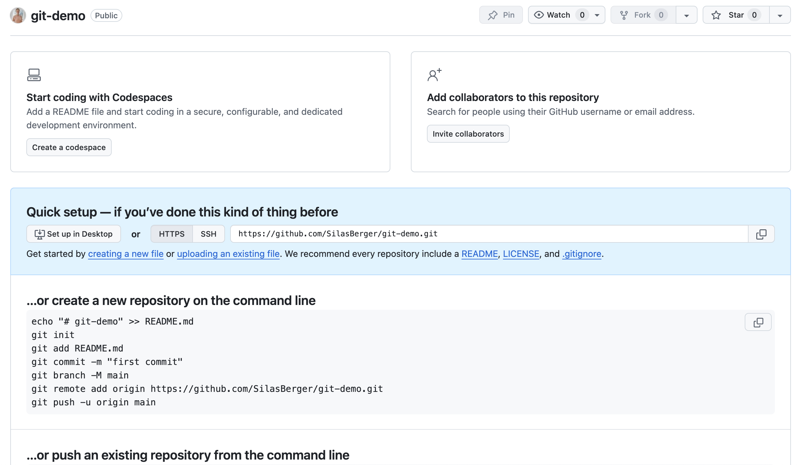

import TabItem from "@theme/TabItem";
import OsTabs from '@tdev-components/OsTabs'

#  Git
Sobald wir die Grundlagen des Programmierens gemeistert haben und uns an ein grösseres Projekt wagen, werden wir auf zwei Herausforderungen stossen:

1. Wie können wir eine lauffähige Version unseres Projekts speichern, damit wir jederzeit darauf zurückgreifen können, wenn wir bei der Weiterentwicklung und Experimenten etwas kaputt machen?
2. Wie können mehrere Personen gleichzeitig an derselben Codebasis arbeiten, ohne sich gegenseitig in die Quere zu kommen?

Die Praxis der Softwareentwicklung hat in der Vergangenheit einige Lösungen hervorgebracht, wovon sich eine als besonders effektiv erwiesen hat: die Verwendung von Versionskontrollsystemen. Eines der beliebtesten und leistungsfähigsten dieser Systeme ist **Git**. Kaum ein Softwareprojekt kommt heute ohne Git aus, und es ist ein unverzichtbares Werkzeug für Entwickler:innen auf der ganzen Welt. Der einzige Nachteil von Git ist, dass es eine gewisse Lernkurve hat – die Investition lohnt sich aber!

## Git installieren und einrichten
### Installation
<OsTabs>
<TabItem value="win">
Öffnen Sie die [Git-Downloadseite](https://git-scm.com/install/windows) und laden Sie sich den Installer `Git for Windows/x64 Setup` herunter. Suchen Sie dann die heruntergeladene Datei in Ihrem «Downloads»-Ordner und führen Sie sie aus, um Git zu installieren. Alle Standardeinstellungen können dabei beibehalten werden.

Nachdem die Installation abgeschlossen ist, öffnen Sie die das Terminal (entweder das integrierte Terminal in VSCode oder das Programm __Eingabeaufforderung__) und geben Sie den Befehl `git --version` ein, um zu prüfen, ob Git korrekt installiert wurde. Falls eine Fehlermeldung kommt, bitten Sie entweder die Lehrperson um Hilfe oder verwenden Sie stattdessen das (von der vorherigen Installation mit installierte) Programm __Git-BASH__, um die Ersteinrichtung durchzuführen (siehe nächster Abschnitt).
</TabItem>

<TabItem value="mac">
Führen Sie im Terminal (entweder im integrierten Terminal in VSCode oder im Programm __Terminal__) folgenden Befehl aus:

```sh
/bin/bash -c "$(curl -fsSL https://raw.githubusercontent.com/Homebrew/install/HEAD/install.sh)"
```

Dieser installiert ein Paketverwaltungstool namens **Homebrew**, mit dem wir Git installieren können. **Evtl. müssen Sie dafür Ihr MacBook-Passwort eingeben.**

Führen Sie anschliessend folgenden Befehl aus, um Git zu installieren:

```sh
brew install git
```

Nachdem die Installation abgeschlossen ist, prüfen Sie mit dem Befehl `git --version`, ob Git korrekt installiert wurde. Falls eine Fehlermeldung kommt, beenden Sie das Terminal und öffnen Sie es erneut, damit die Änderungen wirksam werden. Prüfen Sie danach erneut mit `git --version`, ob Git jetzt erkannt wird. 

**Wichtig dabei:**
  - Wenn Sie mit dem Programm __Terminal__ arbeiten, müssen Sie darauf achten, dass Sie es vollständig beenden ([[Cmd]] + [[Q]] oder ganz oben links auf __Terminal__ → __Terminal beenden__ klicken).
  - Falls Sie das integrierte Terminal in VSCode nutzen, können Sie dieses mit dem Mülleimer-Symbol schliessen und mit dem Plus-Symbol wieder öffnen:
   

Lassen Sie das Terminal danach geöffnet, damit Sie mit der Ersteinrichtung fortfahren können.
</TabItem>
</OsTabs>

### Ersteinrichtung
Sie haben Git nun installiert, ein Terminal geöffnet (VSCode-Terminal, macOS __Terminal__, Windows __Eingabeaufforderung__ oder __Git-BASH__) und können nun mit der Ersteinrichtung fortfahren. Führen Sie dazu folgende Befehle aus, um Git anzugeben, wie Sie heissen und wie Ihre E-Mail-Adresse lautet:

```sh
git config --global user.name "Ihr Name"
git config --global user.email "Ihre E-Mail-Adresse"
```

also z.B.

```sh
git config --global user.name "Mara Mustermann"
git config --global user.email "mara.mustermann@example.com"
```

Führen Sie dann noch folgenden Befehl aus[^1]:

```sh
git config --global init.defaultBranch main
```

Es ist egal, ob Sie schulische oder die private E-Mail angeben.

## Git als Versionskontrollsystem
- Working Directory, Staging Area, Repository
- commit, log, checkout, revert

## Git zur Zusammenarbeit
Git ist immer dann besonders wertvoll, wenn mehrere Personen gleichzeitig an einem Projekt arbeiten wollen.

### GitHub-Account einrichten
Wenn wir mit Git zusammenarbeiten wollen, brauchen wir einen Ort, an dem wir unseren Code speichern können, damit andere darauf zugreifen können. Es gibt verschiedene Anbieter von solchen Online-Diensten, die Git-Repositories «hosten» (also online anbieten), aber der bekannteste und am weitesten verbreitete ist **GitHub**. Dieser Dienst (übrigens von Microsoft) ist für die meisten Anwendungsfälle kostenlos – man muss sich aber bewusst sein, dass der Code standardmässig (also, wenn man nicht zahlen will) **öffentlich zugänglich ist**. Das bedeutet, dass jeder Mensch auf der Welt den Code sehen und herunterladen kann, den man auf GitHub hochlädt.

Um einen GitHub-Account zu erstellen, gehen Sie auf https://github.com/ und klicken Sie auf __Sign up__. Geben Sie dann Ihre E-Mail (Schule oder privat) ein, wählen sie ein **sicheres** Passwort und geben Sie sich einen (Vorsicht: **öffentlich sichtbaren**) Benutzernamen. Folgen Sie dann den weiteren Anweisungen auf der Registrierungsseite, um Ihren Account zu erstellen.

TODO: PAT erstellen.

### Ein GitHub-Repository erstellen
Wenn wir Git nur lokal nutzen, dann gibt es lediglich eine einzige Kopie unseres Repositories. Wenn wir aber mit anderen Personen zusammenarbeiten wollen, dann braucht es zwingend eine Kopie des Repositories, die für alle Beteiligten online zugänglich ist.

Wenn wir mit GitHub arbeiten, müssen wir für unser Projekt, für das wir vielleicht bereits ein lokales Git-Repository angelegt haben, ein sogenanntes **Remote Repository** auf GitHub erstellen. Das ist sozusagen die Online-Version unseres lokalen Repositories, auf die alle Beteiligten Zugriff haben. Das machen wir wie folgt:



Dort müssen wir dann einige Angaben für unser Repository machen:



Am wichtigsten ist der Name (__1__), den wir möglichst sinnvoll wählen sollten - z.B. entsprechend dem Namen unseres Projekts. Leerschläge sind darin nicht erlaubt, aber stattdessen können wir Bindestriche oder Unterstriche verwenden. Die Beschreibung (__2__) ist optional, aber es ist eine gute Praxis, hier kurz zu beschreiben, worum es in diesem Repository geht. Die Sichtbarkeit (__3__) sollte auf __Öffentlich__ (__Public__) eingestellt werden (oder eingestellt bleiben), weil wir mit kostenlosen Accounts nur begrenzt viele private Repositories anlegen können. Ansonsten können wir alle Standardeinstellungen akzeptieren und am Schluss ganz unten auf __Create repository__ klicken, um das Remote Repository zu erstellen.

Nachdem das Repository erstellt wurde, sehen Sie folgenden Screen:



Kopieren Sie sich am besten gleich die URL des Repositories (siehe Markierung im Bild) irgendwo hin, da Sie die später wieder brauchen. Sie können sie aber natürlich auch jederzeit wieder auf der Hauptseite Ihres Repositories finden.

### Ein GitHub-Repository mit einem lokalen Repository verbinden
TBD (nur dann, wenn das Repo noch leer ist und man den lokalen Stand hochladen will)
- add origin
- push

### Ein GitHub Repository klonen
TBD (nur dann, wenn man lokal noch nichts hat und den Stand von GitHub herunterladen will)

### Mit Remote Repositories arbeiten
- push
- pull
- Konflikte
- Achtung: trotzdem nicht am gleichen File arbeiten


[^1]: In Git können wir gleichzeitig mehrere Versionsketten haben – sogenannte _Branches_. Der Standard-Branch hat früher immer den Namen `master` gehabt, aber mittlerweile ist es üblich, diesen stattdessen `main` zu nennen. Mit diesem Befehl passiert das automatisch, wenn Sie ein neues Git-Projekt (ein sog. «Repository») aufsetzen.nzufügen.