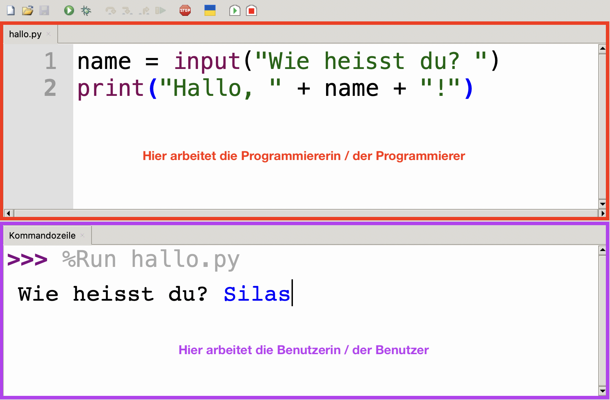

# Ein- und Ausgabe

## Rollenwechsel

Beim Programmieren gibt es eine besondere Herausforderung: Nämlich müssen wir sehr oft unsere Rolle wechseln. Solange wir unseren Code schreiben, sind wir **Programmierer:innen**. Irgendwann wollen wir unser Programm aber auch ausprobieren. Also drücken wir in Thonny auf den grünen Start-Knopf — und werden in dem Moment zu **Benutzer:innen**!

:::key[Wer arbeitet wo?]

- **Programmierer:innen** arbeiten oben im **Code-Editor**, wo sie ihren **Programmcode bearbeiten**.
- **Benutzer:innen** arbeiten unten in der **Kommandozeile**, wo sie **mit dem laufenden Programm interagieren**.

 :::

Dieser _Rollenwechsel_ wird besonders deutlich, wenn wir uns mit der Ein- und Ausgabe befassen.

## Ausgabe

Um in der Kommandozeile etwas auszugeben, benötigen wir die Funktion `print()`.

Folgendes Beispiel zeigt verschiedene Möglichkeiten, wie wir die `print()`-Funktion verwenden können:

```python showLineNumbers
print("Hallo, Welt!")
print(23)
print(3.14)
print(True)

name = "Bob"
print("Hallo, " + name + "!")
print("Hallo,", name, "!")
```

Dieses Programm produziert folgende Ausgabe in der Kommandozeile:

```
Hallo, Welt!
23
3.14
True
Hallo, Bob!
Hallo, Bob !
```

## Eingabe

Um vom Benutzer / der Benutzerin eine Eingabe zu erfragen, benötigen wir die Funktion `input()`:

```python showLineNumbers
name = input("Wie heisst du? ")
```

Auf dieser einen Zeile passieren die folgenden drei Dinge:

- Der Aufruf der Funktion `input()` sorgt dafür, dass das Programm anhält und darauf wartet, dass die Benutzerin etwas eingibt. Es läuft erst weiter, wenn sie _Enter_ drückt.
- Der _String_ `"Wie heisst du? "` wird dabei als sogenannte **Eingabeaufforderung** in der Kommandozeile ausgegeben. Eine _Eingabeaufforderung_ ist nicht zwingend notwendig. Ohne diese weiss der Benutzer allerdings nicht, was er eingeben muss. Noch schlimmer: Vermutlich merkt er gar nicht erst, dass das Programm auf seine Eingabe wartet.
- Der eigegebene Wert wird der Variable `name` zugewiesen (`name = ...`). Auch das ist genau genommen nicht zwingend nötig. Wenn wir den eingegebenen Wert allerdings in keine Variable speichern, dann verlieren wir ihn sofort wieder. Die Eingabe wäre in dem Fall also sinnlos.

## Datentypen im Kontext der Ein- und Ausgabe

### Datentyp bei der Eingabe

Die Funktion `input()` produziert **immer** einen Wert vom Datentyp `str` (vgl. [Datentypen](Variablen-und-Datentypen#datentypen)) — selbst wenn die Benutzerin eine Zahl eingibt.

Wenn wir vom Benutzer eine Zahl erfragen und den eingegebenen Wert auch als Zahl verwenden möchten, dann müssen wir ihn zuerst zum entsprechenden Zahlentyp umwandeln. Das tun wir mit den Funktionen `int()` und `float()`:

```python showLineNumbers
alter = input("Wie alt bist du? ")
alter_als_zahl = int(alter)
print("In einem Jahr bist du", alter_als_zahl + 1, "Jahre alt.")

groesse = input("Wie gross bist du in Metern? ")
groesse_als_zahl = float(groesse)
print("Das entspricht einer Grösse von ", groesse_als_zahl * 100, "Zentimeter.")
```

Die "Zwischenschritt-Variablen" (`alter_als_zahl` und `groesse_als_zahl`) braucht es im Prinzip nicht, da wir Funktionsaufrufe auch _verschachteln_ können. Dasselbe Programm könnten wir also auch mit zwei Zeilen weniger schreiben:

```python showLineNumbers
alter = int(input("Wie alt bist du? "))
print("In einem Jahr bist du", alter_als_zahl + 1, "Jahre alt.")

groesse = float(input("Wie gross bist du in Metern? "))
print("Das entspricht einer Grösse von ", groesse_als_zahl * 100, "Zentimeter.")
```

### String-Konkatenation mit nummerischen Werten

Mit dem `+`-Operator können wir Werte vom Datentyp `str` _konkatenieren_ (sprich, aneinanderhängen). Diese "Addition" funktioniert aber nicht zwischen einem `str` und einem _nummerischen_ Datentyp (`int`, `float`). Bei der `print()`-Funktion ist das häufig kein Problem, da wir mehrere Werte unterschiedlichen Datentyps mit Kommas getrennt angeben können:

```python showLineNumbers
alter = 18
print("Dein Alter beträgt", alter, "!")
```

Aber achtung: Dieses Programm gibt in der Kommandozeile folgenden Text aus:

```
Dein Alter beträgt 18 !
```

Python fügt zwischen den komma-getrennten Werten jeweils einen Leerschlag ein. Wenn wir das nicht möchten, dann müssen wir auf die _String-Konkatenation_ (also die "Addition" von Text-Werten) zurückgreifen. Die Variable `alter` hat allerdings den Datentyp `int`. Solche Werte müssen wir zuerst mit der `str()`-Funktion zu einem `str` umwandeln:

```python showLineNumbers
alter = 18
print("Dein Alter beträgt " + str(alter) + "!")
```

Dieses Programm gibt in der Kommandozeile nun folgenden Wert aus:

```
Dein Alter beträgt 18!
```

---
