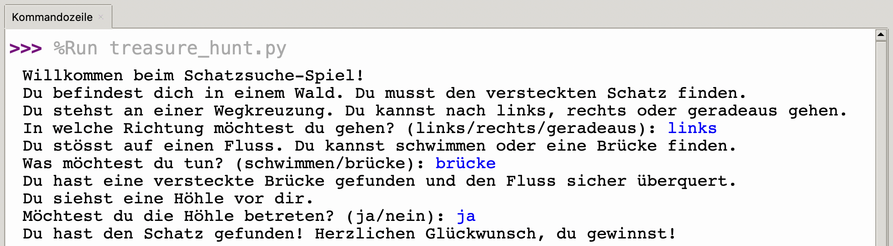

# Text Adventure v1
In einer Zeit, in der komplexe Computergrafiken noch eine ferne Zukunftsvision waren, erzählten viele klassische Videospiele ihre Geschichte als sogenannte _Text Adventures_. Das Geschehen wurde der Spielerin oder dem Spieler also nicht grafisch gezeigt, sondern in Textform beschrieben. Die Spielfigur steuerte man nicht mit Tasten, Controllern oder Touch-Gesten, sondern mittels Texteingaben.

## Inspiration
Etwa so könnte ein einfaches Text Adventure in der Kommandozeile aussehen:


Den Python-Code dazu können Sie hier anzeigen:
<details>
  <summary>Code anzeigen</summary>
  ```python showLineNumbers
  print("Willkommen beim Schatzsuche-Spiel!")
  print("Du befindest dich in einem Wald. Du musst den versteckten Schatz finden.")
  print("Du stehst an einer Wegkreuzung. Du kannst nach links, rechts oder geradeaus gehen.")

  auswahl = input("In welche Richtung möchtest du gehen? (links/rechts/geradeaus): ")
  if auswahl == "links":
      print("Du stösst auf einen Fluss. Du kannst schwimmen oder eine Brücke finden.")
      auswahl = input("Was möchtest du tun? (schwimmen/brücke): ")
      if auswahl == "schwimmen":
          print("Du wurdest von einem Krokodil angegriffen! Spiel vorbei!")
      elif auswahl == "brücke":
          print("Du hast eine versteckte Brücke gefunden und den Fluss sicher überquert.")
          print("Du siehst eine Höhle vor dir.")
          auswahl = input("Möchtest du die Höhle betreten? (ja/nein): ")
          if auswahl == "ja":
              print("Du hast den Schatz gefunden! Herzlichen Glückwunsch, du gewinnst!")
          else:
              print("Du hast beschlossen, die Höhle nicht zu betreten und den Schatz verpasst. Spiel vorbei!")
      else:
          print("Ungültige Wahl! Spiel vorbei!")

  elif auswahl == "rechts":
      print("Du begegnest einem Rudel Wölfe. Du kannst entweder rennen oder versuchen, sie zu zähmen.")
      auswahl = input("Was möchtest du tun? (rennen/zähmen): ")
      if auswahl == "rennen":
          print("Du bist erfolgreich vor den Wölfen geflohen.")
          print("Du siehst ein Schloss in der Ferne.")
          auswahl = input("Möchtest du dich dem Schloss nähern? (ja/nein): ")
          if auswahl == "ja":
              print("Du bist ins Schloss eingetreten und hast den Schatz gefunden! Herzlichen Glückwunsch, du gewinnst!")
          else:
              print("Du hast beschlossen, dich dem Schloss nicht zu nähern und den Schatz verpasst. Spiel vorbei!")
      elif auswahl == "zähmen":
          print("Die Wölfe greifen dich an! Spiel vorbei!")
      else:
          print("Ungültige Wahl! Spiel vorbei!")

  elif auswahl == "geradeaus":
      print("Du gehst geradeaus und triffst auf eine Riesenspinne.")
      auswahl = input("Was möchtest du tun? (kämpfen/fliehen): ")
      if auswahl == "kämpfen":
          print("Du hast die Spinne besiegt!")
          print("Du siehst eine Höhle in der Nähe.")
          auswahl = input("Möchtest du die Höhle erkunden? (ja/nein): ")
          if auswahl == "ja":
              print("Du hast den Schatz gefunden! Herzlichen Glückwunsch, du gewinnst!")
          else:
              print("Du hast beschlossen, die Höhle nicht zu erkunden und den Schatz verpasst. Spiel vorbei!")
      elif auswahl == "fliehen":
          print("Du konntest der Spinne entkommen.")
          print("Du siehst einen Tempel in der Ferne.")
          auswahl = input("Möchtest du den Tempel betreten? (ja/nein): ")
          if auswahl == "ja":
              print("Du bist in den Tempel eingetreten und hast den Schatz gefunden! Herzlichen Glückwunsch, du gewinnst!")
          else:
              print("Du hast beschlossen, den Tempel nicht zu betreten und den Schatz verpasst. Spiel vorbei!")
      else:
          print("Ungültige Wahl! Spiel vorbei!")

  else:
      print("Ungültige Wahl! Spiel vorbei!")
  ```
</details>

## Auftrag
Sie kennen jetzt die wichtigsten Grundelemente des Programmierens in Python: Sequenzen (Befehlsabfolgen), Variablen, Schleifen (`for` und `while`), Verzweigungen (`if`, `else` und `elif`), sowie die Funktionen `input()`, `print()`, `int()`, `float()` und `str()`. Damit haben Sie bereits alles, was Sie für die Entwicklung Ihres ersten eigenen _Text Adventures_ brauchen!

Erstellen Sie dazu in Thonny zuerst eine neue Datei und speichern Sie diese als `text_adventure.py` an einem Ort ab, wo Sie es wieder finden.

Entwickeln Sie in dieser Datei nun einen ersten Entwurf für Text Adventure Spiel. Lassen Sie sich dabei ruhig vom obigen Beispiel inspirieren — als Startpunkt dürfen Sie natürlich auch den Code kopieren und darauf aufbauen. Lassen Sie Ihrer Fantasie dann freien Lauf und erzählen Sie Ihre ganz eigene Geschichte.

Nach diesem Schritt sollte Ihr Spiel folgende Bedingungen erfüllen:
- Der/die Spieler/in kann das Spiel irgendwie gewinnen.
- Der/die Spieler/in kann das Spiel irgendwie verlieren.
- Im Spiel existieren insgesamt mindestens vier verschiedene _Verzweigungen_ (d.h. Orte, an denen der/die Spieler/in etwas entscheiden muss). Welche dieser Verzweigungen der/die Spieler/in in einem gegebenen Spieldurchlauf dann tatsächlich antrifft, soll von seinen/ihren Entscheidungen abhängig sein. Es sollen jedoch alle vier Verzweigungen irgendwie erreichbar sein.

Viel Spass, und seien Sie kreativ!

---
