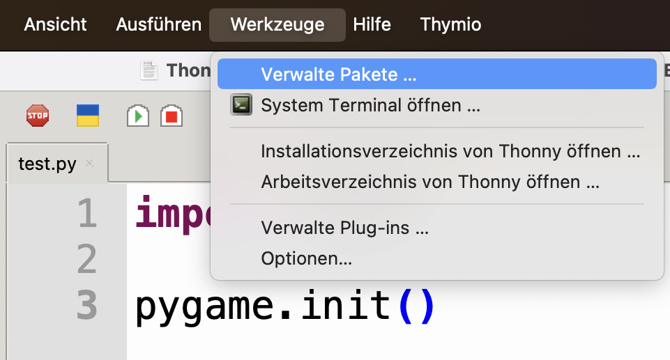
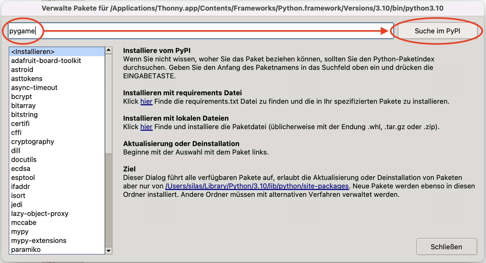
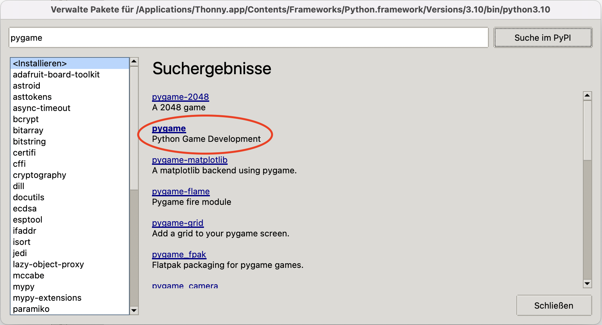
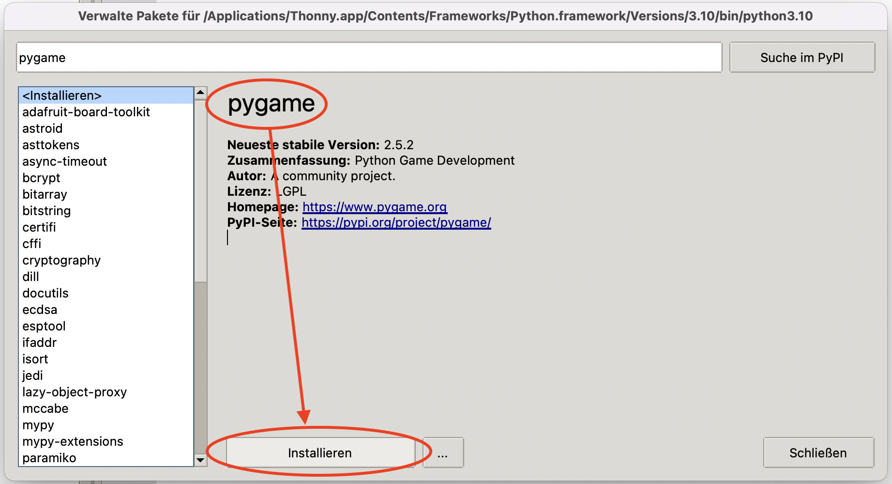
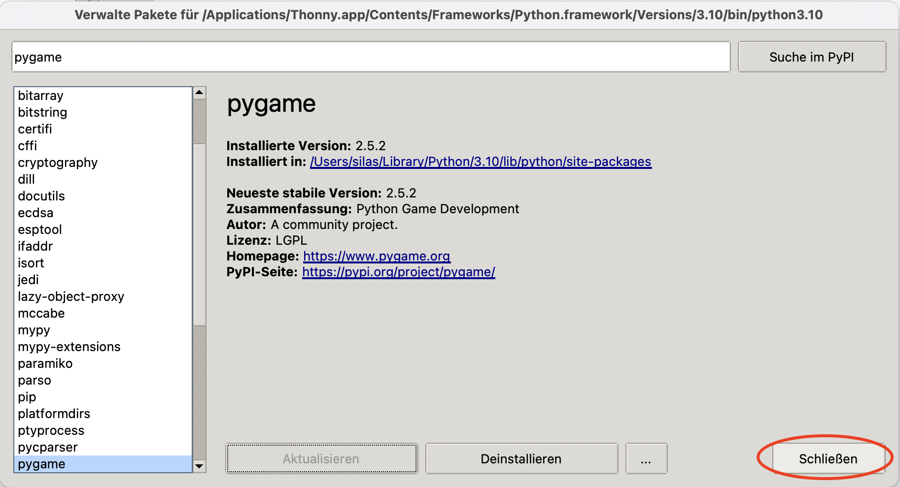
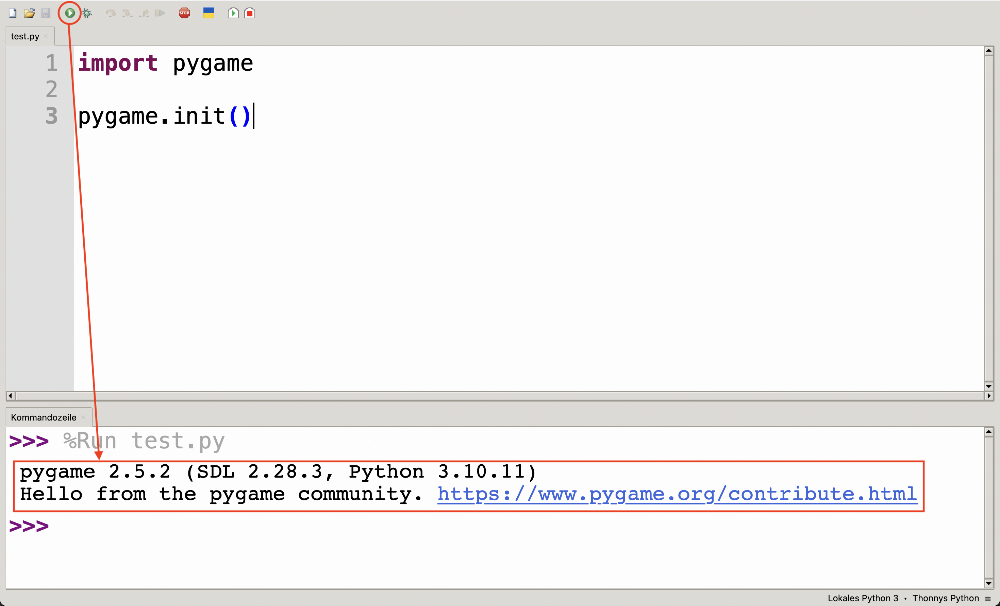

# Pygame einrichten
Die Funktionen von Pygame sind im `pygame`-Paket verfügbar, genauso wie die Turtle-Funktionen im `turtle`-Paket verfügbar sind. Im Unterschied zu `turtle` müssen wir `pygame` aber zuerst einrichten.

## Das `pygame`-Paket installieren
1. Klicken Sie auf _Werkzeuge_ → _Verwalte Pakete_:
   
2. Suchen Sie nach `pygame`:
   
3. Klicken Sie auf das Paket `pygame`:
   
4. Überprüfen Sie nochmal den Namen des Pakets und klicken Sie dann auf _Installieren_:
   
5. Sobald `pygame` installiert ist, klicken Sie auf _schliessen_:
   

## Einrichtung überprüfen
Um zu prüfen, ob die Einrichtung erfolgreich war, erstellen Sie irgendwo auf Ihrem Computer eine neue Python-Datei und nennen Sie sie z.B. `test.py`. Kopieren Sie folgenden Code in diese Datei:

```python showLineNumbers
import pygame

pygame.init()
```

Führen Sie das Programm anschliessend aus. Wenn alles geklappt hat, sollten Sie unten in der Kommandozeile eine ähnliche Ausgabe haben, wie auf diesem Bild gezeigt:


Sofern Sie diese Ausgabe sehen, haben Sie `pygame` erfolgreich eingerichtet. Die Datei `test.py` brauchen Sie jetzt nicht mehr.

---
