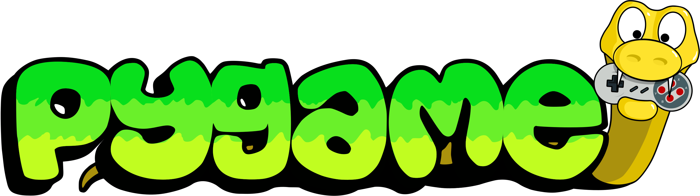

# Pygame
Pygame ist eine [Programmbibliothek](https://de.wikipedia.org/wiki/Programmbibliothek) zur **Entwicklung von Videospielen in Python**.

Mit den Modulen dieser _Bibliothek_ können wir unter anderem folgenden Dinge viel einfacher umsetzen:
- Elemente wie Rechtecke, Kreise, etc. zeichnen
- Bitmap-Grafiken anzeigen
- Elemente animieren
- Benutzerinteraktion einbinden (Maus, Tastatur, Gamepads, Joysticks)
- Sound abspielen
- Kollisionskontrolle[^1]

[^1]: In Videospielen müssen wir regelmässig prüfen, ob sich bestimmte Elemente berühren - zum Beispiel ein Ball und ein Schläger, oder ein Spieler und eine Wand. Wir bezeichnen das als _Kollisionskontrolle_.
