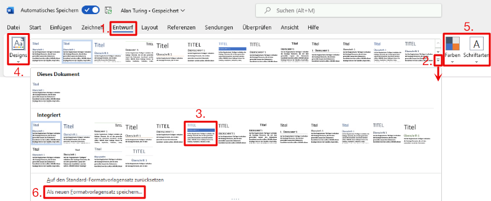

---
sidebar_custom_props:
  source:
    name: rothe.io
    ref: >-
      https://craft.rothe.io/DaKvaRbuG85WnX/b/0059CD2D-346F-4CE3-9023-0118A7792A9F/1.3-%E2%80%94-Formatvorlagens%C3%A4tze
page_id: d510215c-40ad-4351-bcde-2ba6d5726a1b
---

# Formatvorlagensätze verwenden

Um das Aussehen eines Dokuments zu verändern, kann ein anderer Formatvorlagensatz ausgewählt werden.

1. Im Menü __Entwurf__ finden Sie eine Auswahl von Formatvorlagensätzen.
2. Mit einem Klick auf den _Doppelpfeil nach unten_ können Sie die Auswahl an Formatvorlagensätzen ausklappen.
3. Mit einem Klick auf einen Formatvorlagensatz können Sie diesen auf das aktuelle Dokument anwenden.
4. Den gewählten Formatvorlagensatz können Sie durch die Wahl eines Designs individuell anpassen.
5. Es können auch alternative Farben- und Schriftsätze gewählt werden.
6. Es kann auch ein eigenes Design gespeichert werden.

---
