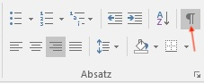

---
sidebar_custom_props:
  source:
    name: rothe.io
    ref: >-
      https://craft.rothe.io/DaKvaRbuG85WnX/b/4237FBF2-8720-43DC-8A13-F6487CDDBC37/1.6-%E2%80%94-Formatierungszeichen
page_id: 0258d62d-8cbe-4310-89ac-51d20cd9700b
---

import OsTabs from "@site/src/components/OsTabs";
import TabItem from "@theme/TabItem";

# Formatierungszeichen
Textdokumente enthalten Formatierungszeichen. Diese werden standardmässig nicht angezeigt und selbstverständlich auch nicht ausgedruckt, steuern aber den Textfluss. Man kann sich diese versteckten Zeichen zur besseren Orientierung anzeigen lassen: __Start__ ‣ __Absatz__ ‣ __¶__.

## Die wichtigsten Formatierungszeichen

<OsTabs>
  <TabItem value="win">
    | Zeichen                     | Eingabe                      | Darstellung               |
    |-----------------------------|------------------------------|---------------------------|
    | Leerzeichen                 | __␣__                        | __·__                     |
    | geschütztes Leerzeichen[^1] | __Ctrl__ + __Shift__ + __␣__ | __°__                     |
    | Zeilenumbruch               | __⇧__ + __⏎__                | __↵__                     |
    | Absatzwechsel               | __⏎__                        | __¶__                     |
    | Seitenumbruch               | __Ctrl__ + __⏎__             | __--- Seitenumbruch ---__ |
    | Tabulator                   | __⇥__                        | __➝__                     |
  </TabItem>
  <TabItem value="mac">
    | Zeichen                     | Eingabe       | Darstellung               |
    |-----------------------------|---------------|---------------------------|
    | Leerzeichen                 | __␣__         | __·__                     |
    | geschütztes Leerzeichen[^1] | __⌘__ + __␣__ | __°__                     |
    | Zeilenumbruch               | __⇧__ + __⏎__ | __↵__                     |
    | Absatzwechsel               | __⏎__         | __¶__                     |
    | Seitenumbruch               | __⌘__ + __⏎__ | __--- Seitenumbruch ---__ |
    | Tabulator                   | __⇥__         | __➝__                     |
  </TabItem>
</OsTabs>

[^1]: Ein **geschütztes Leerzeichen** ist ein Leerzeichen, bei dem die Zeile nicht umgebrochen werden darf. Es wird beispielsweise in Telefonnummern oder bei Massangaben wie «CHF 10.–» oder «12 kg» verwendet, damit der Wert nicht von der Einheit getrennt wird.
