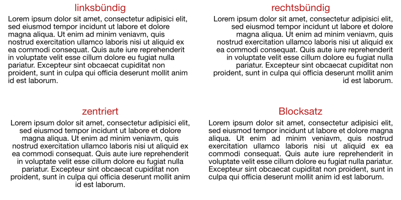

---
sidebar_custom_props:
  source:
    name: rothe.io
    ref: >-
      https://craft.rothe.io/DaKvaRbuG85WnX/b/5C950770-AF96-429D-9904-7E8BA1584D8A/2.2-%E2%80%94-Textausrichtung
page_id: d24ce95b-14f2-48aa-8716-7c1cdead0fd5
---

# Textausrichtung
Text kann auf vier unterschiedliche Arten ausgerichtet werden:

In Word ist eine **linksbündige** Ausrichtung voreingestellt. Zur besseren Leserlichkeit kann es von Vorteil sein, **Blocksatz** zu verwenden.

Eine **zentrierte** Ausrichtung wird beispielsweise für Titel oder für Lyrik verwendet.

Die **rechtsbündige** Ausrichtung kann für spezielle Gestaltungswünsche ebenfalls Sinn machen.

Die Ausrichtung kann pro Absatz festgelegt werden. Dazu kann die Formatvorlage angepasst werden, welche für den entsprechenden Absatz verwendet wurde.

---
