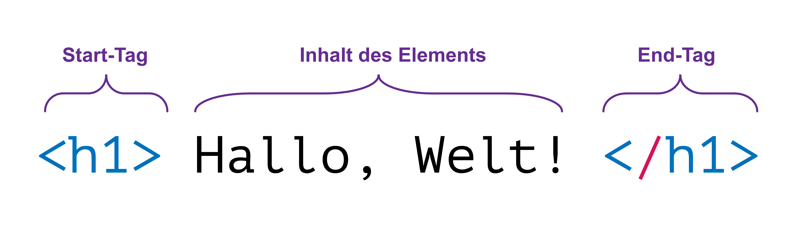
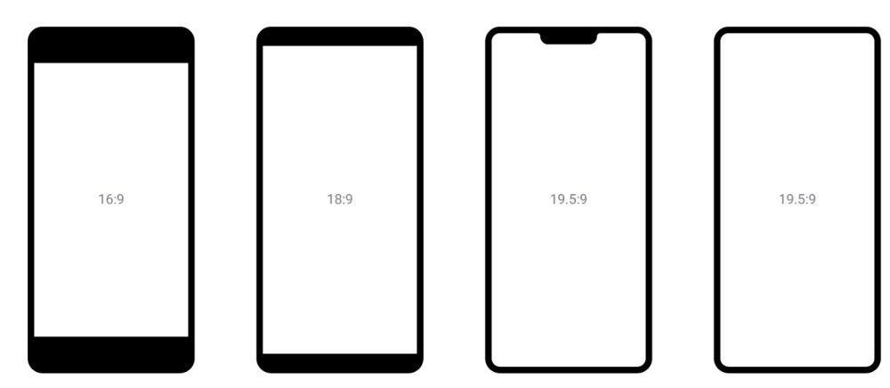

# Texte im Web

:::Hero  ::: :::Caption Die Anatomie eines HTML-Elements. :::

 
Microsoft Word eignet sich nicht für die Erstellung eines Textes, der für das Web bestimmt ist. Wir verwenden
stattdessen zwei formale Sprachen namens _HTML_ und _CSS_. In diesem Artikel lernen Sie, wieso das so ist, und
was diese beiden Sprachen machen.

## Die Herausforderung mit dem Format

Ein Word-Dokument gestalten wir immer in einem vordefinierten Format, z.B. A4 im Hochformat. Wenn wir eine Webseite gestalten, dann ist dieses Prinzip problematisch. Schliesslich sollte die Webseite auf dem Beamer im Klassenzimmer (Querformat) genauso gut aussehen, wie auf Ihrem Smartphone (meistens Hochformat, manchmal aber auch Querformat).

Man könnte sich jetzt überlegen, dass man die Webseite deshalb vielleicht einfach einmal im Hochformat und einmal im Querformat gestaltet - doch auch das würde nicht funktionieren. Die Seitenverhältnisse der Bildschirme moderner Smartphones unterscheiden sich so stark, dass der Begriff _Hochformat_ keinesfalls eindeutig ist. Das verdeutlicht die untenstehende Grafik.

Grundsätzlich könnten wir natürlich für jedes Smartphone-Modell und jedes Laptop-Bildschirmformat eine eigene Version unserer Webseite erstellen. Einerseits würde das aber einen unzumutbaren Aufwand bedeuten, und andererseits wäre das Problem auch damit noch nicht gelöst: Das Browserfenster auf Ihrem Laptop können sie beliebig vergrössern und verkleinern. Damit ist nicht nur jedes erdenkliche Hoch- und Querformat möglich, sondern sogar auch ein quadratisches Fenster.

Der Ansatz mit dem Gestalten eines Dokuments in einem festgelegten Format ist für das Web also ungeeignet. Wir brauchen eine andere Lösung!

## Dateiformat statt Papierformat

Eine Webseite gestalten wir deshalb nicht in einem Programm wie Word, das zu einem festgelegten Format zwingt. Stattdessen schreiben wir unseren Text in einem einfachen _Texteditor_ wie [Thonny](https://thonny.org/).

Thonny ist zwar in erster Linie für das Programmieren mit Python entwickelt worden. Dennoch ist Thonny ein **Texteditor**: ein Programm, mit dem wir _Textdateien_ bearbeiten können. Eine **Textdatei** ist eine Datei, die nur **unformatierten** Text enthält. Ein Python-Programm ist genau das: Text in einer Textdatei. Eine Webseite - wie wir gleich sehen werden - ist ebenfalls nur Text in einer Textdatei. Somit können wir Thonny also auch zum Gestalten von Webseiten verwenden.

:::insight[Alternativen zu Thonny] Obwohl wir Thonny problemlos für die Gestaltung von Webseiten verwenden können, ist dieses Programm in erster Linie für das Programmieren mit Python optimiert. Alternative Text-Editoren sind beispielsweise der [Windows Editor](<https://de.wikipedia.org/wiki/Editor_(Windows)>), das [Notepad++](https://notepad-plus-plus.org/) für Windows, oder das deutliche mächtigere [Visual Studio Code](https://code.visualstudio.com/) für Windows und macOS.

Der Einfachheit halber verwenden wir in diesem Themenblock ausschliesslich Thonny – Sie dürfen aber auch einen anderen Text-Editor verwenden, wenn Sie bereit sind, diesen selbstständig einzurichten und zu erlernen. :::

Nun bleibt aber noch die Frage: Wie können wir in Thonny unseren Text formatieren? Bei einer Webseite drücken wir dazu nicht auf einen Knopf. Stattdessen schreiben wir die Information zur Darstellung und Struktur einfach gleich direkt in den Text hinein. Statt unsere Überschrift `Hallo, Welt` zu markieren und dann auf die Formatvorlage _Titel_ klicken, schreiben wir davor `<h1>` und danach `</h1>` (vgl. Abbildung am Anfang dieser Seite). In Thonny ändert sich damit erstmal nichts an der Darstellung dieses Texts. Wenn aber nun ein Webbrowser diesen Text liest, dann weiss er, dass er `Hallo, Welt` als Überschrift (engl.: _heading 1_, Überschrift 1) darstellen soll.

:::insight[WYSIWYG] Microsoft Word ist ein sogenannter **WYSIWYG-Editor**. WYSIWYG (sprich: _"wisiwig"_) steht dabei für _**W**hat **Y**ou **S**ee **I**s **W**hat **Y**ou **G**et_ (dt.: _Was du siehst, ist \[das], was du bekommst_). Das bedeutet: wenn wir unser Dokument in Word bearbeiten, dann sieht es später als PDF oder in gedruckter Form genau so aus, wie wir es in Word sehen.

Wenn wir aber in einem Texteditor wie Thonny eine Webseite gestalten, dann sehen wir dort erstmal nichts von der Darstellung, wie sie später im Browser aussehen wird. Was wir _\[im Texteditor]_ sehen, ist also nicht das, was wir _\[im Browser]_ bekommen.

Mittlerweile gibt es auch einige WYSIWYG-Editoren für das Web - etwa sogenannte _Webseiten-Baukästen_ wie [Squarespace](https://de.squarespace.com/) oder [wix.com](https://www.wix.com/). Im Hintergrund machen diese aber genau das, was wir in den nächsten Kapiteln in unserem Text-Editor selber machen. :::

Wie genau das funktioniert, schauen wir uns später an. Damit es aber überhaupt funktioniert, braucht es klare Regeln. Aus Autor\*innen einer Webseite müssen wir uns darauf verlassen können, dass jeder Browser diese Strukturinformationen genau gleich interpretiert. Von Edge, über Safari, bis hin zu Chrome und Firefox sollen sich alle Browser einig sein:

- Alles was zwischen `<h1>` und `</h1>` steht ist eine Überschrift.
- Das `<h1>` und das `</h1>` sind demnach Strukturinformationen und werden auf der Webseite nicht angezeigt.
- `Hallo, Welt!` wird als Überschrift dargestellt.

Diese Regeln werden als sogenannte _Dateiformate_ definiert.

:::definition[Dateiformat] Ein **Dateiformat** legt (unabhängig vom Inhalt) fest, wie die innere Struktur einer Datei auszusehen hat, und wie die darin enthaltenen Informationen interpretiert werden sollen. :::

Solange sich Autor\*in und Browser über das [verwendete Dateiformat](#die-dateiformate-des-web) und dessen Regeln einig sind, können wir sicherstellen, dass der Text unserer Webseite auch wirklich so aussieht, wie wir uns das vorstellen.

### Die Dateiformate des Web

Das wichtigste _Dateiformat_ (kurz: _Format_) im Web heisst **HTML** (Hypertext Markup Language). HTML ist eine sogenannte **Auszeichnungsspareche** (Hypertext _Markup_ Language, engl.: _to mark up_, auszeichnen, markieren). Sie definierte also Reihe von Regeln, mit denen wir die Elemente unseres Texts zum Beispiel als eine Überschrift oder einen Absatz _markieren_ können. Ihre wichtigste Aufgabe ist demnach das Strukturieren von Text. Sie haben HTML übrigens bereits kennengelernt: Das Bild ganz oben an dieser Seite zeigt eine Überschrift gemäss den Regeln von HTML.

Ein weiteres zentrales Dateiformat für das Web heisst **CSS** (Cascading Style Sheets). Dank HTML weiss der Browser zwar, welchen Teil unseres Texts er beispielsweise als Titel darstellen soll. Wir müssen ihm aber noch sagen können, wie ein Titel auszusehen hat (Schriftfarbe, Schriftgrösse, etc.). Dazu verwenden wir CSS (_style sheets_, dt: Musterblatt, Stilvorlage, Formatvorlage).

:::insight[Ist das programmieren?] HTML ist eine Auszeichnungs**sprache** - also, wie eine Programmiersprache…?

Jein. Ja, HTML ist eine formale Sprache, genauso wie Python, und übrigens auch CSS. Eine formale Sprache ist aber lediglich ein Regelwerk, bestehend aus einer Syntax (_"Grammatik"_) und eine Semantik (_"Bedeutung"_). HTML ist aber keinesfalls eine Programmiersprache wie Python. Bei einer Programmiersprache geht es um die Formulierung von Algorithmen. Bei HTML und CSS geht es stattdessen wie bei Word um die Strukturierung und Gestaltung von Texten. :::

Beide Formate sehen wir uns in diesem Kapitel noch genauer an.

---
