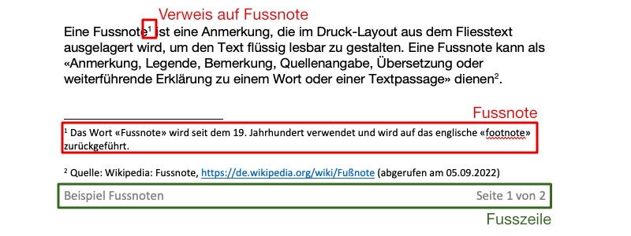
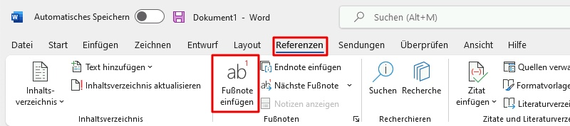

---
sidebar_custom_props:
  source:
    name: rothe.io
    ref: >-
      https://craft.rothe.io/DaKvaRbuG85WnX/b/1CDC8721-8F20-4D26-8323-45FB6DE27A71/2.4-%E2%80%94-Fussnoten
page_id: 1ab6bead-5595-4c44-9c07-23bb773d45cb
---

# Fussnoten

> Eine Fußnote ist eine Anmerkung, die im Druck-Layout aus dem Fließtext ausgelagert wird, um den Text flüssig lesbar zu gestalten.
>
> :::Cite
> Wikipedia: _Fussnote_. https://de.wikipedia.org/wiki/Fu%C3%9Fnote (abgerufen am 22.08.2024)
> :::

Fussnoten werden verwendet, um Definitionen, Erklärungen oder Quellenangaben aus dem Fliesstext auszulagern. Die Position des ausgelagerten Texts wird im Fliesstext mit einer hochgestellten Zahl dargestellt, welche auf die Fussnote verweist.

Unten an der Seite wird diese Zahl wiederholt, gefolgt vom ausgelagerten Text.

**Achtung:** Fussnoten werden oberhalb der Fusszeile dargestellt, sie sind nicht Teil der Fusszeile.

## Fussnoten einfügen
In Microsoft Word können Fussnoten über den Menüpunkt __Referenzen__ ‣ __Fußnote einfügen__ eingefügt werden:

---
