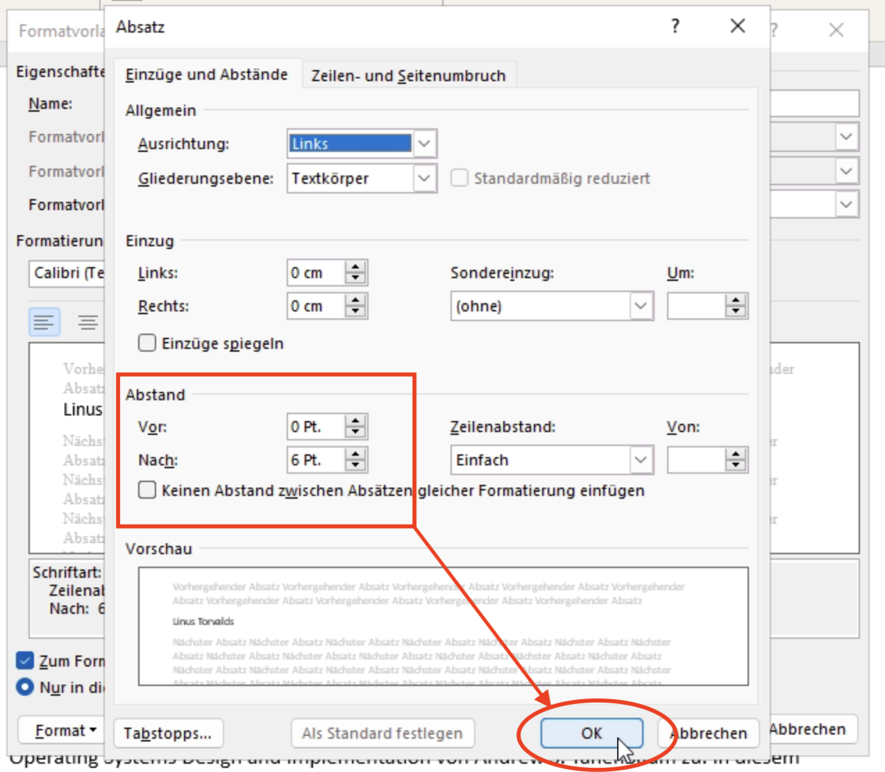
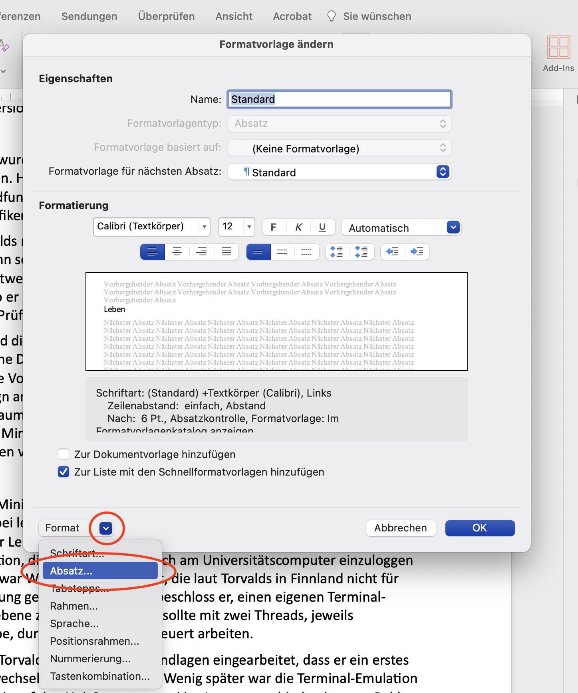

# Absatzabstand anpassen
Um den Absatzabstand auf einen bestimmten Wert zu setzten, gehen Sie folgendermassen vor:

::::Tabs
:::Tab[Windows]{value="win"}
Öffnen Sie das [Änderungs-Menu der entsprechenden Formatvorlage](Formatvorlagen-Anpassen#option-2-vorlagen-ändern) der entsprechenden Formatvorlage.

Klicken Sie unten rechts auf __Format__ → __Absatz__:

Hier können Sie im entsprechenden Feld den __Abstand vor__ oder den "Abstand nach" anpassen. Anschliessend bestätigen Sie mit __OK__.

:::

:::Tab[macOS]{value="macos"}
Öffnen Sie das [Änderungs-Menu der entsprechenden Formatvorlage](Formatvorlagen-Anpassen#option-2-vorlagen-ändern) der entsprechenden Formatvorlage.

Klicken SIe unten rechts auf __Format__ → __Absatz__:

Hier können Sie im entsprechenden Feld den __Abstand vor__ oder den __Abstand nach__ anpassen. Anschliessend bestätigen Sie mit __OK__.

:::
::::

---
