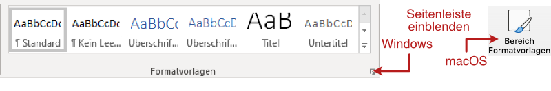
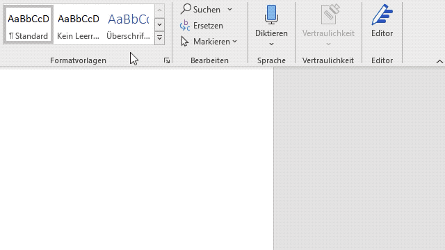
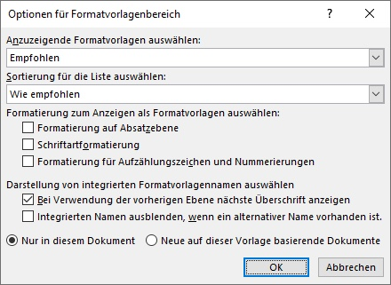

---
sidebar_custom_props:
    source:
        name: rothe.io
        ref: >-
            https://craft.rothe.io/DaKvaRbuG85WnX/b/0059CD2D-346F-4CE3-9023-0118A7792A9F/1.3-%E2%80%94-Formatvorlagens%C3%A4tze

page_id: c7f22dce-c8cb-4f85-b7fe-2ce9997b5e64
---

import TabItem from '@theme/TabItem';
import OsTabs from '@tdev-components/OsTabs';
import React from 'react';

# Formatvorlagen zuweisen

## Seitenleiste «Formatvorlagen»

Am einfachsten werden Formatvorlagen mit der entsprechenden Seitenleiste zugewiesen. Die Seitenleiste **Formatvorlagen** bietet einen guten Überblick der vorhandenen Formatvorlagen.

Diese Seitenleiste kann so angezeigt werden: 

- **Windows :mdi[microsoft-windows]**: Klicken Sie auf die untere rechte Ecke im Menübereich **Formatvorlagen**.
- **macOS :mdi[apple]**: Klicken Sie auf den Knopf **Bereich Formatvorlagen**.

## Formatvorlage zuweisen

Mit der Seitenleiste können einzelnen Textabschnitten wie folgt eine Formatvorlage zugewiesen werden:

- Auf den Textbereich klicken, dem eine Formatvorlage zugewiesen werden soll.
- Die entsprechende Formatvorlage auswählen.

## Weitere Einstellungen

Weitere Einstellungen können über **Optionen...** erreicht werden. Hier lässt sich z.B. einstellen, ob die empfohlenen, die im Dokument verwendeten oder alle verfügbaren Formatvorlagen angezeigt werden sollen.

---
