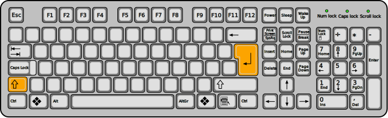

---
sidebar_custom_props:
    source:
        name: ict.mygymer.ch
        ref: 'https://ict.mygymer.ch/textverarbeitung/allgemein/absatz-vs-zeilenwechsel/'
page_id: bbb885dd-ceff-4a10-88f3-e8212bd723a0
---

# Absatz- vs. Zeilenwechsel

:::tip[Formatierungszeichen aktivieren] Wenn Sie Ihr Dokument nach Absatz- und Zeilenwechseln untersuchen möchten, empfiehlt es sich, [Formatierungszeichen](Formatierungszeichen) anzeigen zu lassen. :::

## Absatzwechsel

Absätze dienen der Strukturierung eines Dokumentes und werden mit **Enter** eingefügt. Der neue Absatz beginnt auf einer neuen Zeile, meist wird ein kleiner Abstand zwischen den Absätzen eingefügt. So können Textstruktur und zusammenhängende Textteile auf einen Blick erkannt werden.

## Zeilenwechseln

Ein Zeilenwechsel wird mit **Shift** + **Enter** eingefügt. Beim Zeilenwechsel handelt es sich um ein Formatierungszeichen, welches bewirkt, dass das nächste Zeichen auf einer neuen Zeile platziert wird. Es wird kein zusätzlicher Abstand zur oberen Zeile eingefügt.

Microsoft Word zeigt das Formatierungszeichen wie folgt an: **↵**

Zeilenumbrüche sollten Sie nur in ganz speziellen Situationen verwenden.

---
