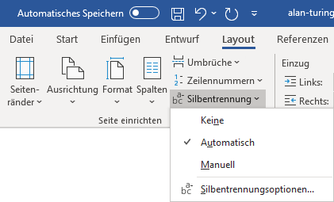

---
sidebar_custom_props:
  source:
    name: rothe.io
    ref: https://craft.rothe.io/DaKvaRbuG85WnX/b/1FD4472B-EDBC-4F4A-9A58-A7B2235D6A7A/2.6-%E2%80%94-Worttrennung
---

# Worttrennung

Worttrennung ist das Auftrennen von Wörtern mit Bindestrichen, um den Fliesstext kompakter darstellen zu können. Dies spart Platz und bei langen gedruckten Texten auch Papier und somit Kosten.

Ausserdem wirkt das Schriftbild gerade bei mehrspaltigen Texten mit Worttrennung regelmässiger und somit ästhetischer:

## Worttrennung in Word aktivieren
Um die Worttrennung in Word zu aktivieren, wird das Menü __Layout__ geöffnet und auf __Silbentrennung__ geklickt. Anschliessend wird der Menüpunkt __Automatisch__ gewählt.

Um die Worttrennung wieder zu deaktivieren, wird der Eintrag __Keine__ gewählt.

---