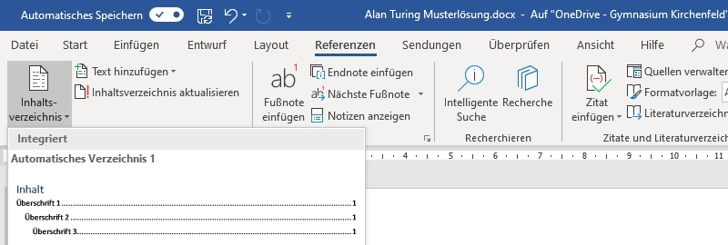
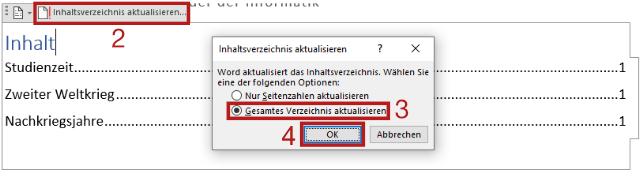

---
sidebar_custom_props:
  source:
    name: rothe.io
    ref: >-
      https://craft.rothe.io/DaKvaRbuG85WnX/b/B97B97F2-6E7D-46D1-AF49-26E9488592D9/1.5-%E2%80%94-Inhaltsverzeichnis
page_id: ac250e4f-8b31-4f21-bb55-43193a8fa223
---

# Inhaltsverzeichnis

## Inhaltsverzeichnis einfügen
Um in Microsoft Word ein Inhaltsverzeichnis einzufügen, wird der Menüpunkt __Referenzen__ ‣ __Inhaltsverzeichnis__ verwendet:

Es stehen verschiedene Layouts zur Auswahl. Im Zweifelsfall wird das oberste Layout gewählt.

Im Inhaltsverzeichnis erscheinen automatisch alle Überschriften, also alle Absätze, welchen eine «Überschrift»-Formatvorlage zugewiesen wurde.

## Inhaltsverzeichnis aktualisieren
Das Inhaltsverzeichnis wird nicht automatisch aktualisiert, wenn neue Überschriften eingefügt werden oder die Seitenzahlen sich ändern. Gehe so vor, um das Inhaltsverzeichnis zu aktualisieren:

1. Inhaltsverzeichnis anklicken
2. Auf __Inhaltsverzeichnis aktualisieren…__ klicken.
3. __Gesamtes Verzeichnis aktualisieren__ auswählen.
4. Auf __OK__ klicken.

---
