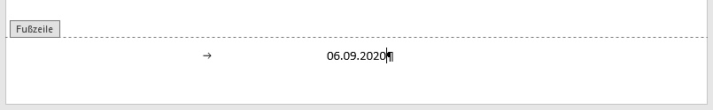

---
sidebar_custom_props:
    source:
        name: rothe.io
        ref: >-
            https://craft.rothe.io/DaKvaRbuG85WnX/b/688CC489-1680-46BA-8466-90BB3B353C56/2.3-%E2%80%94-Kopf--und-Fusszeile

page_id: d3aba14d-07b5-4924-9d0b-ebbd3e5f9f3a
---

# Kopf- und Fusszeilen

## Kopf- und Fusszeile bearbeiten

Mit einem **Doppelklick** auf den oberen bzw. untern Rand der Seite kann die Kopf- bzw. Fusszeile bearbeitet werden.

Word zeigt durch eine graue Box mit dem Inhalt **Kopfzeile** bzw. **Fusszeile** an, dass diese aktiviert ist.

Durch einen _Doppelklick_ auf den Mittelteil der Seite wird das Bearbeiten der Kopf- und Fusszeile beendet.

## Tabulatoren

Die Kopf- und Fusszeile ist durch Tabulatoren in einen **linken**, einen **mittleren** und einen **rechten** Teil unterteilt. Die Inhalte in diesen Teilen werden entsprechend linksbündig, zentriert und rechtsbündig ausgerichtet.

Die Teile werden durch ein Tabulatorzeichen voneinander getrennt. Dieses unsichtbare Formatierungszeichen wird mit der Tabulatortaste **⇥** eingefügt.

Zur besseren Übersicht können in Word die [Formatierungszeichen](Formatierungszeichen) eingeblendet werden.

---
