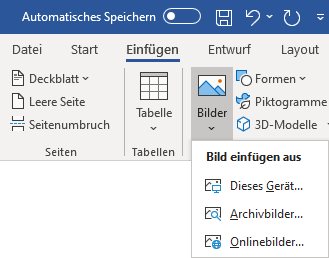
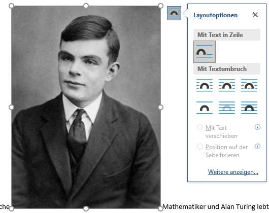
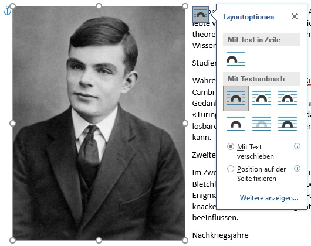
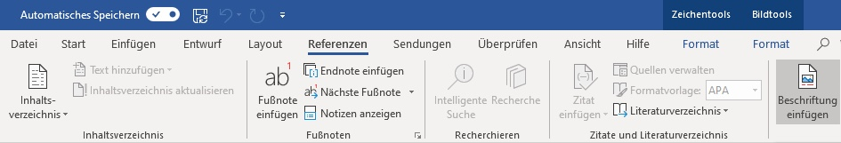
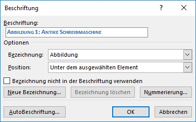

---
sidebar_custom_props:
    source:
        name: rothe.io
        ref: >-
            https://craft.rothe.io/DaKvaRbuG85WnX/b/8510D3D7-C97E-4466-9DCF-DDB629F1160B/2.5-%E2%80%94-Abbildungen

page_id: b4a33f2e-0f64-4cd1-b427-20f9db794928
---

# Abbildungen

:::key[Kurzanleitung] Beim Einfügen eines Bildes in Word sollte immer nach folgendem Schema vorgegangen werden:

1. Bild einfügen
2. Textumbruch auf **Quadrat** (macOS: **Rechteck**) ändern
3. Grösse anpassen
4. Beschriftung einfügen
5. Bild und Beschriftung gruppieren :::

## 1. Einfügen

In Microsoft Word wird ein Bild über den Menüpunkt **Einfügen** ‣ **Bilder** eingefügt. 

## 2. Textfluss

Wenn ein Bild in Word einfügt, so hat es zunächst den Textfluss «Mit Text in Zeile». Dabei verhält sich das Bild wie ein einzelner Buchstabe im Text, also wie ein sehr grosser Emoji.

:::cards{flexBasis="450px"}  ::br  :::

Normalerweise wollen wir aber ein Bild beliebig auf der Seite platzieren können. Dazu muss die Textfluss-Eigenschaft des Bildes auf **Quadrat** (macOS: **Rechteck**) umgeschaltet werden. Nun «fliesst» der Text um das Bild herum.

:::danger[Textfluss umstellen] Der Textfluss muss unbedingt umgestellt werden, ansonsten kann das Bild später auch nicht mit der Beschriftung gruppiert werden. :::

## 3. Grösse ändern

Die Grösse des Bildes kann angepasst werden, indem an einer der Ecken gezogen wird. Drücke die **⇧**-Taste während des Ziehens, um das Seitenverhältnis zu bewahren und das Bild nicht zu verzerren.

## 4. Beschriftung einfügen

Um eine Beschriftung für ein Bild einzufügen, muss erst das Bild durch anklicken ausgewählt werden. Anschliessend wird der Menüpunkt **Referenzen** ‣ **Beschriftung einfügen** ausgewählt.

Word zeigt ein Dialogfenster an, in welchem die Beschriftung eingegeben werden kann. Mit einem Klick auf **OK** wird die Beschriftung in das Dokument eingefügt.

## 5. Bild und Beschriftung gruppieren

Normalerweise möchten wir ein Bild zusammen mit seiner Beschriftung verschieben. Dies geht einfacher, wenn die beiden Elemente gruppiert werden. Das geht so:

- Auf die Beschriftung klicken, um sie auszuwählen.
- Die **⇧**-Taste drücken und auf das Bild klicken, um dieses zusätzlich auszuwählen.
- Das _Kontextmenü_ öffnen (Rechtsklick), und den Menüpunkt **Gruppieren** ‣ **Gruppieren** wählen.

---
