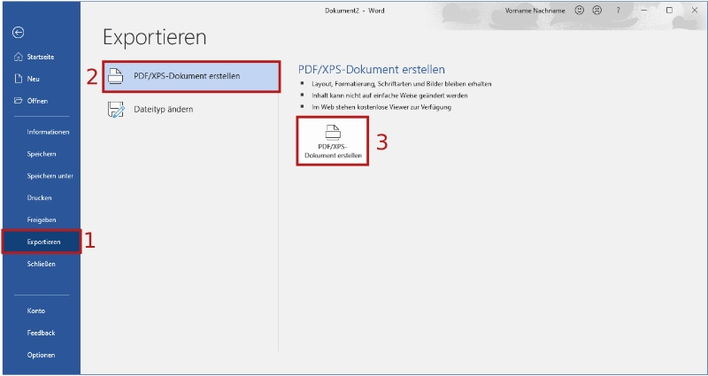
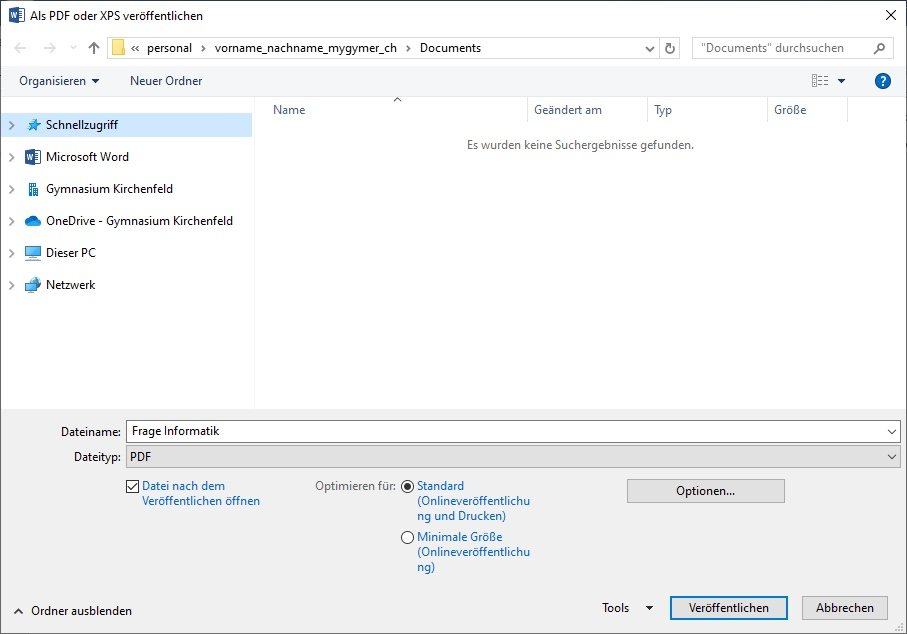

---
sidebar_custom_props:
    source:
        name: rothe.io
        ref: >-
            https://craft.rothe.io/DaKvaRbuG85WnX/b/3CA3C740-CE4E-4947-82CE-23FE1B81530E/3.3-%E2%80%94-PDF-exportieren

page_id: 7f49c46f-baf9-4309-a735-cce99a3709e9
---

# PDF Export

Um ein Word-Dokument als PDF-Datei zu exportieren, gehen wir folgendermassen vor:

1. Menüpunkt **Datei** ‣ **Exportieren** wählen.
2. Sicherstellen, dass **PDF/XPS-Dokument erstellen** ausgewählt ist.
3. Auf **PDF/XPS-Dokument erstellen** klicken.

Nun erscheint das folgende Fenster. Hier kann einfach auf **Veröffentlichen** geklickt werden. Damit wird die PDF-Datei im gleichen Ordner wie die Word-Datei gespeichert.

---
