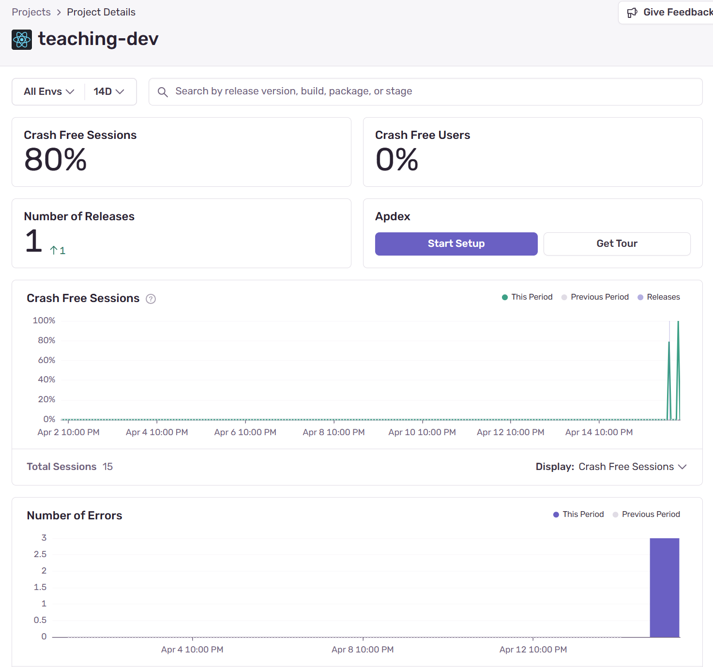

# Error Reporting



Fehler lassen sich mit [Sentry](https://sentry.io/) erfassen - sowohl im Backend wie auch im Frontend. Sentry ist ein Open-Source-Tool, das Fehlerberichte und Performance-Metriken in **Echtzeit** erfasst. Es bietet eine benutzerfreundliche Oberfläche zur Überwachung und Analyse von Fehlern in Anwendungen (inkl. Stack-Traces, Benutzerumgebung und Kontextinformationen).

Die Integration von Sentry in die Anwendung erfolgt über die Umgebungsvariablen, die im Build-Prozess gesetzt werden:

```bash title=".env"
SENTRY_DSN=https://<key>@o<id>.ingest.sentry.io/<project>
SENTRY_AUTH_TOKEN=<token>
SENTRY_ORG=<org>
SENTRY_PROJECT=<project>
```

Die Sentry-DSN wird beim erstellen eines neuen Projekts angzeigt.
Damit Stack-Traces sinnvoll interpretierbar sind, sollten die Source-Maps nach einem Build jeweils auf Sentry.io hochgeladen werden. Dazu braucht es das `SENTRY_AUTH_TOKEN`. Es kann generiert werden, indem

```bash
npx @sentry/wizard@latest -i sourcemaps
```

im jeweiligen Repository ausgeführt wird.