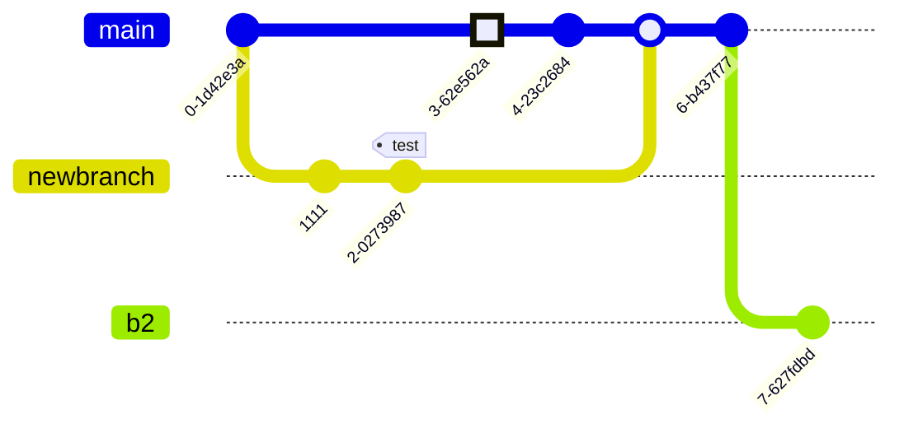

import BrowserWindow from '@tdev-components/BrowserWindow';

# Mermaid

[Docusaurus](https://docusaurus.io/docs/api/themes/@docusaurus/theme-mermaid) unterstützt [Mermaid](https://docs.mermaidchart.com/mermaid-oss/intro/index.html) Diagramme in Markdown Dateien.


[Live Editor](https://mermaid.live/)

## Beispiele
Beispiele von [https://docs.mermaidchart.com](https://docs.mermaidchart.com/mermaid-oss/syntax/flowchart.html)

### Graph
````md

````
<BrowserWindow>

</BrowserWindow>

### Pie Chart
````md

````

<BrowserWindow>

</BrowserWindow>


### Sequence Diagram
````md

oder


````

<BrowserWindow>
:::flex{flexBasis=220px}


::br

:::
</BrowserWindow>

### Git Graph
````md

````

<BrowserWindow>

</BrowserWindow>

````md

### State Diagram


````

<BrowserWindow>

</BrowserWindow>

### Gantt Chart

````md


```` 

<BrowserWindow>


</BrowserWindow>
