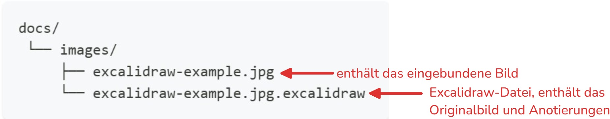
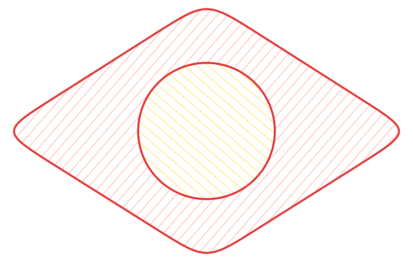

# Bilder Annotieren

:::warning[Nur für Chrome-Browser]
Die Excalidraw-Integration für das Editieren von Bildern basiert auf der [Local File System Access API](https://developer.mozilla.org/de/docs/Web/API/Window/showOpenFilePicker), welche aktuell nur unter Chromium-basierten Browsern (z.B. Google Chrome, Microsoft Edge) unterstützt wird.
:::

Oft müssen Screenshots oder Bilder annotiert werden. Ansich praktisch, bis sich das Bild ändert, die Anmerkungen aber eigentlich gleich bleiben (z.B. wenn das neue Excel eine leicht andere Benutzeroberfläche hat).

TDev bringt in der Entwicklungsumgebung eine einfache Möglichkeit mit, Bilder zu annotieren, wobei die Originalbilder erhalten und die Anmerkungen weiterhin editierbar bleiben.

:::info[Technischer Hintergrund]
Die Excalidraw-Integration für das Editieren von Bildern basiert auf der [Local File System Access API](https://developer.mozilla.org/de/docs/Web/API/Window/showOpenFilePicker), welche aktuell nur unter Chrome-basierten Browsern (z.B. Google Chrome, Microsoft Edge) unterstützt wird.

Sobald ein Bild editiert wird, wird eine gleichnamige [Excalidraw](https://excalidraw.com/)-Datei erstellt und das Bild als Hintergrund gesetzt. Beim speichern wird das Bild inkl. der Anmerkungen exportiert und gespeichert. Das Originalbild ist fortan als Bildquelle in Excalidraw hinerlegt und kann jederzeit wiederhergestellt werden.
:::

Nach dem Speichern im Editor wird die Excalidraw-Datei (`.excalidraw`) im gleichen Ordner wie das Bild abgelegt.





Dies hat den Vorteil, dass die Anotierungen unabhängig von der Bilddatei gespeichert werden. Dies hat mehrere Vorteile:
- Die Original-Bilddatei bleibt unverändert (und kann wiederhergestellt werden)
- Die servierte Bilddatei bleibt klein, da das Bild und die Anotierungen getrennt gespeichert werden
- Die Anotierungen können jederzeit wieder angepasst werden
- Das Hintergrundbild kann ausgetauscht werden, ohne die Anotierungen zu verlieren 


:::warning[Exportkonfiguration]
Beim Exportieren wird das Bild in der Regel im Original-Format gespeichert. Folgende Konfigurationen werden angewandt:

- Export mit `92` DPI
- Bildbreite: wie das Original, aber nicht breiter als `3840px`.
- Bildqualität von `0.8` (für __.jpeg__ und __.webp__ Bilder).
:::


## Beispiel

::video[./images/demo-1.mp4]{mute=1}

### Effizienteres webp-Exportformat

Die Bilder lassen sich auch als webp exportieren:


:::warning[Webp-Export]
Wird ein Bild als __WebP__ exportiert, müssen die Quellen im Markdown **manuell** angepasst werden.
:::


## Neue Excalidraw-Zeichnung erstellen

Es können auch neue Excalidraw-Zeichnungen erstellt werden, indem im Markdown ein neuer Bild-Pfad angegeben wird:

```md

```

Dann wird:
- basierend auf der Dateiendung ein neues Bild beim angegebenen Pfad erzeugt (erzeugt wenn nötig auch die Ordnerstruktur)
- der Pfad im Markdown-Bild ohne das `.new` Suffix überschrieben
- eine neue, leere Excalidraw-Zeichnung am angegebenen Pfad (hier `./images/zeichnung.webp.excalidraw`) erstellt

```md

```

Unterstützte Bildformate:
- `.png`
- `.jpg`
- `.jpeg`
- `.svg`
- `.webp`

::video[./images/excalidraw-standalone.mp4]

## Manuell ein Excalidraw Bild hinzufügen

Es können auch reine Excalidraw Bilder erstellt werden, die keine Hintergrundbilder enthalten (und bei welchen entsprechend auch das Hintergrundbild nicht ersetzt werden kann).

Um ein solches Bild neu zu erstellen:
1. Leeres excalidraw file erstellen, bspw. `./images/demo.svg.excalidraw` mit dem Inhalt `{}` (muss ein valides `JSON` sein)
2. Leeres SVG-Bild erstellen, bspw. `./images/demo.svg`
3. SVG-Bild im Markdown referenzieren:
   ```md
   
   ```

:::warning[Zu beachten]
Sobald das SVG-Bild bearbeitet wird, wird die entsprechende `demo.svg.excalidraw` Datei eingelesen um die Szene aufzubauen. Beim Export wird `demo.svg` in jedem Fall überschrieben - es lohn sich also nicht, hier ein hübsches SVG-Bild zu suchen.
:::


:::note[Technischer Hintergrund]
Ob ein Hintergrundbild vorhanden ist oder nicht, wird vom Vorhandensein einer Element- & File-ID `TDEV-BACKGROUND-IMAGE` bzw. `TDEV-BACKGROUND--FILE` abgeleitet. Ist keine ID vorhanden, wird stets die Bild-Erweiterung (`.png`, `.jpg`, `.svg`, `.webp`) für das Export-Format verwendet.

Für Zeichnungen ohne Hintergrundbild wird ein Meta-Element `TDEV-STANDALONE-DRAWING` hinzugefügt, welches zusätzliche Export-relevante Informationen enthält.
:::

:::info[Empfohlenes Export-Format für reine Excalidraw Bilder]
Das empfohlene Export-Format für reine Excalidraw Bilder ist `SVG`. Dieses Format ermöglicht eine verlustfreie Skalierung und Bearbeitung der Bilder.

Eine Ausnahme bilden Excalidraw Szenen mit vielen eingefügten Bildern.
:::