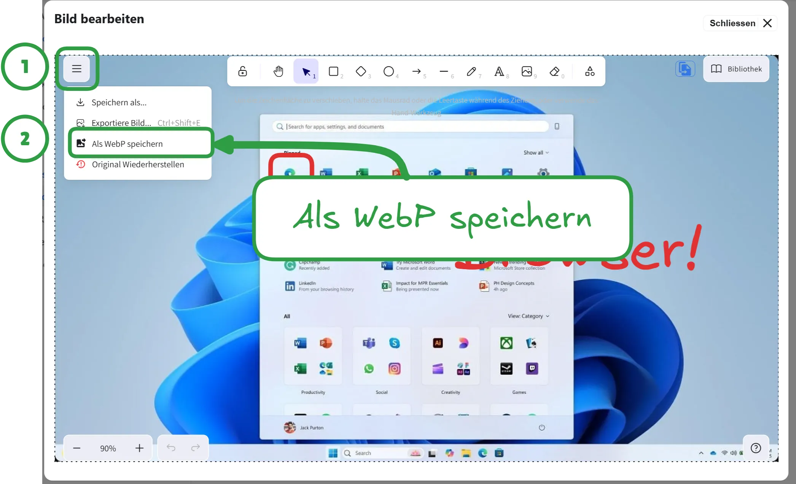

# Bilder Annotieren

Oft müssen Screenshots oder Bilder annotiert werden. Ansich praktisch, bis sich das Bild ändert, die Anmerkungen aber eigentlich gleich bleiben (z.B. wenn das neue Excel eine leicht andere Benutzeroberfläche hat).

TDev bringt in der Entwicklungsumgebung eine einfache Möglichkeit mit, Bilder zu annotieren, wobei die Originalbilder erhalten und die Anmerkungen weiterhin editierbar bleiben.

:::info[Technischer Hintergrund]
Mit der [File System Access API](https://developer.mozilla.org/en-US/docs/Web/API/File_System_API) können lokale Dateien und Ordner im Browser geöffnet und bearbeitet werden.

Sobald ein Bild editiert wird, wird eine gleichnamige [Excalidraw](https://excalidraw.com/)-Datei erstellt und das Bild als Hintergrund gesetzt. Beim speichern wird das Bild inkl. der Anmerkungen exportiert und gespeichert. Das Originalbild ist fortan als Bildquelle in Excalidraw hinerlegt und kann jederzeit wiederhergestellt werden.
:::

:::warning[Exportkonfiguration]
Beim Exportieren wird das Bild in der Regel im Original-Format gespeichert. Folgende Konfigurationen werden angewandt:

- Export mit `92` DPI
- Bildbreite: wie das Original, aber nicht breiter als `3840px`.
- Bildqualität von `0.8` (für __.jpeg__ und __.webp__ Bilder).
:::

## Beispiel

::video[./images/demo-1.mp4]{mute=1}

### Effizienteres webp-Exportformat

Die Bilder lassen sich auch als webp exportieren:

:::warning[Webp-Export]
Wird ein Bild als __WebP__ exportiert, müssen die Quellen im Markdown **manuell** angepasst werden.
:::