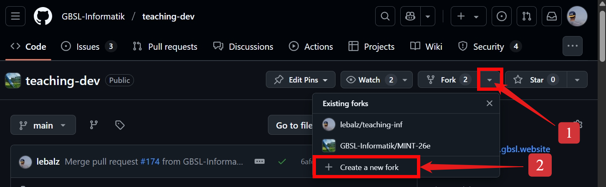
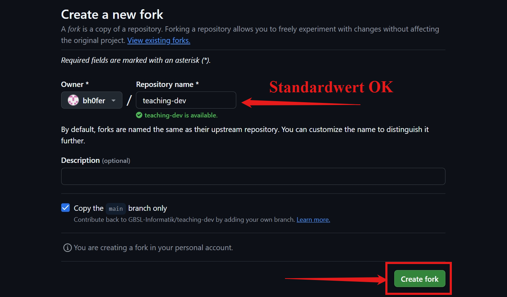
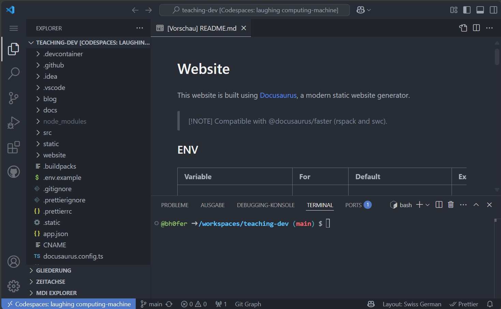
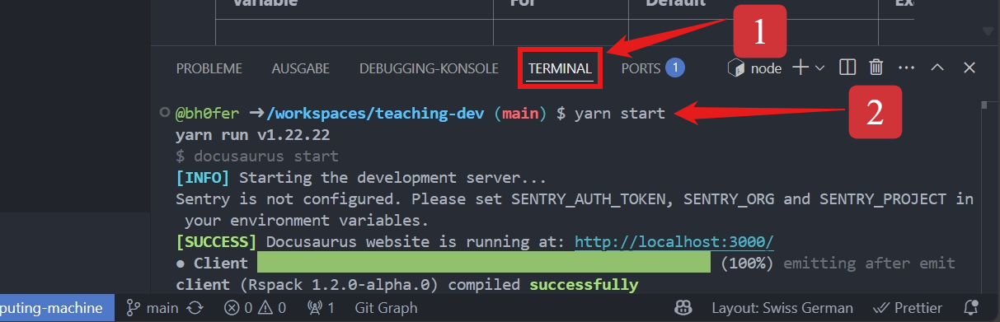
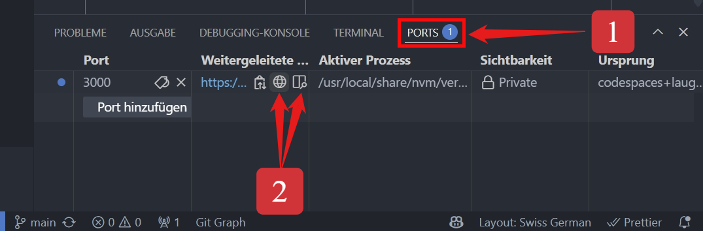
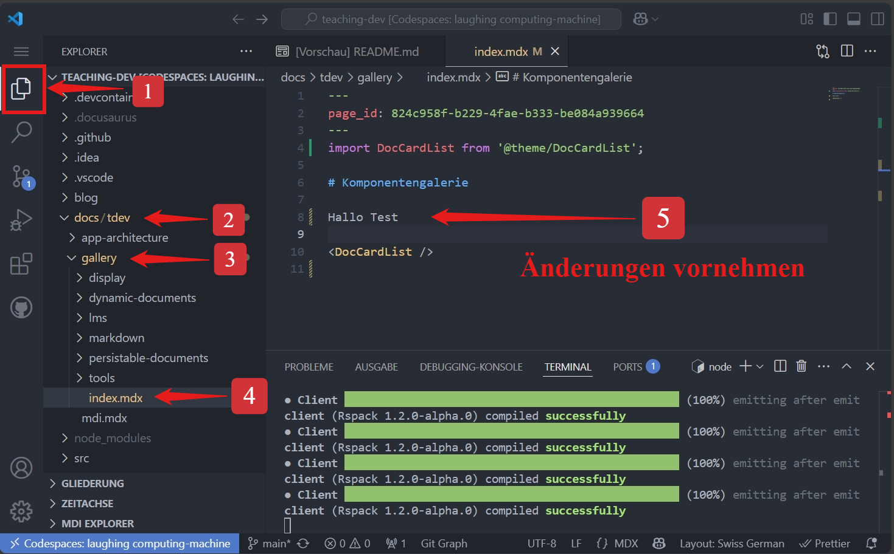

import Steps from '@tdev-components/Steps';

# Quickstart

Um die Möglichkeiten von der Unterrichtswebseite auszuprobieren, ohne auf dem eigenen Computer etwas zu installieren, können [GitHub Codespaces](https://github.com/features/codespaces) verwendet werden.

<Steps>
1. Repository [GBSL-Informatik/teaching-dev](https://github.com/GBSL-Informatik/teaching-dev) **forken**
    
    

    

2. Im geforkten Repository, einen **Codespace** erstellen\
    

3. Warten ☕\
    Es öffnet sich ein neuer Tab und der Codespace wird eingerichtet. Dabei wird automatisch
    - eine NodeJS Umgebung installiert und alle Abhängigkeiten installiert
    - nützliche Erweiterungen für VS Code installiert

    Wenn der Codespace bereit ist (ca. 1-2 Minuten), sollte die Seite so aussehen:

    

4. Live-Server starten  
    - Im Terminal den Befehl `yarn start` ausführen

        
    - Es öffnet sich ein neuer Tab mit Vorschau der Webseite. Alternativ kann die URL auch manuell aufgerufen werden:

        
    
    Nun ist alles bereit, um die Webseite zu testen...

    
5. Änderungen vornehmen und ausprobieren
    - Im Codespace können nun Änderungen an der Webseite vorgenommen werden.
    - Die Änderungen werden automatisch in der Vorschau aktualisiert.

    

</Steps>
