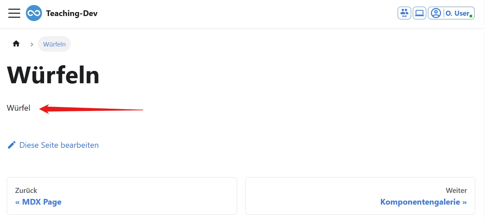
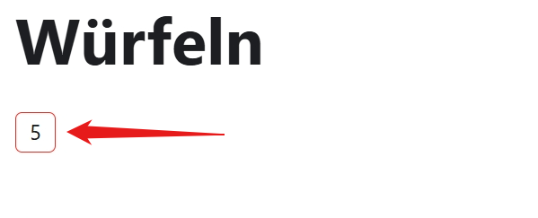

import ProgressState from '@tdev-components/documents/ProgressState';
import Dice from './components/Dice';
import DiceHistory from './components/DiceHistory';
import BrowserWindow from '@tdev-components/BrowserWindow';

# Würfeln

:::info[Diese interaktive Komponente wird erstellt]
<BrowserWindow>
    <DiceHistory />
</BrowserWindow>
:::

<div className="compactDeflist">
<ProgressState>
1. Neues Dokument anlegen, in welchem wir den Würfel später verwenden.
    ```md title="docs/tdev/dice/index.mdx"
    # Würfeln
    ```
2. Den Würfel erstellen. In React sind alle Komponenten eine Funktion, deren Rückgabewert in einer erweiterten `HTML`-Syntax 
   geschrieben ist. Diese Syntax wird von React in HTML umgewandelt.
   
    ```tsx title="docs/tdev/dice/Dice.tsx"
    import React from 'react';

    const Dice = () => {
        return (
            <div>
                Würfel
            </div>
        );
    }

    export default Dice;
    ```

    Die Funktion `Dice` ist eine React-Komponente und gibt ein `div`-Element mit dem Text "Würfel" zurück. Die Komponente kann nun als `<Dice />` aufgerufen werden.
3. Die Komponente in der `index.mdx`-Datei importieren und verwenden:
    ```md title="docs/tdev/dice/index.mdx" showLineNumbers
    ---
    page_id: xxxxxxxx-xxxx-xxxx-xxxx-xxxxxxxxxxxx
    ---
    {/*highlight-next-line*/}
    import Dice from './Dice';

    # Würfeln

    {/*highlight-next-line*/}
    <Dice />
    ```
    :::warning[Leerzeile nach dem Import]
    Beachte, dass nach dem Import-Statement auf auf **Zeile 5** eine Leerzeile stehen muss, damit der Import funktioniert und die Überschrift korrekt dargestellt wird.
    :::

    Die Vorschau sollte nun den Text "Würfel" anzeigen.
    <BrowserWindow>
    
    </BrowserWindow>
4. Nun soll anstelle des "Würfel"-Textes eine Zahl zwischen 1 und 6 angezeigt werden.

    ```tsx title="docs/tdev/dice/Dice.tsx" showLineNumbers
    import React from 'react';

    // highlight-start
    const rollDice = () => {
        return Math.floor(Math.random() * 6) + 1;
    }
    // highlight-end

    const Dice = () => {
        // highlight-next-line
        const num = rollDice();
        
        return (
            <div>
                // highlight-next-line
                {num}
            </div>
        );
    };

    export default Dice;
    ```
    :::note
    Zeilen 3-5
    : Die Funktion `rollDice` wird definiert - sie gibt eine Zufallszahl zwischen 1 und 6 zurück.
    Zeile 8
    : `rollDice` wird aufgerufen und das Ergebnis in der Konstante `num` gespeichert.
    Zeile 12
    : Die Konstante `num` wird in geschweifte Klammern `{num}` gesetzt. Somit wird der Inhalt **evaluiert**/ausgewertet und das Ergebnis angezeigt.
    :::

    :::info[Zufallszahl]
    Jedesmal beim Neuladen der Seite (oder wenn beim "Hinnavigieren" auf die Seite) wird eine neue Zufallszahl generiert. In React-Sprache sagt man, "wenn die Komponente neu gerendert wird, wird eine neue Zufallszahl generiert".
    :::
5. Beim Klicken auf den Würfel soll nun eine neue Zahl angezeigt werden. Dazu muss
    1. Ein neuer Wert generiert werden
    2. der Aktuelle Wert durch den neuen Wert ersetzt werden.
    
    Hier kommt React ins Spiel. React hat einen eigenen Mechanismus, um den aktuellen Wert zu speichern und bei Änderungen zu aktualisieren. Dazu wird der Hook `useState` verwendet.

    ```tsx title="docs/tdev/dice/Dice.tsx" showLineNumbers
    import React from 'react';

    const rollDice = () => {
        return Math.floor(Math.random() * 6) + 1;
    }

    const Dice = () => {
        // highlight-next-line
        const [num, setNum] = React.useState(rollDice());

        return (
            // highlight-next-line
            <div onClick={() => setNum(rollDice())}>
                {num}
            </div>
        );
    };

    export default Dice;
    ```
    ::::note
    Zeile 8
    : `React.useState` ist ein sog. **Hook**. Ein Hook ist eine Funktion, die es ermöglicht, den Zustand einer Komponente zu speichern und zu aktualisieren. `useState` gibt ein Array mit zwei Werten zurück:
    :::dd
    - den aktuellen Wert (in diesem Fall `num`)
    - eine Funktion, um den Wert zu aktualisieren (in diesem Fall `setNum`).
    
    `num` enthält immer den aktuellen Wert. Dass es ein `const` ist, ist kein Widerspruch, da alle Werte in einer React-Komponente nur genau bei einem Render verwendet werden. Dank dem `useState`-Hook wird der Wert von einem zum nächsten Render übertragen.
    :::
    Zeile 11
    : im `onClick`-Event wird die Funktion `setNum` aufgerufen, um den aktuellen Wert zu aktualisieren.
    ::::
    :::tip[Ausprobieren]
    Beim Klicken auf den Würfel wird nun eine neue Zahl angezeigt.
    :::

6. Aufhübschen mit CSS\
    Wir fügen ein Stylesheet hinzu, um den Würfel zu stylen. Damit es keine Konflikte zwischen den verschiedenen Stylesheets gibt, werden sog. **CSS-Module** verwendet. Ein CSS-Modul bezieht sich nur auf die Komponenten, in welchen es importiert wird. Es hat die Dateiendung `.module.css`.

    ```css title="docs/tdev/dice/Dice.module.css"
    .dice {
        width: 30px;
        height: 30px;
        border: 1px solid red;
        border-radius: 5px;
        display: flex;
        align-items: center;
        justify-content: center;
        cursor: pointer;
        user-select: none;
    }
    ```

    und in der `Dice.tsx`-Datei importieren:

    ```tsx title="docs/tdev/dice/Dice.tsx" showLineNumbers
    import React from 'react';
    // highlight-next-line
    import styles from './Dice.module.css';

    const rollDice = () => {
        return Math.floor(Math.random() * 6) + 1;
    };

    const Dice = () => {
        const [num, setNum] = React.useState(rollDice());

        return (
            // highlight-next-line
            <div className={styles.dice} onClick={() => setNum(rollDice())}>
                {num}
            </div>
        );
    };

    export default Dice;
    ```
    :::note
    Zeile 2
    : Die CSS-Datei wird als JS-Objekt importiert.
    Zeile 12
    : Die CSS-Klasse `dice` wird mit `className={styles.dice}` auf das `div`-Element angewendet.
    :::

    <BrowserWindow>
    
    </BrowserWindow>

7. Eine Animation fürs Würfeln Hhinzufügen
    Dass der Würfel am würfeln ist, soll visualisiert werden.

    <BrowserWindow>
    <Dice />
    </BrowserWindow>

    Dazu brauchen wir einen zusätzlichen Zustand `isRolling`, der beim Würfeln auf `true` gesetzt wird und nach 1 Sekunde wieder auf `false`. Falls `isRolling` `true` ist, wird eine CSS-Klasse `isRolling` zum `div`-Element hinzugefügt.

    ```tsx title="docs/tdev/dice/Dice.tsx" showLineNumbers
    import React from 'react';
    import styles from './Dice.module.css';
    import clsx from 'clsx';

    const rollDice = () => {
        return Math.floor(Math.random() * 6) + 1;
    };

    const Dice = () => {
        const [num, setNum] = React.useState(rollDice());
        // highlight-next-line
        const [isRolling, setIsRolling] = React.useState(false);

        // highlight-start
        React.useEffect(() => {
            if (isRolling) {
                const interval = setInterval(() => {
                    setIsRolling(false);
                }, 1000);
                return () => clearInterval(interval);
            }
        }, [isRolling]);
        // highlight-end

        return (
            <div 
                // highlight-next-line
                className={clsx(styles.dice, isRolling && styles.isRolling)} 
                onClick={() => {
                    setNum(rollDice());
                    // highlight-next-line
                    setIsRolling(true);
                }}
            >
                {num}
            </div>
        );
    };

    export default Dice;
    ```
    :::::note
    Zeile 11
    : Ein neuer Zustand `isRolling` wird hinzugefügt. Beim Klicken auf den Würfel wird in Zeile 27 `isRolling` auf `true` gesetzt.
    ::::dd
    :::warning[Zeile 27: Arrow-Function]
    Beachte die geänderte Syntax auf Zeile 27:

    Der Funktionskörper ist nun mehrzeilig und braucht deshalb geschweifte Klammern.\
    Aus `onClick={() => setNum(rollDice())}` wird:
    ```tsx
    onClick={() => {
        setNum(rollDice());
        setIsRolling(true);
    }}
    ```
    :::
    ::::
    Zeilen 14-20
    : Der `useEffect`-Hook wird verwendet, um eine Funktion auszuführen, wenn sich der Zustand `isRolling` ändert. Wenn `isRolling` auf `true` gesetzt wird, wird ein Intervall gestartet, das nach 1 Sekunde `isRolling` wieder auf `false` setzt.
    : Der Rückgabe-Wert eines `useEffect`-Hooks kann zum Stoppen des Intervall-Timers verwendet werden. Ist der Rückgabewert eine Funktion, so wird diese aufgerufen, sobald sich `isRolling` ändert oder von der Seite wegnavigiert wird (in React-Sprache: "sobald die Komponente `unmounted` wird").
    : Hier wird mit `return () => clearInterval(interval)` der Intervalltimer gestoppt, sofern er noch nicht abgelaufen ist.
    Zeile 24
    : Falls `isRolling` `true` ist, wird die CSS-Klasse `isRolling` zum `div`-Element hinzugefügt. Damit nicht von Hand einzelne CSS-Klassen hinzugefügt werden müssen, wird die Bibliothek `clsx` verwendet. `clsx` sortierte `falsey` Werte aus und gibt nur die aktuell aktiven CSS-Klassen zurück.
    : So wäre bei `clsx('foo', false, 1 > 0 && 'bar', 0 > 1 && 'baz')` der Rückgabewert `'foo bar'`.
    :::::
    Damit der Würfel auch wirklich animiert ist, muss noch das CSS angepasst werden.

    ```css title="docs/tdev/dice/Dice.module.css" showLineNumbers
    .dice {
        width: 30px;
        height: 30px;
        border: 1px solid red;
        border-radius: 5px;
        display: flex;
        align-items: center;
        justify-content: center;
        cursor: pointer;
        user-select: none;
        // highlight-start
        &.isRolling {
            animation: rotate 1s ease-out infinite;
        }
        // highlight-end
    }

    // highlight-start
    @keyframes rotate {
        100% {
            transform: rotate(2turn) scale(1.2);
        }
    }
    // highlight-end
    ```

8. (Optional) Eine History hinzufügen und die letzten 5 Würfe anzeigen:
    <DiceHistory />

    ```tsx title="docs/tdev/dice/Dice.tsx" showLineNumbers
    import React from 'react';
    import styles from './Dice.module.css';
    import clsx from 'clsx';

    const rollDice = () => {
        return Math.floor(Math.random() * 6) + 1;
    };

    // highlight-start
    interface Props {
        num: number | null;
        onRoll?: () => void;
        isRolling?: boolean;
    }
    // highlight-end

    // highlight-start
    const DiceComponent = (props: Props) => {
        return (
            <div
                className={clsx(styles.dice, props.isRolling && styles.isRolling)}
                onClick={props.onRoll}
            >
                {props.num}
            </div>
        );
    };
    // highlight-end

    const Dice = () => {
        const [num, setNum] = React.useState(rollDice());
        const [isRolling, setIsRolling] = React.useState(false);
        // highlight-next-line
        const [history, setHistory] = React.useState<(number | null)[]>([null, null, null, null, null]);

        React.useEffect(() => {
            if (isRolling) {
                const interval = setInterval(() => {
                    setIsRolling(false);
                    // highlight-next-line
                    setHistory((prev) => [num, ...prev].slice(0, 5));
                }, 1000);
                return () => clearInterval(interval);
            }
        }, [isRolling, num]);

        return (
            // highlight-start
            <div className={clsx(styles.container)}>
                <DiceComponent
                    num={num}
                    isRolling={isRolling}
                    onRoll={() => {
                        setNum(rollDice());
                        setIsRolling(true);
                    }} 
                />
                <div className={clsx(styles.history)}>
                    {history.map((val, idx) => {
                        return <DiceComponent num={val} key={idx} />;
                    })}
                </div>
            </div>
            // highlight-end
        );
    };

    export default Dice;
    ```
    :::::note
    Zeilen 15-24
    : Ein einzelner Würfel wird in eine eigene Komponente `DiceComponent` ausgelagert. Diese erhält die Props `onRoll`, `isRolling` und `num`. Da TypeScript verwendet wird, werden diese Props auf Zeilen 9-13 im Interface `Props` definiert.
    : Auf Zeile 10 steht: `num: number` - `num` muss übergeben werden, bspw. `<DiceComponent num={3} />`.
    : Die Syntax `onRoll?: () => void` bedeutet, dass die Prop `onRoll` optional ist - das `?` beschreibt dies.
    Zeile 29
    : Es wird ein neuer Zustand `history` hinzugefügt, der die letzten 5 Würfe speichert. Achtung! React wechselt den Zustand nur dann, wenn sich die Referenz ändert.
    Zeile 35
    : Nachdem die Animation abgelaufen ist, wird der aktuelle Wert `num` der History hinzugefügt.
    : `setHistory((prev) => [num, ...prev].slice(0, 5))` macht mehrere Dinge:
    :::dd
    - `prev` ist der vorherige Zustand von `history`, also die letzten Würfen (kann auch leer sein).
    - `[num, ...prev]` erstellt ein neues Array mit dem aktuellen Wert `num` als ersten Wert und allen vorherigen Werten danach.
        ```ts
        prev = [1, 2, 3, 4, 5]
        num = 6
        [num, ...prev] // => [6, 1, 2, 3, 4, 5]
        ```
    - `slice(0, 5)` schneidet das Array auf die ersten 5 Werte. Wenn weniger als 5 Werte vorhanden sind, wird das Array nicht verändert.
    :::	
    Zeilen 42-56
    : Die History wird angezeigt.
    ::::dd
    Es wird ein `div`-Element mit der CSS-Klasse `history` erstellt. Darin wird zuerste eine einzelne Würfelkomponente (Zeilen 43-50) angezeigt und danach die letzten 5 Würfe (Zeilen 51-55).

    Bemerkenswert sind die Zeilen 52-54:
    ```tsx
    {history.map((val, idx) => {
        return <DiceComponent num={val} key={idx} />;
    })}
    ```
    `history` ist ein Array mit den letzten 5 Würfen. Mit der Methode `map` wird über das Array iteriert und für jeden Wert `val` eine neue `DiceComponent` erstellt. Der Index `idx` wird als `key`-Prop übergeben.
    `key` ist ein spezielles Attribut in React, das verwendet wird, um die einzelnen Elemente in einer Liste zu identifizieren. Es ist wichtig, dass jeder `key` innerhalb seines Eltern-Elements **eindeutig** ist, damit React die Elemente effizient aktualisieren kann.

    :::details[Reacts Rükgabewerte]
    React-Komponenten dürfen immer nur **ein** Element zurückgeben.
    ```tsx
    return (
        <div>...</div>
        <div>...</div>
    );
    ```
    wäre also nicht erlaubt.

    Entweder werden die beiden `div`-Elemente in ein weiteres `div`-Element gepackt:
    ```tsx
    return (
        <div>
            <div>...</div>
            <div>...</div>
        </div>
    );
    ```
    oder die `div`-Elemente werden in ein `React.Fragment` gepackt:
    ```tsx
    return (
        <>
            <div>...</div>
            <div>...</div>
        </>
    );
    ```
    ::::
    :::::

    Das Stylesheet muss ebenfalls angepasst werden, so dass die Würfel in der History farblich anders dargestellt werden.
    ```css title="docs/tdev/dice/Dice.module.css"
    .dice {
        width: 30px;
        height: 30px;
        border: 1px solid red;
        border-radius: 5px;
        display: flex;
        align-items: center;
        justify-content: center;
        cursor: pointer;
        user-select: none;
        &.isRolling {
            animation: rotate 1s ease-out infinite;
        }
    }
    // highlight-start
    .container {
        display: flex;
        align-items: center;
        justify-content: center;
        flex-direction: column;
        .history {
            display: flex;
            gap: 5px;
            margin: 10px 0;
            flex-wrap: wrap;
            .dice {
                border-color: gray;
            }
        }
    }
    // highlight-end

    @keyframes rotate {
        100% {
            transform: rotate(2turn) scale(1.2);
        }
    }
    ```
</ProgressState>

</div>
