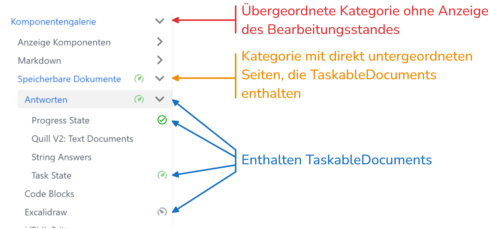

import { useStore } from '@tdev-hooks/useStore'
import { observer } from 'mobx-react-lite';
import CodeBlock from '@theme/CodeBlock';
import JsObjectViewer from '@tdev-components/shared/JsObject/Viewer';

# page-index

Dieses Plugin ermöglicht eine Übersicht über alle speicherbaren Dokumente. So kann bspw. der Bearbeitungsstand in der Seitenleiste angezeigt werden.

Standardmässig wird in der Seitenleiste der Bearbeitungsstand in zwei Fällen angezeigt:
1. Auf einer Seite sind *Statusdokument* vorhanden, deren Fortschritt bestimmt werden kann (sog. `TaskableDocuments`, bspw. `task_state` oder `progress_state`).
2. In einer Kategorie befinden sich direkt untergeordnete Seiten mit *Statusdokumenten*. 



Dieses Verhalten kann über das *Frontmatter* der Seite angepasst werden:

:::cards{flexBasis="300px"}
```yaml
---
sidebar_custom_props:
    taskable_state: 'show'
---
```
Bearbeitungsstand anzeigen, auch wenn keine Statusdokumente in den direkt untergeordneten Seiten vorhanden sind.
::br
```yaml
---
sidebar_custom_props:
    taskable_state: 'hide'
---
```
Bearbeitungsstand nicht anzeigen, auch wenn Statusdokumente vorhanden sind.
:::

## Page index

Der Seitenindex ist ein Baum aller speicherbaren Dokumente in der aktuellen Seite.

Im `dev`-Modus wird er automatisch aktualisiert, wenn sich die Seite ändert.

:::details[Page Index]

export const Comp = observer(() => {
    const pageStore = useStore('pageStore')

    return (
        <div style={{ maxHeight: '550px', overflow: 'auto' }}>
            <CodeBlock language="json">{JSON.stringify(pageStore._pageIndex, null, 2)}</CodeBlock>
        </div>
    );
});

<Comp />
:::

## Für Plugin-Autoren

:::tip[`@tdev/page-read-check` als Beispiel]
Das Plugin `@tdev/page-read-check` implementiert das `iTaskableDocument`-Interface und wird daher automatisch im Seitenindex erfasst.
Es dient als Beispiel und Referenz, wie ein *Statusdokument* implementiert werden kann, damit es im Seitenindex erfasst wird.
:::

Wenn ein Plugin ein weiteres *Statusdokument* implementiert, das im Seitenindex erfasst werden soll, müssen folgende Schritte durchgeführt werden:
1. In der `siteConfig` die neue Komponente für das `remark`-Plugin registrieren:
    ```ts  title="siteConfig.ts"
    import { PageIndexPluginDefaultOptions } from './src/siteConfig/markdownPluginConfigs';
    const indexPluginOptions = {
        ...PageIndexPluginDefaultOptions,
        components: [
            ...PageIndexPluginDefaultOptions.components,
            {
                name: 'MyNewTaskableDocument',
                docTypeExtractor: (node: MdxJsxFlowElement) => 'my_new_taskable_document'
            }
        ]
    };
    export const pageIndexPluginConfig = [pageIndexPlugin, indexPluginOptions];
    ```
2. Im `index.ts` des neuen Plugins den neuen Dokumenttyp importieren:
    ```ts title="packages/<scope>/<new-plugin>/index.ts"
    declare module '@tdev-api/document' {
        export interface TaskableDocumentMapping {
            ['my_new_taskable_document']: MyNewTaskableData;
        }
        export interface TaskableTypeModelMapping {
            ['my_new_taskable_document']: MyNewTaskableDocument;
        }
    }
    ```
    :::warning[iTaskableDocument]
    Das neue `MyNewTaskableDocument`-Modell muss das Interface `iTaskableDocument<'my_new_taskable_document'>` implementieren, damit es im Seitenindex als *Statusdokument* erkannt wird.
    :::
3. Im `apiDocumentProviders` den neuen Dokumenttyp registrieren:
    ```ts title="siteConfig.ts"
    const getSiteConfig = () => {
        apiDocumentProviders: {
            ...,
            require.resolve('@scope/new-plugin/register')
        }
    }
    ```
    und den neuen Dokumenttyp im `ComponentStore` registrieren:
    ```ts title="packages/<scope>/<new-plugin>/register.ts"
    const register = () => {
        rootStore.documentStore.registerFactory('my_new_taskable_document', createModel);
        rootStore.componentStore.registerTaskableDocumentType(new ModelMeta({}));
    };
    ```

## Installation

:::info[`docusaurus.config.ts`]
```ts
import pageIndexPlugin from './packages/tdev/page-index/plugin';

export default {
    // ...
    plugins: [
        // ...
        pageIndexPlugin
    ]
};

```
:::

:::info[swizzle `theme/DocSidebarItem/index.tsx`]
See the swizzled component of this page. This should be synced with the `updateTdev.config.yaml` by default.
:::


:::details[remark config]
```ts
import pageProgressStatePlugin from '@tdev/page-index/remark-plugin';

export const PageIndexPluginDefaultOptions: PageIndexPluginOptions = {
    components: [
        {
            name: 'Answer',
            docTypeExtractor: (node) => {
                return (
                    getAnswerDocumentType(
                        node.attributes.find((a) => a.type === 'mdxJsxAttribute' && a.name === 'type')
                            ?.value as string
                    ) || 'unknown'
                );
            }
        },
        {
            name: 'ProgressState',
            docTypeExtractor: () => 'progress_state'
        },
        {
            name: 'TaskState',
            docTypeExtractor: () => 'task_state'
        },
        {
            name: 'QuillV2',
            docTypeExtractor: () => 'quill_v2'
        },
        {
            name: 'String',
            docTypeExtractor: () => 'string'
        },
        {
            name: 'CmsText',
            docTypeExtractor: () => 'cms_text'
        },
        {
            name: 'CmsCode',
            docTypeExtractor: () => 'cms_text'
        },
        {
            name: 'Restricted',
            docTypeExtractor: () => 'restricted'
        },
        {
            name: 'DynamicDocumentRoots',
            docTypeExtractor: () => 'dynamic_document_roots'
        }
    ],
    persistedCodeType: (node: Code) => {
        if (node.lang === 'html') {
            return 'script';
        }
        const liveLangMatch = /(live_[a-zA-Z0-9-_]+)/.exec(node.meta || '');
        const liveCode = liveLangMatch ? liveLangMatch[1] : null;

        switch (liveCode) {
            case 'live_py':
            case 'live_bry':
                // legacy name, TODO. should be 'brython_code'?
                return 'script';
            case 'live_pyo':
                return 'pyodide_code';
            default:
                return 'code';
        }
    }
};
export const pageIndexPluginConfig = [pageIndexPlugin, PageIndexPluginDefaultOptions];
```
:::