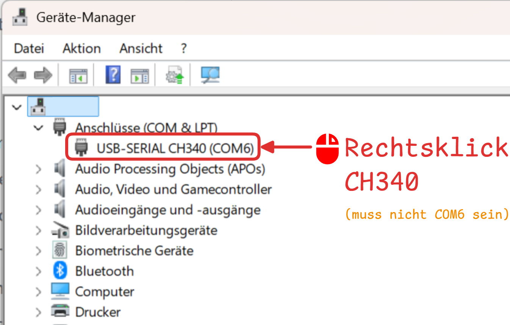
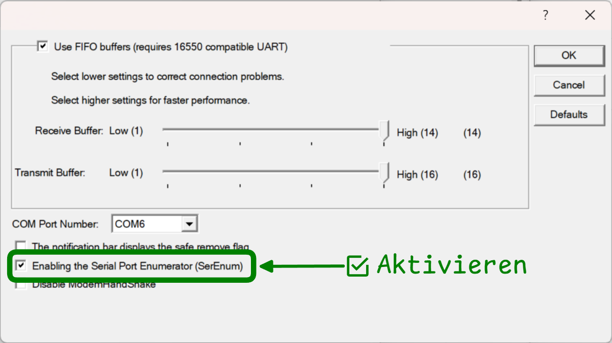

import Webserial from '@tdev/webserial/component'
import BinaryDecoder from '@tdev/webserial/decoders/BinaryDecoder/component'
import Badge from '@tdev-components/shared/Badge'
import BrowserWindow from '@tdev-components/BrowserWindow';

# webserial

Mit dem Webserial Package können auf [unterstützten Browsern](https://caniuse.com/web-serial) Geräte über die serielle Schnittstelle angesprochen werden. Es bietet eine einfache API, um Daten zu senden und zu empfangen.

```tsx
import Webserial from '@tdev/webserial/component'

<Webserial 
    baudRate={115200}
    deviceId='foo'
    showInput
    resetTrigger='::READY::'
    initialData={['Hello World', 'Foo Bar']}
/>
```

<BrowserWindow>
    <Webserial 
        baudRate={115200}
        deviceId='foo'
        showInput
        resetTrigger='::READY::'
        initialData={['Hello World', 'Foo Bar']}
    />
</BrowserWindow>

## Eigene Decoder

Decoder und Outputs können individuell erstellt und über die Option `output` eingebunden werden. Im folgenden Beispiel wird ein Decoder verwendet, der die empfangenen Daten als Binärstring interpretiert und in lesbaren Text umwandelt.

```tsx
import Webserial from '@tdev/webserial/component'
import BinaryDecoder from '@tdev/webserial/decoders/BinaryDecoder/component'

<Webserial 
    baudRate={115200}
    hideLogs
    resetTrigger='::READY::'
    initialData={'01001000 01100001 01101100 01101100 01101111 00100001'.replace(' ', '').split('')}
    output={<BinaryDecoder />}
/>
```

<BrowserWindow>
    <Webserial 
        baudRate={115200}
        hideLogs
        resetTrigger='::READY::'
        initialData={'01001000 01100001 01101100 01101100 01101111 00100001'.replace(' ', '').split('')}
        output={<BinaryDecoder />}
    />
</BrowserWindow>

:::tip[`BinaryDecoder`]
Für die Implementierung eines eigenen Decoders dient der [BinaryDecoder](https://github.com/GBSL-Informatik/teaching-dev/blob/main/packages/tdev/webserial/decoders/BinaryDecoder/model/Decoder.ts) als Referenz.
:::


## Optionen für `<Webserial />`

`deviceId`
: `string`
: Die `deviceId` wird nur verwendet, um das Gerät im `WebserialStore` zu identifizieren. 
: So kann das entsprechende Gerät angesprochen werden und bspw. die empfangenen Daten angezeigt werden.
: Für eine Output-Komponente kann aber auch der `useDeviceId`-Hook verwendet werden, um die vergebene deviceId zu erhalten.
`baudRate`
: `number`
: Die Baudrate, mit der die serielle Verbindung aufgebaut wird. Standard ist `115200`.
`resetTrigger`
: `string`
: Wird der `resetTrigger` empfangen, so werden die empfangenen Daten zurückgesetzt.
`showInput`
: `boolean`
: Wenn `true`, wird ein Eingabefeld angezeigt, mit dem Daten an das serielle Gerät gesendet werden können. Standard ist `false`.
`collapseLogs`
: `boolean`
: Wenn `true`, werden die Logs in einem collapsible Element angezeigt. Standard ist `false`.
`hideLogs`
: `boolean`
: Wenn `true`, werden die Logs nicht angezeigt. Standard ist `false`.
`output`
: `React.ReactNode`
: Mit `output` kann ein eigenes Element unterhalb der Logs angezeigt werden.

## API

Das Package registriert einen neuen Viewstore namens `webserialStore`. In einer Komponente kann wie folgt auf die Daten zugegriffen werden:

```tsx
const Logger = observer((props: Props) => {
    const viewStore = useStore('viewStore');
    const webserialStore = viewStore.useStore('webserialStore');
    const device = webserialStore.devices.get('<deviceId>');
    if (!device) {
        return null;
    }
    return (
        <pre>
            <code>{device.receivedData.join('\n')}</code>
        </pre>
    )
});
```

Falls die Komponente als `output` in `<Webserial />` eingebunden ist, kann auch der `useDeviceId`-Hook verwendet werden:
```tsx
// highlight-next-line
import { useDeviceId } from '@tdev/webserial/hooks/useDeviceId';

const Logger = observer((props: Props) => {
    const viewStore = useStore('viewStore');
    const webserialStore = viewStore.useStore('webserialStore');
    // highlight-next-line
    const deviceId = useDeviceId();
    const device = webserialStore.devices.get(deviceId);
    if (!device) {
        return null;
    }
    return (
        <pre>
            <code>{device.receivedData.join('\n')}</code>
        </pre>
    )
});
```

:::info[`webserialStore.useDevice`]
Soll in jedem Fall eine `SerialDevice`-Instanz abgerufen werden, so kann auch die `webserialStore.useDevice`-Methode verwendet werden. Diese erstellt automatisch eine neue Instanz, wenn noch keine existiert.

```tsx
const Logger = observer((props: Props) => {
    const viewStore = useStore('viewStore');
    const webserialStore = viewStore.useStore('webserialStore');
    const device = webserialStore.useDevice('<deviceId>', { baudRate: 115200 }, {});
    return (
        <pre>
            <code>{device.receivedData.join('\n')}</code>
        </pre>
    )
});
```
:::


## Troubleshooting

<details>
<summary>Fehler: <Badge type='danger'>Error: Failed to execute 'open' on 'SerialPort': Failed to open serial port</Badge></summary>

Beim ESP8266 kann es vorkommen, dass die serielle Schnittstelle nicht geöffnet werden kann. In diesem Fall muss die serielle Schnittstelle in den Geräteeinstellungen von Windows angepasst werden.

:::cards{flexBasis="350px"}

::br

::br

::br

:::

</details>

## Ausprobieren

Die serielle Schnittstelle kann am einfachsten mit einem Micro:Bit ausprobiert werden.

### Echo Test

<Webserial 
    baudRate={115200}
    showInput
    resetTrigger='::READY::'
/>

```py
from microbit import *

print('::READY::')

while True:
    if uart.any():
        data = uart.readline()
        if data:
            uart.write(data)
```

### Binary Decoder Test

<Webserial 
    baudRate={115200}
    hideLogs
    resetTrigger='::READY::'
    output={<BinaryDecoder />}
/>

```py
from microbit import *

def to_latin1(char):
    bin_string = bin(ord(char))[2:]
    return '0' * (8 - len(bin_string)) + bin_string


print('::READY::')

count = 1
while True:
    message = 'Hello World! ' + str(count) + '\n'
    binary = [to_latin1(c) for c in message]
    for char in binary:
        for bit in char:
            print(bit)
            sleep(20)
    count = count + 1
```

## Installation

:::info[`packages/tdev/webserial`]
Kopiere des `packages/tdev/webserial`-Verzeichnis in das `tdev-website/website/packages`-Verzeichnis oder über `updateTdev.config.yaml` hinzufügen.
:::

Danach muss das `webserial`-Package bei den `apiDocumentProviders` im `siteConfig.ts` registriert werden:
```ts title="siteConfig.ts"
const getSiteConfig: SiteConfigProvider = () => {
   return {
       apiDocumentProviders: [
           require.resolve('@tdev/webserial/register'),
       ]
   };
};
```


Zum Schluss muss erneut installiert werden, so dass yarn das neue Package verwenden kann:

```bash
yarn install
```